# Codex Orange Book: A Complete Guide from Installation to Real-World Practice
>This English version is translated from the original Chinese edition of [**Codex Orange Book**](https://github.com/bozhouDev/codex-orange-book)
> The original project is a community-maintained, unofficial guide to Codex. This repository provides an English-localized version for readers who prefer English technical documentation.
> Translation updates may lag behind the Chinese source, so please refer to the original repository for the latest revisions and authoritative context.

> Unofficial open-source guide · Continuously updated edition  
> A practical Codex handbook for developers, indie developers, and heavy users of AI tools.

| Version | Last reviewed | Document status |
| --- | --- | --- |
| v0.1.0 | 2026-06-22 | Unofficial guide. Not OpenAI official documentation or a product commitment |

> This guide is based on the publicly accessible capabilities and hands-on UI behavior of Codex App, Codex CLI, Codex IDE Extension, and Codex Web / Cloud as of 2026-06-22. Codex changes quickly. Installation methods, model names, usage limits, entry points, and command parameters may change. For specific features and pricing, always rely on OpenAI's official documentation, the current Codex version, and what your own account displays.  
> Third-party tools and model integration approaches such as CC Switch and DeepSeek are documented only as extension methods. They are not official OpenAI features.

## Table of contents

- [0. How to use this guide](#0-how-to-use-this-guide)
  - [0.1 Important notes](#01-important-notes)
  - [0.2 Who this PDF is for](#02-who-this-pdf-is-for)
  - [0.3 Reading paths](#03-reading-paths)
- [Part 1: Understand what Codex is first](#part-1-understand-what-codex-is-first)
  - [Codex fundamentals](#codex-fundamentals)
  - [Codex entry points](#codex-entry-points)
- [Part 2: Installation, configuration, and environment setup](#part-2-installation-configuration-and-environment-setup)
  - [Before you install](#before-you-install)
  - [Installing and getting started with Codex App (the best starting point for beginners, and also the most capable option)](#installing-and-getting-started-with-codex-app-the-best-starting-point-for-beginners-and-also-the-most-capable-option)
  - [Installing and getting started with Codex CLI](#installing-and-getting-started-with-codex-cli)
  - [Codex IDE Extension](#codex-ide-extension)
  - [Codex Web](#codex-web)
- [Part 3: Core capabilities in depth](#part-3-core-capabilities-in-depth)
  - [Automations](#automations)
  - [Plugins](#plugins)
  - [Skill](#skill)
  - [MCP](#mcp)
  - [Code management (Git and GitHub workflows)](#code-management-git-and-github-workflows)
  - [Cloud execution](#cloud-execution)
  - [Memory system](#memory-system)
- [Part 4: Standard workflow](#part-4-standard-workflow)
  - [The complete path from requirement to delivery](#the-complete-path-from-requirement-to-delivery)
  - [Codex task template library](#codex-task-template-library)
- [Part 5: Real-world case library](#part-5-real-world-case-library)
  - [Case 1: Build a frontend website for selling pet treats](#case-1-build-a-frontend-website-for-selling-pet-treats)
  - [Case 2: Add features to the pet-treat website and improve the page](#case-2-add-features-to-the-pet-treat-website-and-improve-the-page)
  - [Case 3: Build an admin dashboard for pet treats](#case-3-build-an-admin-dashboard-for-pet-treats)
  - [Case 4: Create a pet-treat brand partnership PPT](#case-4-create-a-pet-treat-brand-partnership-ppt)
  - [Case 5: Create a promotional video for pet treats](#case-5-create-a-promotional-video-for-pet-treats)
- [Appendix](#appendix)
  - [Appendix A: Third-party model integration](#appendix-a-third-party-model-integration)

## 0. How to use this guide

### 0.1 Important notes

- This material is an unofficial guide and does not represent OpenAI official documentation.
- All features are subject to OpenAI's official documentation and the actual Codex version you use.
- This PDF will be maintained as Codex evolves.
- Readers are encouraged to check the latest Markdown source in the GitHub repository first.

### 0.2 Who this PDF is for

- People who have never used Codex and want a structured onboarding path.
- Developers who can code but do not know how to integrate Codex into real projects.
- Users who have tried Cursor, Claude Code, or ChatGPT and want to compare Codex workflows.
- Indie developers, AI-tool creators, and technical team leads.
- Anyone building AI-assisted coding workflows, knowledge bases, or automation pipelines.

### 0.3 Reading paths

- **Quick-start path**: 0. How to use this guide → Part 1: Understand what Codex is first → Part 2: Installation, configuration, and environment setup → Part 4: Standard workflow → Part 5: Real-world case library
- **Developer core path**: Part 1: Understand what Codex is first → Part 2: Installation, configuration, and environment setup → Part 3: Core capabilities in depth → Part 4: Standard workflow
- **Advanced extension path**: Part 3: Core capabilities in depth → Part 4: Standard workflow → Appendix: Third-party model integration

---

## Part 1: Understand what Codex is first

### Codex fundamentals

#### What exactly is Codex?

When people first hear the name Codex, they often assume it is “just another AI coding tool.”

But if you treat Codex merely as “ChatGPT that helps me write code,” you will likely underestimate it.

What makes Codex important is not simply whether it can write a function, complete a snippet, or explain an error. Its real significance is that it represents a shift in the role of AI programming tools:

At first, AI sat beside you and helped complete code.

Later, AI entered the editor and modified code together with you.

Now, Codex is closer to an engineering executor you can assign tasks to.

It does not only answer “how should I write this code?” It can enter a project, read files, understand context, make a plan, modify code, run commands, check results, and finally organize the changes into a reviewable output.

That is the biggest difference between Codex and ordinary AI chat tools.

---

##### Four shifts in five years

<p align="center">
  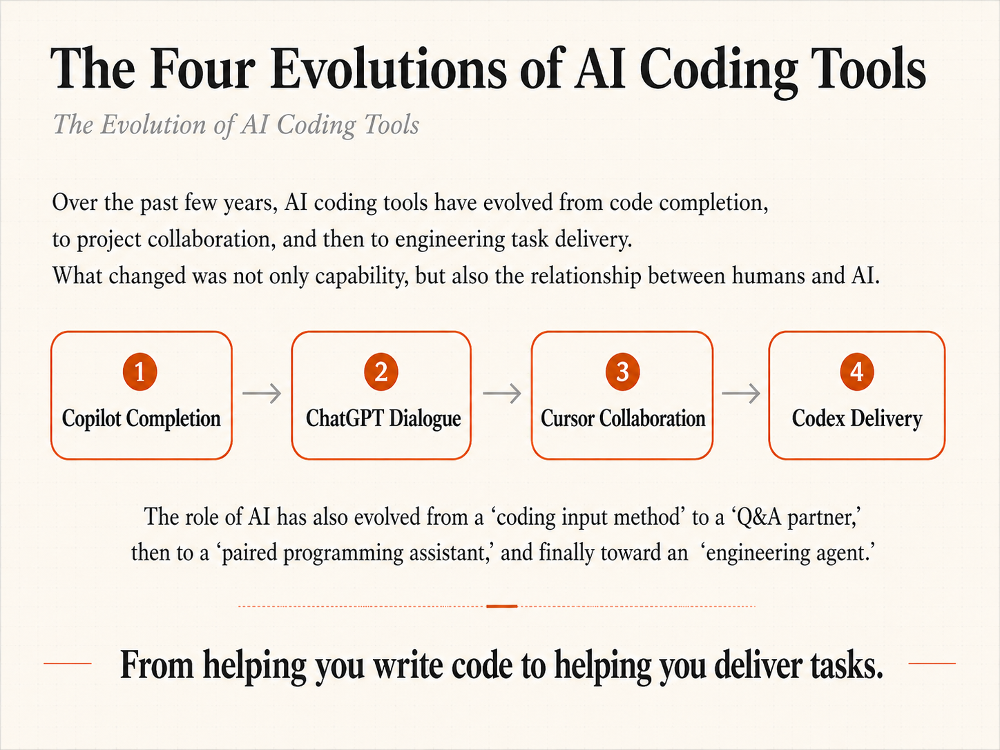
</p>

**The four stages of AI programming tools**

Over the past few years, AI programming tools have broadly moved through four stages.

**2021: The Copilot completion era.**
The name Codex first became widely known among developers because of GitHub Copilot. At that time, AI was mainly responsible for code completion: you wrote the beginning, it completed the rest; you wrote a function name, it suggested the body. It was like a smarter input method that helped you write faster, but humans still handled how to break down the project, locate files, and run tests.

**2022: The ChatGPT conversation era.**
After ChatGPT appeared, AI programming moved from “completion” into “conversation.” You could ask directly about error messages, code improvements, API design, or project structure. AI evolved from an input method into a Q&A partner. But it usually did not operate inside the real project. You still had to copy code, paste errors, manually provide context, and move the answer back into the project.

**2023–2024: The Cursor project-collaboration era.**
AI editors such as Cursor brought AI into the editor. They could see files, modify functions, refactor across files, and complete part of a development task using project context. AI started moving from “answering questions” to “helping modify projects.” But most of the time it still lived inside the IDE. You still had to watch the edits, decide the next step, run tests, and prepare the commit.

**2025: The Codex engineering-agent era.**
When Codex returned, it was no longer only the model once associated with code completion. It had become a coding agent for real software engineering tasks. It can read projects, explain code, fix bugs, add features, add tests, refactor modules, run commands, inspect diffs, draft PR summaries, and even work on multiple engineering tasks in parallel.

This means the focus of AI programming tools is shifting from “helping you write code” to “helping you deliver tasks.”

In one sentence:

**Copilot completes code, ChatGPT helps you think through code, Cursor works with you inside a project, and Codex starts executing engineering tasks for you.**

---

#### What Codex can do

**What Codex Can Do**

<p align="center">
  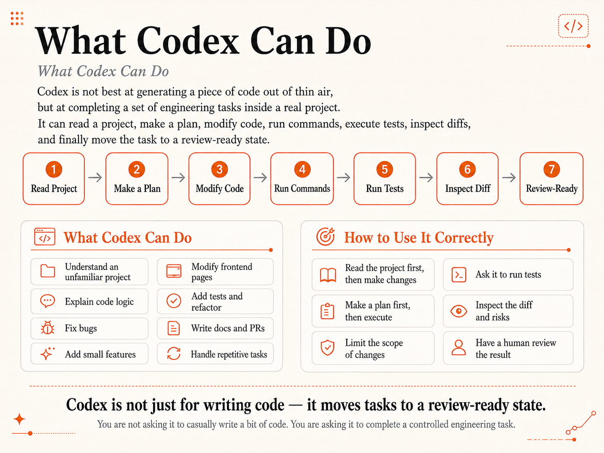
</p>

Many first-time Codex users immediately ask:

- “Build me a login page.”
- “Fix this bug for me.”
- “Create a project for me.”

Those requests are possible, but they are not precise enough.

What Codex is truly good at is not generating isolated code from scratch. It is completing a set of engineering tasks inside a real project.

It can read a project, locate files, understand context, create a plan, modify code, run commands, check results, organize the diff, and move the task to a reviewable state.

So do not treat Codex as a “generate code” button.

A more accurate description is:

**Codex is an AI engineering assistant that can enter the project site.**

Its capabilities can be roughly grouped into the following areas.

---

##### Understand an unfamiliar project

The first step with Codex should not be asking it to write code immediately. You should ask it to read the project first.

It can help you quickly understand:

- What technology stack the project uses.
- Where the entry files are.
- Where the core modules live.
- What the test and build commands are.
- Which files should not be modified casually.

Many Codex tasks fail not because Codex cannot write code, but because it has not yet understood the project before being asked to act.

---

##### Explain code and map logic

Codex can help explain code you do not understand.

For example:

- What this function does.
- Why this component is implemented this way.
- What the API call chain looks like.
- Where the state comes from.
- Which files may be related to this bug.

It does not only explain a single function. It can use project context to map module relationships, data flow, and potential risks.

This is especially useful when taking over a legacy project.

---

##### Fix bugs and add features

Codex works well on development tasks with clear boundaries.

For example:

- Fixing a reproducible bug.
- Adding a settings page.
- Adding form validation.
- Adding an API endpoint.
- Adding an export button.
- Improving a frontend page.

But do not hand it a large project all at once.

A better approach is to break the work into smaller tasks:

1. Read the project first.
2. Draft a plan.
3. Modify only one module.
4. Run tests.
5. Inspect the diff.
6. Continue only after confirming the result.

Codex is better at completing a sequence of small tasks than swallowing an entire large project in one go.

---

##### Write tests and refactor code

Codex can help you add tests and refactor code.

It can:

- Add unit tests.
- Cover boundary conditions.
- Cover error scenarios.
- Extract duplicated logic.
- Split overly long functions.
- Organize component structure.
- Encapsulate API requests.

But tasks like these must have clear constraints:

- Do not change business logic.
- Do not change public APIs.
- Do not introduce unrelated dependencies.
- Do not perform broad refactors.
- Run tests after the changes.

Codex can refactor, but you must control the scope.

---

##### Write documentation and prepare PRs

Codex is well suited for engineering documentation.

For example:

- README files.
- Installation instructions.
- Startup instructions.
- API documentation.
- Environment variable documentation.
- Project structure documentation.
- PR descriptions.
- Commit messages.
- Changelogs.

Documentation is not an accessory.

In a Codex workflow, documentation is part of the context infrastructure.

The clearer the documentation is, the easier it becomes for both humans and AI to take over the project later.

But you should remind Codex:

**Do not invent commands that do not exist. Clearly mark information that is uncertain.**

---

##### Run commands, inspect diffs, and review changes

One of the biggest differences between Codex and ordinary chat tools is that Codex can run commands inside the project environment.

It can:

- Run tests.
- Run lint.
- Run type checks.
- Run builds.
- Inspect `git status`.
- Inspect `git diff`.
- Search the codebase.
- Check modification results.

This means Codex is not only “guessing an answer.” It can verify outcomes.

But command execution also carries risk.

Let it verify what can safely be verified.

Risky operations must require your approval.

Do not let it automatically execute operations involving production environments, databases, or real user data.

---

##### When Codex is a good fit

Tasks that suit Codex generally share several traits:

- The goal is clear.
- The scope is controlled.
- The context is clear.
- The result can be verified.
- Failures can be rolled back.
- The risk is acceptable.

For example:

- Reading a project.
- Fixing bugs.
- Adding small features.
- Adding tests.
- Writing documentation.
- Improving frontend pages.
- Preparing PRs.
- Reviewing diffs.
- Handling repetitive tasks.

---

##### When you should not use Codex directly

It is not recommended to let Codex directly handle:

- Production databases.
- Real user data.
- Core payment logic.
- Permission and security-critical modules.
- Large-scale architecture migrations.
- Important projects without backups.
- Core business logic without tests.
- Tasks you cannot validate yourself.

If you cannot judge whether the result is correct, do not let Codex complete the task independently.

Codex can improve efficiency, but it cannot replace your judgment.

---

##### One-sentence summary

Codex does more than write code.

Its truly important capability is:

**Moving a clearly defined software engineering task from requirement to reviewable result.**

You are not asking it to write code at random.

You are asking it to complete a controlled engineering task according to your project rules, context, and acceptance criteria.


---

#### Codex vs. ChatGPT

Many people ask:

If ChatGPT can also write code, why use Codex?

The core difference is:

**ChatGPT is more like a consultant: you ask questions, get answers, and then execute the work yourself. Codex is closer to an intern or junior engineering assistant: you can assign it a task and let it do real work toward completion.**

ChatGPT is better for helping you think.

Codex is better for moving tasks forward.

A more effective pattern is:

**Use ChatGPT to think clearly first, then use Codex to execute inside the project.**

<p align="center">
  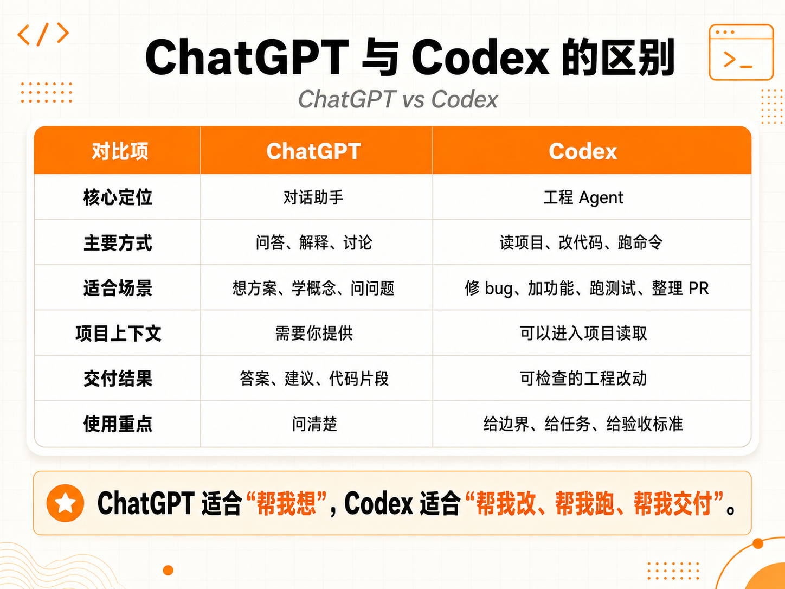
</p>

#### Codex vs. Cursor

Many people compare Codex with Cursor because both can help write code, modify code, and understand projects.

But their positioning is different.

**Cursor is closer to an AI editor. Codex is closer to an engineering agent.**

A sensible approach is to use them together:

**Use Cursor for day-to-day coding and local edits. Use Codex for task progression and engineering delivery.**

Cursor writes with you.

Codex helps you run an end-to-end task.

One leans toward IDE collaboration; the other leans toward agent execution.

That is the biggest difference between them.

<p align="center">
  
</p>

#### Codex vs. Claude Code

Codex and Claude Code are similar.

Both are **agentic coding tools**, but their focus is different.

---

##### Claude Code leans toward long-running terminal collaboration

The Claude Code experience is closer to this:

You open a terminal, place it inside a project, and then continuously collaborate with it around a development task.

It is suitable for:

- Reading a project for an extended period.
- Continuously tracking a complex task.
- Discussing and editing inside the terminal.
- Handling multi-step engineering problems.
- Extending workflows through hooks, subagents, MCP, and related mechanisms.

In that sense, Claude Code is more like an AI engineering partner that stays in your terminal for the long run.

Its strengths are command-line workflow, deep contextual collaboration, and continuous engineering-task progression.

---

##### Codex leans toward multi-entry task execution in the OpenAI ecosystem

Codex's strength is not only the CLI, but multi-entry coordination across the OpenAI ecosystem.

You can use it through different entry points:

Codex CLI.

Codex App.

Codex IDE Extension.

Codex Web.

The ChatGPT account system.

GitHub / PR workflows.

Skills and project rules.

In OpenAI official documentation, Codex CLI is a coding agent in the local terminal. Codex App provides desktop multi-threading, worktrees, automation, and Git capabilities. Codex Skills can also be reused across the CLI, IDE extension, and Codex app.

So Codex is closer to an engineering task platform connected to the OpenAI ecosystem.

It is not just “writing code in the terminal.” It can flow across App, CLI, IDE, Web, and other entry points, letting you manage, execute, and review engineering tasks in different ways.

---

##### How to choose

If you prefer terminal workflows and want AI to stay inside the project for long-running collaboration around complex tasks, Claude Code is a strong fit.

If you already use ChatGPT and the OpenAI ecosystem, want to switch across CLI, desktop App, IDE, and Web, and want to connect tasks, diffs, PRs, Skills, and GitHub workflows, Codex will likely feel more natural.

Neither one absolutely replaces the other.

The final choice depends on:

- Model capability.
- Context handling.
- Toolchain.
- Pricing.
- Team habits.
- Your own development process.

In one sentence:

**Claude Code is more like a long-running engineering partner in the terminal, while Codex is more like a multi-entry engineering agent in the OpenAI ecosystem.**

<p align="center">
  
</p>

#### Codex in one sentence

- Beginner usage: ask it to help write code.
- Intermediate usage: ask it to read the project, modify features, and run tests.
- Advanced usage: make it your project execution agent, working with rules, context, automation, and team processes.

---

### Codex entry points

<p align="center">
  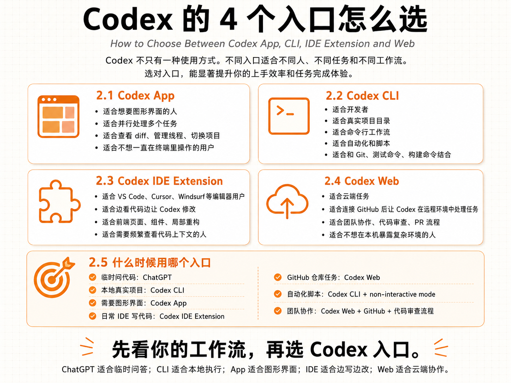
</p>

If you mainly work on local projects, web practice, and day-to-day development, starting with Codex App is usually enough. After you become familiar with Git, terminals, and team collaboration, you can gradually add CLI, IDE Extension, and Web / Cloud.

---

## Part 2: Installation, configuration, and environment setup

### Before you install

#### Account preparation

If you are an ordinary individual user, prepare the following:

- A ChatGPT account
- A network environment that can reliably access ChatGPT / OpenAI services
- A ChatGPT plan that currently includes Codex; plan names, limits, and feature coverage may change, so rely on the official pages and what your account displays.

#### System preparation

The four main Codex modes:


| Mode | Best for | What you need |
| --- | --- | --- |
| Codex App desktop | Beginners and users who prefer a graphical interface | Windows or macOS |
| Codex CLI | Users with some terminal experience | Terminal, Git, and a project environment |
| Codex IDE Extension | Users of VS Code / Cursor / Windsurf | Editor + extension |
| Codex Web / Cloud | Users who want Codex to work on GitHub projects remotely | GitHub repository |


Codex App supports **macOS and Windows**. Codex CLI supports macOS, Windows, and Linux.

#### Software tools to prepare

Before installing Codex, prepare these basic tools:


| Tool | Purpose | Download / registration link |
| --- | --- | --- |
| Git | Allows Codex to inspect code changes, generate diffs, and roll back changes | Git official download |
| VS Code / Cursor | Convenient for viewing and editing code | VS Code download / Cursor download |
| Terminal | Use PowerShell on Windows; Terminal on Mac | Built into the system; no download required |
| Browser | Sign in to ChatGPT / OpenAI / GitHub | Chrome download |
| Node.js | Commonly used for web, frontend, Next.js, and Vite projects | Node.js download |
| Python | Commonly used for scripts, automation, and data processing | Python download |
| GitHub account | Required if you want to use Codex Cloud or push code | GitHub signup |
| Codex App | Codex desktop app for managing tasks and projects through a GUI | Codex App official page |
| Codex CLI | Use Codex in the terminal; suitable for real project development | Codex CLI official documentation |
| Codex Web | Connect GitHub and let Codex process projects in the cloud | Codex Web |


#### Project directory preparation

Codex is not just a chat tool. It needs to work inside a specific project directory. The official onboarding flow is similar: after signing in to Codex, choose a folder or Git repository on your computer, then start the first task.

It is recommended to create a dedicated practice directory first, for example:

```text
D:\AI-Codex-Projects
```

You can place projects such as:

```text
hello-web
ai-tools-page
xiaohongshu-cover-tool
landing-page-demo
```

Do not let Codex operate on your most important real project at the beginning. Start with practice projects to learn how it modifies files, runs commands, and generates results.

#### Permission and safety preparation

Codex can read and modify files, and it can run commands inside your project directory. The official CLI description is exactly that: it can read and modify code in the directory you select and run commands.

So before installing, pay attention to the following:


| Point to watch | Recommendation |
| --- | --- |
| Do not place important files directly in the workspace | Start with a test project |
| Do not write passwords or API keys directly in code | Use `.env` files and avoid uploading them |
| Commit with Git before operations | Makes rollback easier |
| Read the commands Codex wants to run | If you do not understand a command, ask it to explain first |
| Do not grant it access to the entire C drive | Select only the specific project folder |


It is recommended to initialize Git in every project first:

```text
git init
git add .
git commit -m "initial commit"
```

This makes it possible to roll back if Codex breaks something.

---

### Installing and getting started with Codex App (the best starting point for beginners, and also the most capable option)

#### Download and installation

##### Installing on macOS

If you are using a Mac, first check your chip type.

Click the Apple icon in the top-left corner of your computer and choose “About This Mac.”

If it shows:

- Apple M1 / M2 / M3 / M4: choose the Apple Silicon version
- Intel: choose the Intel version

After opening the official Codex App page, download the version that matches your chip. When the download finishes, open the installer and drag Codex into the Applications folder.

After installation, open Codex from Applications.

The first time you open it, macOS may show:

“This app was downloaded from the Internet. Are you sure you want to open it?”

Choose “Open.”

###### Difference between Intel Mac and Apple Silicon

Macs mainly use two chip families:


| Type | Common models | Version to download |
| --- | --- | --- |
| Apple Silicon | M1 / M2 / M3 / M4 Mac | Apple Silicon version |
| Intel Mac | Older Intel-chip Macs | Intel version |


The simplest way to check:

Open “About This Mac” and read the chip information.

If it says Apple M series, it is Apple Silicon.

If it says Intel Core i5, Intel Core i7, or Intel Core i9, it is an Intel Mac.

Do not choose the wrong version here. The wrong version may fail to install, fail to launch, or run unstably.

##### Installing on Windows

If you are using Windows, open the official Codex App page and choose the Windows version.

The Windows version usually redirects to Microsoft Store for installation.

Installation steps:

1. Open the [official Codex App page](https://openai.com/zh-Hans-CN/codex/)
2. Click the Windows download entry

<p align="center">
  
</p>

3. Go to Microsoft Store

<p align="center">
  
</p>

4. Click “Get” or “Install” (in this screenshot, it shows “Open” because it is already installed)
5. Open Codex App
6. At this point, Codex App is installed


#### Opening Codex App for the first time

##### Choose a project directory

After you open Codex App for the first time and finish signing in, the system asks you to choose a project directory.

You can think of the “project directory” as:

The folder Codex will enter to work.

For example, if you want Codex to help build a webpage, you can create a folder first:

```text
hello-codex
```

Then choose that folder in Codex App.

For beginners, the first directory should be a clean practice folder. Do not select the C drive directly, and do not start with an important work project.

Recommended directory structure:

```text
AI-Codex-Projects
└── hello-codex
    └── index.html
```

Only after choosing a project directory does Codex know which files to read, which files to modify, and where to run commands.

<p align="center">
  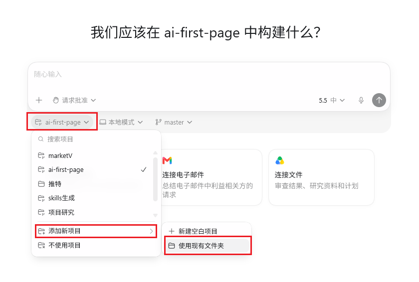
</p>

##### Understand the project list

After entering Codex App, you will usually see a project list on the left.

You can think of the project list as:

The different code folders you have given to Codex.

For example:

```text
hello-codex
ai-first-page
```

Each project corresponds to a local folder on your computer or a Git repository.

If you have previously opened projects in Codex App, Codex CLI, or Codex IDE Extension, those projects may also appear in the list.

Beginners should remember one thing:

The project list is not a chat-history list. It is a “code project list.”

When you enter different projects, Codex sees a different file scope.

<p align="center">
  
</p>

##### Understand threads

A thread can be understood as:

A task conversation within the same project.

For example, in a project named `hello-Codex`, you can create multiple threads:

```text
Thread 1: Build a home page
Thread 2: Fix the button not responding to clicks
Thread 3: Improve mobile layout
Thread 4: Write a README for me
```

<p align="center">
  
</p>

Each thread has its own context.

That means if you ask Codex to build a home page in Thread 1, it will continue understanding and modifying around that task.

If you ask it to fix a bug in Thread 2, it will work around a separate task.

Beginners can understand it this way:

- Project = a company
- Thread = an employee inside that company

Do not put everything into one thread.

A better practice is:

One clear task, one thread.

For example:

```text
Please help me build a personal homepage.
```

That is one thread.

```text
Please check why the mobile layout is broken.
```

That is another thread.

This keeps the project organized and helps Codex understand task boundaries.

##### Understand the task window

The task window is where you talk to Codex and assign work.

You can enter a task such as:

```text
Please build a simple webpage with a black background and “Hello, Codex” centered in the middle.
```

<p align="center">
  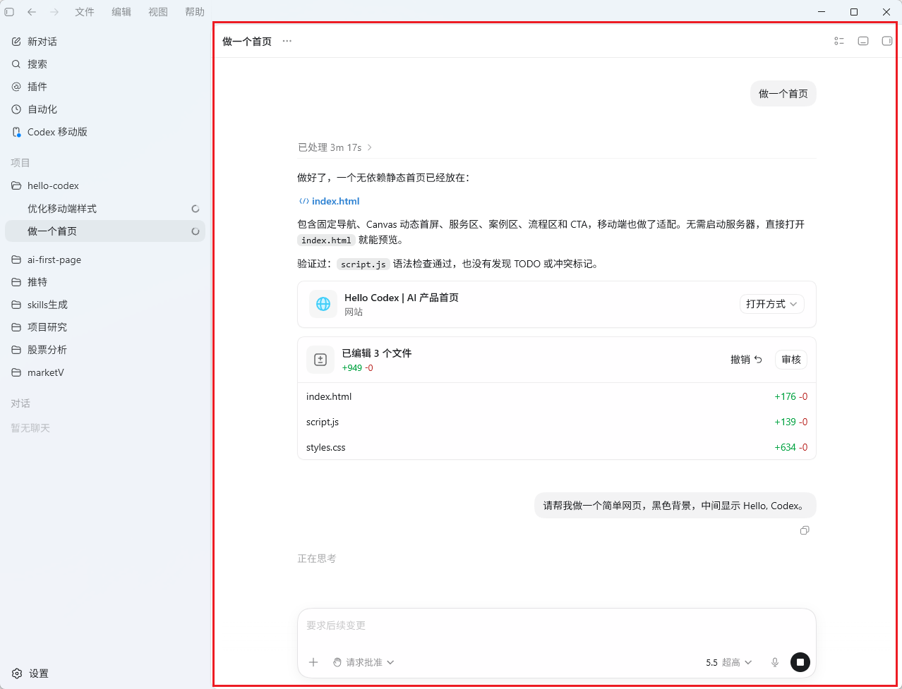
</p>

You can also follow up:

```text
Please make this page feel more like a technology product landing page.
```

The task window usually contains:


| Content | Purpose |
| --- | --- |
| Your task description | Tells Codex what to do |
| Codex's plan | Shows how it intends to proceed |
| Codex's execution process | Shows it reading files, modifying files, and running commands |
| Codex's summary | Summarizes what it changed |
| Follow-up input box | Lets you ask it to keep modifying |


For your first use, do not write an overly complex task.

Not recommended:

```text
Build me a complete AI tools platform with login, payment, database, and admin dashboard.
```

Recommended:

```text
Please build a simple product introduction page using only HTML and CSS.
```

The clearer the task, the easier it is for Codex to do well.

##### Understand the review pane

The review pane is where you inspect what Codex changed.

After Codex modifies files, do not rely only on its written summary. Open the review pane and inspect the actual changes.

<p align="center">
  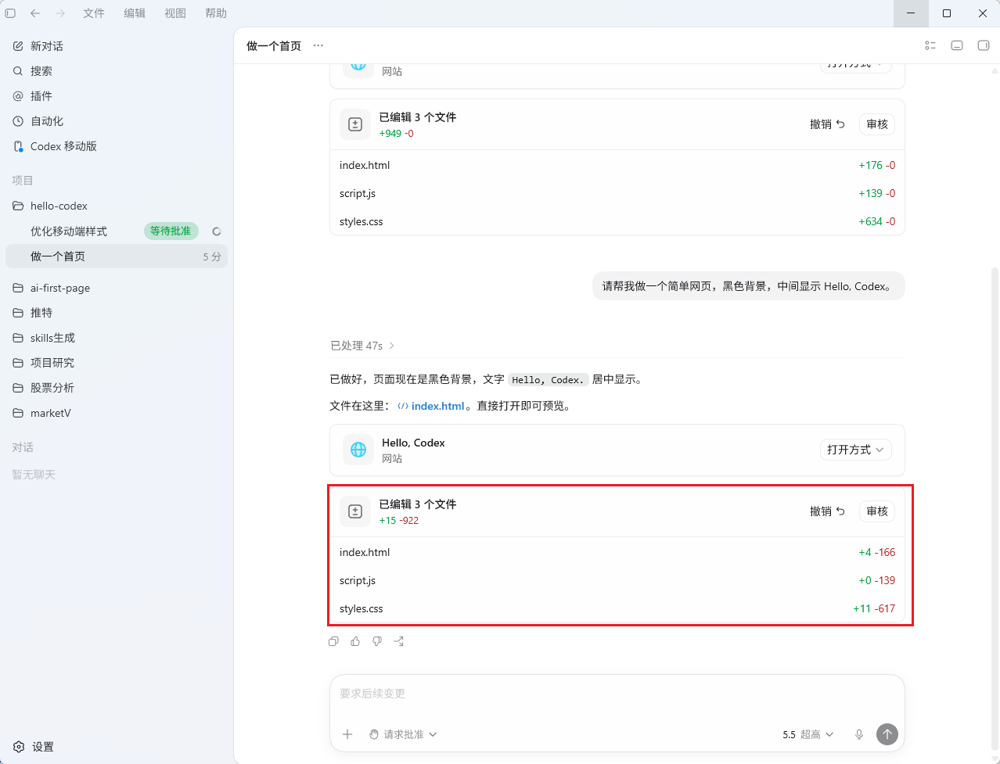
</p>

It tells you:

- Which files were modified
- Where code was added
- Where code was removed
- Which changes can be accepted
- Which changes can be reverted

Beginners can think of the review pane as:

Codex's “work inspection area.”

You should not simply trust Codex after it finishes writing. You should inspect exactly what it delivered.

If you are not satisfied with a line of code, you can leave a comment at that position and ask Codex to revise according to the comment.

For example, you can comment:

```text
This button color is too bright. Change it to a more restrained dark blue.
```

Or:

```text
This code is too complex. Rewrite it in a way that is easier for beginners to understand.
```

##### Understand diff

A diff is a comparison of code changes.

<p align="center">
  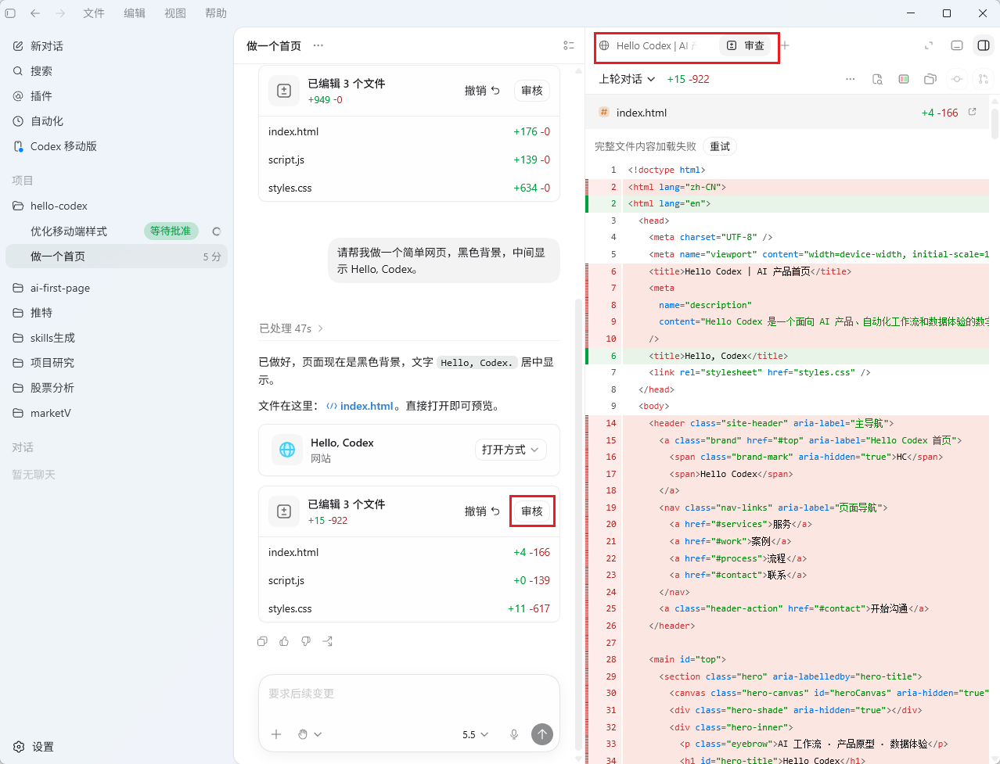
</p>

Beginners can understand it like this:

```text
Green = added content
Red = deleted content
```

For example, if Codex originally had no title and later added a line:

```html
<h1>Hello, Codex</h1>
```

That line appears as an addition.

If Codex deleted an old block of code, that block appears as a deletion.

The purpose of diff is to let you see clearly:

Exactly what Codex changed.

Do not only look at the final page, and do not only read Codex's summary.

The diff is what matters.

Because Codex may sometimes:

- Change something you did not ask it to change
- Delete code you still need
- Make simple code more complex
- Modify multiple files without explaining clearly

So from the very first use, build this habit:

```text
Every time Codex completes a task, inspect the diff first, then decide whether to accept it.
```

##### Recommended first-run workflow

When opening Codex App for the first time, follow this order:

```text
1. Sign in to ChatGPT
2. Choose a practice project directory
3. Create or select a thread
4. Enter a simple task in the task window
5. Wait for Codex to modify files
6. Open the review pane
7. Inspect the diff
8. Continue modifying only after confirming the result
```

Recommended first task:

```text
Please build a simple webpage with the following requirements:
1. Black background
2. Large “Hello, Codex” text centered in the page
3. White text
4. The whole page centered horizontally and vertically
5. Use only HTML and CSS
```

This task is simple enough to help you learn the basic Codex App workflow.


##### Key concepts beginners should remember


| Concept | Simple interpretation |
| --- | --- |
| Project directory | The company address |
| Project list | The company's project departments |
| Thread | An employee inside a project department |
| Task window | Where you give instructions to the employee |
| Review pane | Where you inspect changes |
| Diff | A comparison of added and deleted code |


#### Basic usage of Codex App

##### Basic layout

Codex App uses a classic three-column layout.

The left column is the task list.

The middle column is the conversation window.

The right column is the multi-purpose area.

<p align="center">
  
</p>

##### New conversation

###### Using a project

You can start a new conversation to execute a new task.

After starting a new conversation, choose which project the conversation belongs to.

<p align="center">
  
</p>

You can also click the small button on the right side of a project to directly start a new conversation for that project.

<p align="center">
  
</p>

###### Not using a project

If you click “Do not use a project,” the corresponding conversation appears under conversations. This is useful for questions unrelated to a project.

<p align="center">
  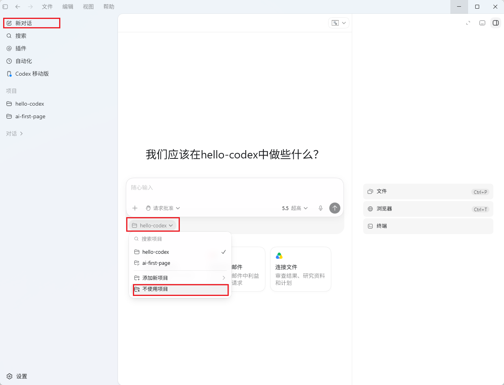
</p>

<p align="center">
  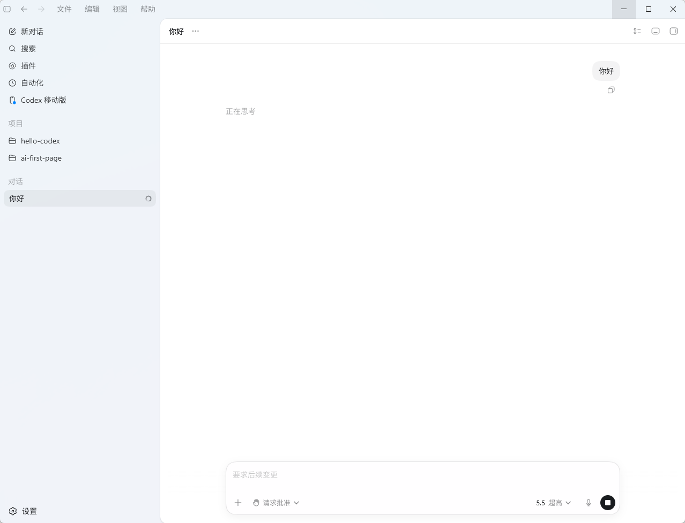
</p>

##### Search

When there are too many task conversations later and you only remember a few keywords, you can search those keywords here to find the matching task conversation.

<p align="center">
  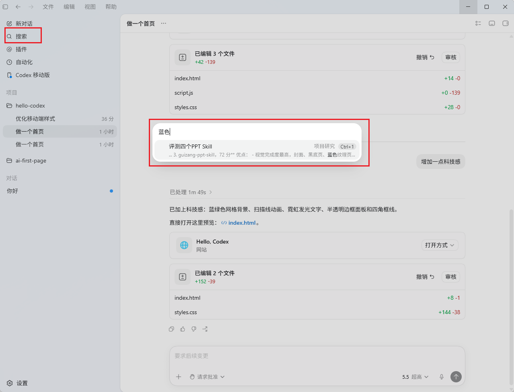
</p>

##### Plugins

There are many plugin features; they are covered later.

##### Automations

There are many automation features; they are covered later.

##### Projects

###### Create a project

You can create a new project directly in Codex, or use an existing project.

Projects you create or select appear in the project column for easier management later.

<p align="center">
  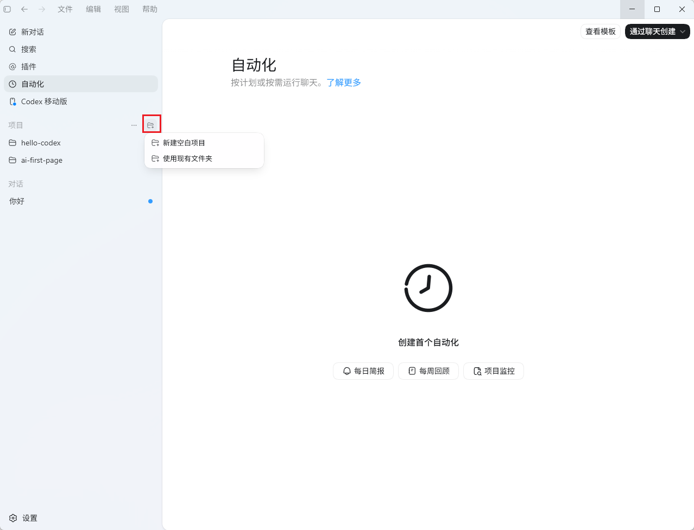
</p>

###### thread

A thread is a “separate task conversation” inside a project.

<p align="center">
  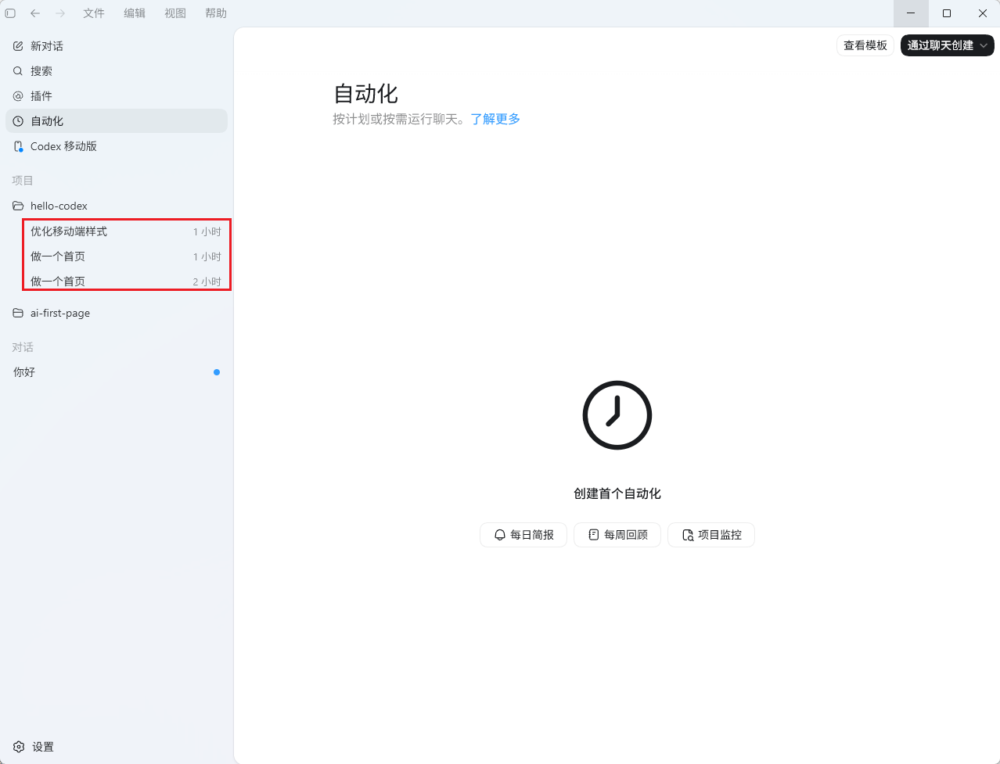
</p>

For example, suppose you have a project named:

```text
hello-codex
```

You can create multiple threads in that project:


| Thread | Task represented |
| --- | --- |
| Thread 1 | Build a home page |
| Thread 2 | Fix the button not responding to clicks |
| Thread 3 | Improve mobile layout |
| Thread 4 | Write a README for me |
| Thread 5 | Check whether the project has errors |


You can understand it this way:

```text
Project = a code folder
Thread = a specific task inside that project
```

For example:

```text
Project: Xiaohongshu cover generator
Thread 1: Build the home page
Thread 2: Fix image upload failure
Thread 3: Improve mobile layout
Thread 4: Write project documentation
```

**Why do threads exist?**

Because different tasks are better handled separately.

If you put “build the home page, fix bugs, adjust styles, and write documentation” into one conversation, Codex may get confused by the context, and you will have a harder time checking exactly what it changed.

A better practice is:

```text
One clear task = one thread
```

For example, if you want to build a page:

```text
Please build an AI tool introduction page for me.
```

That is one thread.

Later, if you find a button problem, open a new thread:

```text
Please check why the home-page button does not respond when clicked.
```

In one sentence:

**A thread is a task conversation in Codex App. One thread should handle one specific task.**


###### Waiting for approval

When Codex executes tasks, it often needs the user to approve permissions.

The corresponding conversation will show a “waiting for approval” label.

Click the corresponding conversation, then click Allow. Codex will continue with the next step.

<p align="center">
  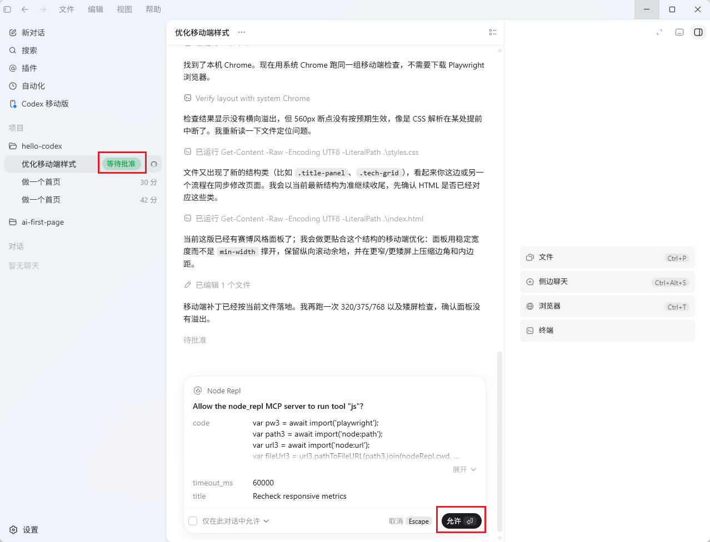
</p>

###### Archive

Archive means putting away a completed thread or a thread you do not plan to continue for now.

It does not delete code or merge code. It simply keeps your task list cleaner.

<p align="center">
  
</p>

For example, suppose you have completed these tasks:

```text
Thread 1: Improve mobile layout
Thread 2: Build a home page
Thread 3: Build a home page

```

If Thread 2 and Thread 3 are finished, and you do not plan to use Thread 1 either, you can archive them.

After archiving, they no longer occupy the current task list, and your project interface becomes cleaner.

**To unarchive a thread, you can find archived conversations in settings and restore them.**

<p align="center">
  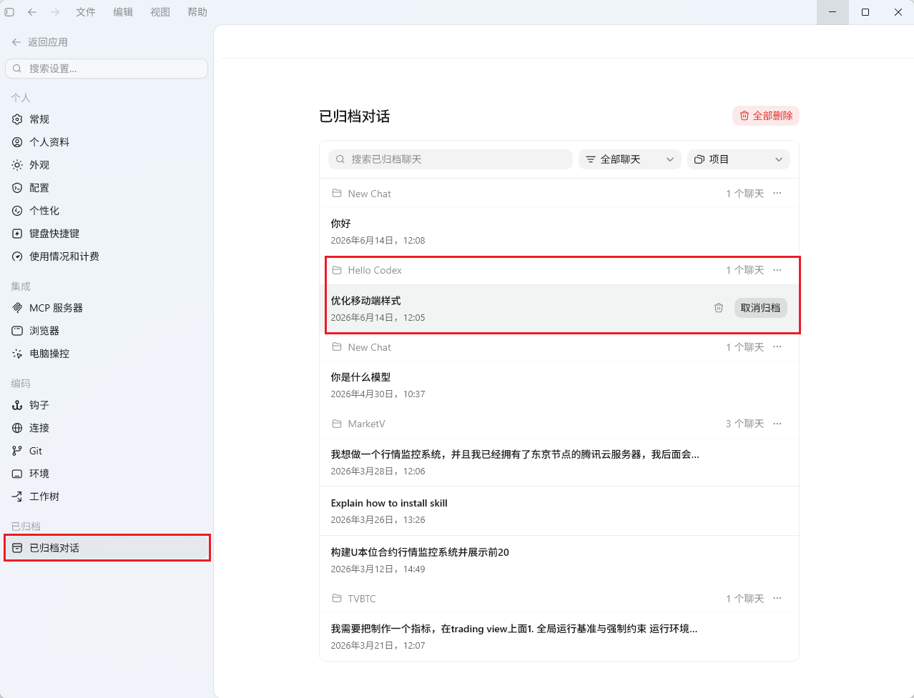
</p>

##### Settings

###### Remaining quota

Here you can see the current account's quota, rate limits, or usage status.

Different plans, workspaces, models, and versions may display different limits. How long you can use it, when limits reset, and whether additional quota can be purchased are all subject to the current Codex interface and official guidance.

<p align="center">
  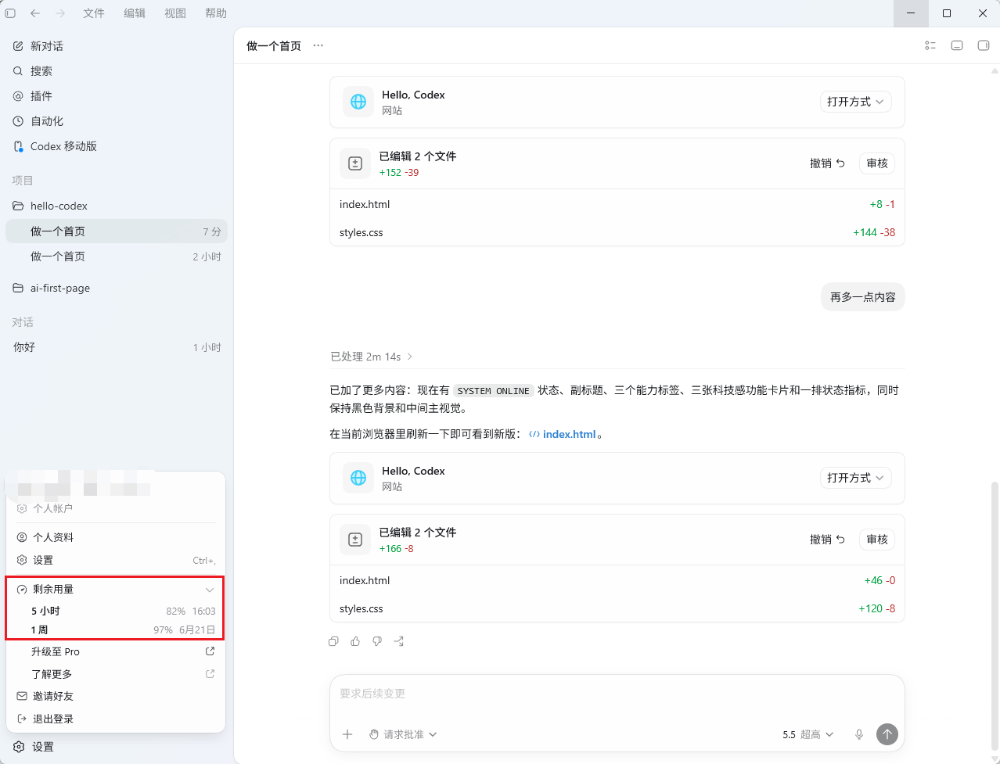
</p>

##### Conversation window

###### Permission control

###### Sandbox

To understand permission control, you first need to understand the concept of a sandbox.

You can think of it as:

> Codex can work inside a fence, but it cannot casually run outside the fence and change your computer.

Because Codex App is not an ordinary chat tool, it can read files, modify files, and run commands. Therefore, it needs a “fence” that limits what it can touch, whether it can access the network, and whether it can modify files outside the project. In official documentation, Codex sandbox modes include `read-only`, `workspace-write`, and `danger-full-access`, which control file-system and network-access boundaries.

###### **In simple terms**

Suppose your project folder is:

```text
D:\AI-Codex-Projects\hello-codex
```

If sandboxing is enabled, Codex normally works only within that project folder, for example:

```text
Can read index.html
Can modify style.css
Can run npm run dev
```

But if it wants to do these things, it may need your approval:

```text
Access desktop files
Read the Downloads folder
Modify files outside the project
Download things from the internet
Run high-risk commands
```

So:

```text
Sandbox = setting work boundaries for Codex
```

###### Three permission levels

<p align="center">
  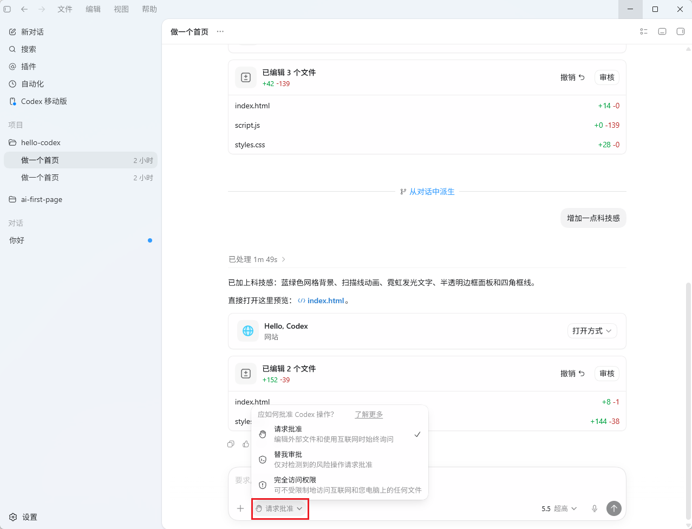
</p>


```text
Request approval
Approve for me
Full access
```

You can understand them like this:


| Option you see | Relationship to sandboxing |
| --- | --- |
| Request approval | Sandbox restrictions are active; operations outside the boundary ask you first |
| Approve for me | Let the system automatically decide some approvals for you |
| Full access | Sandbox restrictions are loosened; Codex can execute anything on the computer, with the highest risk |


Beginners should choose:

**Request approval or an automatic-approval option that still preserves boundaries**. If you are a beginner, prioritize a mode that does not open up the project boundary: let Codex work inside the current project, but still stop for confirmation when it needs to cross boundaries, access the network, or run high-risk commands. Option names may differ across versions, but the core principle is: do not start with full access.

###### One-sentence summary

**The sandbox is Codex's safety fence.**

It determines whether Codex can:

```text
Read files
Modify files
Access directories outside the project
Use the network
Run commands
```

###### Model selection

###### Reasoning effort

Reasoning effort is divided into four levels. Higher effort means stronger reasoning, but it also takes more time and consumes more tokens.

<p align="center">
  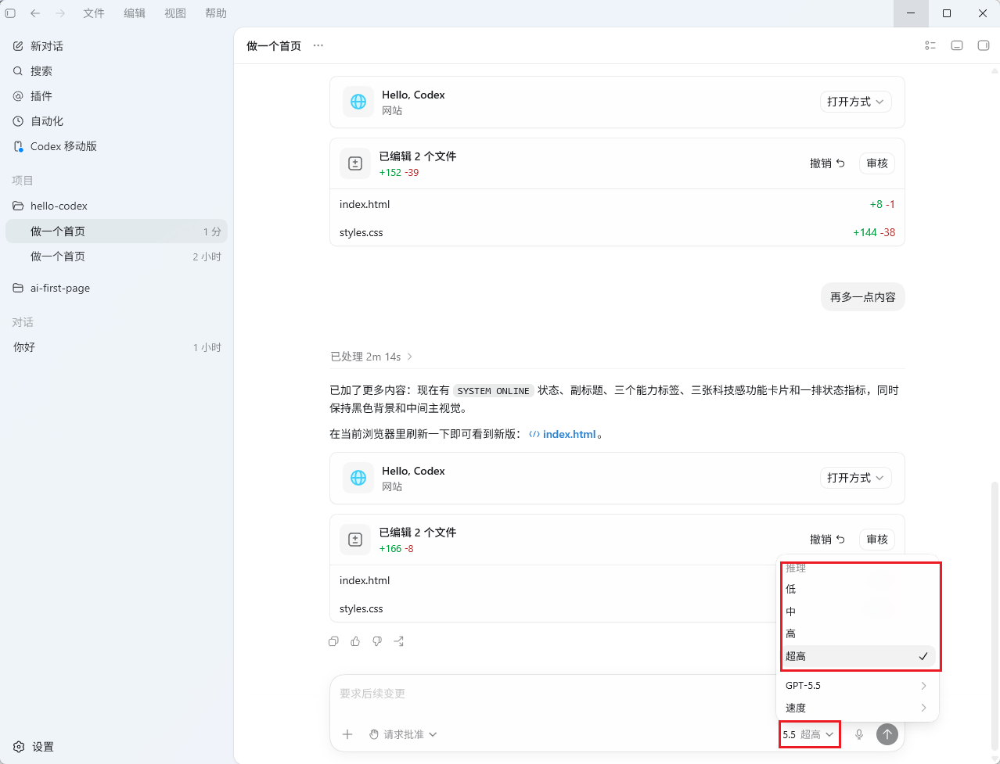
</p>


| Option | Simple meaning | Suitable tasks |
| --- | --- | --- |
| Low | Less thinking, faster, saves quota | Copy edits, color changes, small issues |
| Medium | Balanced speed and quality | Ordinary webpages, simple bugs, day-to-day development |
| High | Deeper thinking, better for complex problems | Multi-file edits, complex bugs, refactors |
| Very high | Most careful, slowest, most expensive | Difficult problems, architecture analysis, repeatedly unresolved bugs |


###### Model selection

Here you can choose different models. Model capability, availability, and consumption may change depending on account plan, region, version, and model catalog. Use the default recommended model for ordinary tasks. For complex tasks, consider switching to a stronger model or increasing reasoning effort.

<p align="center">
  
</p>

###### Speed

Some models or versions provide service tiers such as Standard / Fast.

Speed improvements, quota consumption, and availability of fast mode are all subject to the current interface. If a task is urgent and quota is sufficient, you can consider enabling it. Daily tasks do not need it by default.

<p align="center">
  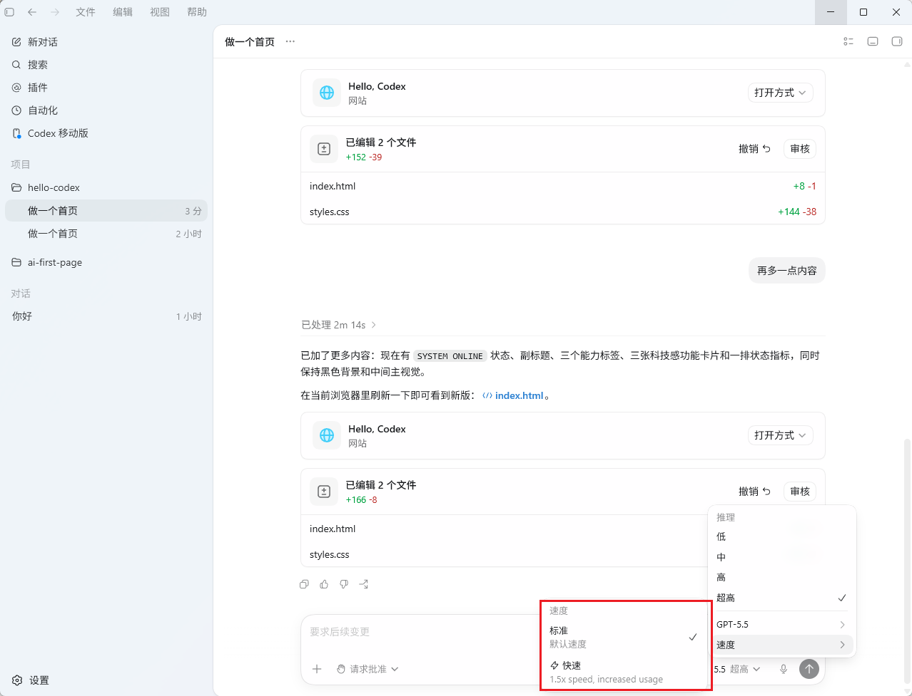
</p>

###### Guidance

You can insert guidance during execution.

If you notice that AI misunderstood your intent while it is executing, you should not let it keep going. Provide human guidance in time.

If you do not choose guidance, your next message may be queued. The AI will only execute it after finishing the previous task.

<p align="center">
  
</p>

###### Plan mode

After plan mode is enabled, Codex will not start working immediately. It first prepares a work plan, and begins only after you confirm it.

For all complex tasks, it is recommended to enable plan mode first. This helps catch missing details before implementation.

<p align="center">
  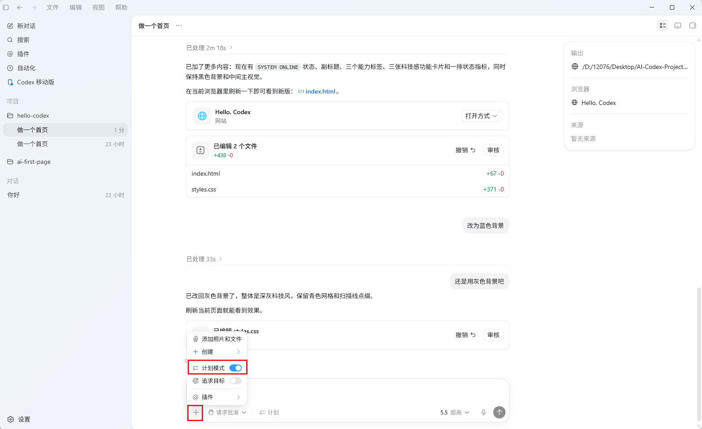
</p>

<p align="center">
  
</p>

##### Multi-purpose area

###### Comments

Comments appear in the upper-right area of the multi-purpose panel.

After opening a page in the built-in Codex browser, you will find a comment feature.

It lets the AI modify only a specific part of the page.

<p align="center">
  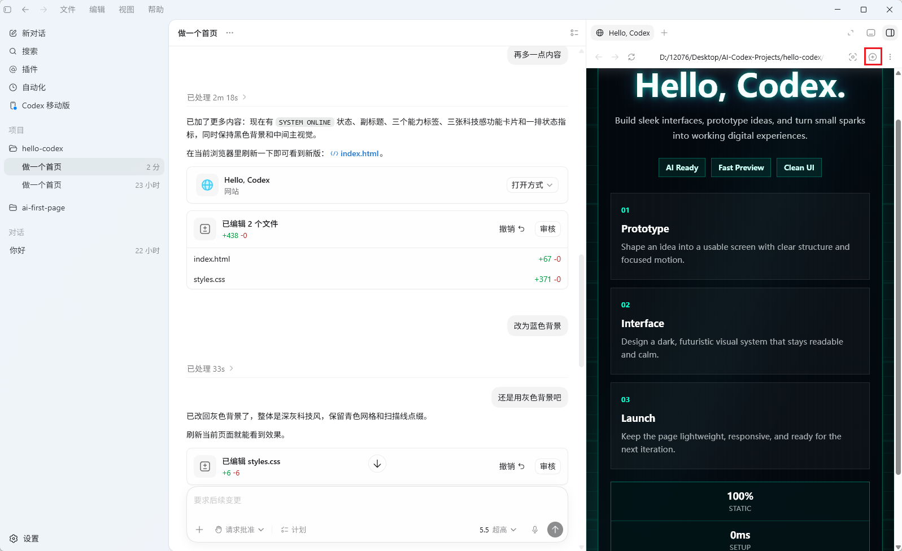
</p>

<p align="center">
  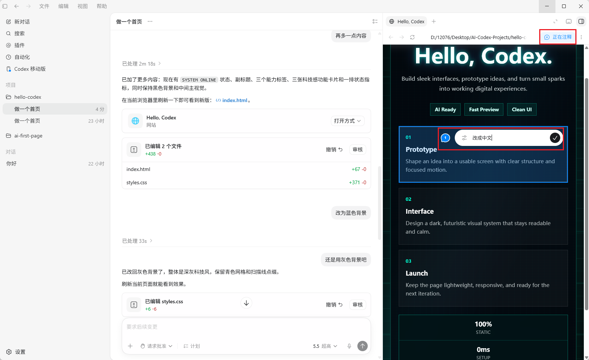
</p>

<p align="center">
  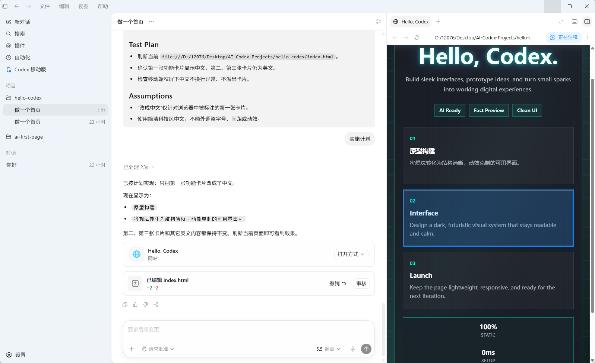
</p>


---

### Installing and getting started with Codex CLI

Codex CLI is the command-line version of Codex.

It is suitable for users willing to open a terminal, such as PowerShell, Terminal, iTerm, or Windows Terminal.

#### Installing on macOS / Linux

macOS has two common installation methods.

##### Method 1: Install with npm

First confirm that Node.js is installed on your computer.

Open Terminal and enter:

```text
node -v
npm -v
```

If you can see version numbers, Node.js and npm are available.

Then install Codex CLI:

```text
npm install -g @openai/codex
```

After installation, check whether it succeeded:

```text
codex --version
```

Or run it directly:

```text
codex
```

---

##### Method 2: Install with Homebrew

Mac users can also use Homebrew:

```text
brew install --cask codex
```

After installation, run:

```text
codex
```

Beginner recommendation:

- If Node.js is already installed, use npm.
- If you already use Homebrew, use brew.

#### Installing on Windows

Windows users are encouraged to use PowerShell or Windows Terminal.

Step 1: install Node.js.

After installation, open PowerShell and enter:

```text
node -v
npm -v
```

If you see version numbers, installation succeeded.

Step 2: install Codex CLI:

```text
npm install -g @openai/codex
```

Step 3: check whether installation succeeded:

```text
codex --version
```

Or run it directly:

```text
codex
```

When using Codex for the first time on Windows, do not run it inside a system directory.

Do not operate directly in these locations:

```text
C:\
System directories
Desktop
Downloads folder
Important document folders
```

Create a practice directory instead:

```text
D:\AI-Codex-Projects\hello-codex
```

#### First run

After installation, enter the following in a terminal:

```text
codex
```

On the first run, Codex asks you to sign in.

Codex CLI commonly supports two sign-in methods:

```text
1. Sign in with a ChatGPT account
2. Sign in with an OpenAI API key
```

Beginners should choose the first option: ChatGPT account sign-in.

##### Method 1: Sign in with a ChatGPT account

This is the best option for ordinary users and beginners.

Enter the following in the terminal:

```text
codex
```

Or:

```text
codex login
```

Then choose:

```text
Sign in with ChatGPT
```

The sign-in flow is roughly:

```text
1. Enter codex or codex login in the terminal
2. Choose Sign in with ChatGPT
3. The browser opens the sign-in page automatically
4. Enter your ChatGPT account
5. After successful sign-in, the browser returns the result to the terminal
6. Return to the terminal, and Codex CLI is ready to use
```

##### Method 2: Sign in with an API key

Codex CLI also supports signing in with an OpenAI API key.

API key sign-in is better suited for developers, automation scripts, CI/CD, server tasks, and similar scenarios.

Beginners can understand it this way:

```text
ChatGPT sign-in = uses your ChatGPT account and plan quota
API key sign-in = billed through the OpenAI Platform API
```

If you want to use API key sign-in, first create an API key on OpenAI Platform.

Then set the environment variable in your terminal.

On macOS / Linux:

```text
export OPENAI_API_KEY="your_API_key"
printenv OPENAI_API_KEY | codex login --with-api-key
```

On Windows PowerShell:

```text
$env:OPENAI_API_KEY="your_API_key"
$env:OPENAI_API_KEY | codex login --with-api-key
```

After successful sign-in, Codex CLI saves the login information. Later you can run:

```text
codex
```

and continue using it.

---

##### What is the difference between ChatGPT sign-in and API key sign-in?


| Comparison | ChatGPT account sign-in | API key sign-in |
| --- | --- | --- |
| Best for | Ordinary users, beginners | Developers, automation, CI/CD |
| Usage quota | Related to your ChatGPT plan | Billed through OpenAI Platform API |
| Onboarding difficulty | Easier | Slightly more complex |
| Recommended for beginners | Recommended | Not recommended at the beginning |
| Suitable for local practice | Suitable | Also possible, but usually unnecessary |
| Suitable for automation scripts | Generally | Better suited |


##### API key sign-in notes

API keys are sensitive and must not be leaked.

Do not put an API key:

```text
In code
In messages to others
In public screenshots
On GitHub
In README files
In frontend web pages
In Git commits
```

If you accidentally leak an API key, immediately delete or regenerate it on OpenAI Platform.

API key sign-in is convenient for automation, but it is billed according to API usage. Beginners should not run long tasks without understanding the cost model.

---

##### Check current login status

Use the following command to see whether you are currently signed in:

```text
codex login status
```

To sign out, run:

```text
codex logout
```

After signing out, you need to sign in again the next time you run Codex CLI.

#### Basic CLI commands

Codex CLI commands can be divided into two categories:


| Type | Where used | Purpose |
| --- | --- | --- |
| Terminal commands | Entered in PowerShell / Terminal | Start, sign in, update, diagnose, and manage Codex |
| Slash commands | Entered after entering Codex | Switch models, adjust permissions, inspect diffs, generate rules, exit sessions |


##### CLI terminal commands

CLI terminal commands are entered in PowerShell / Terminal / Windows Terminal.

###### Terminal commands beginners use most often


| Command | Purpose | Simple meaning | Use case |
| --- | --- | --- | --- |
| `codex` | Start Codex CLI | Open terminal Codex | Use after entering a project |
| `codex --version` | Show version | Check whether installation succeeded | First step after installation |
| `codex --help` | Show help | See supported commands | When you do not know how to use a command |
| `codex login` | Sign in to Codex | Use a ChatGPT account or API key | First use |
| `codex login status` | Show login status | See whether you are signed in | Login troubleshooting |
| `codex logout` | Sign out | Clear local login state | Switching accounts or using a public computer |
| `codex doctor` | Check environment issues | Automatically generate a diagnostic report | Startup failure, login failure, environment issues |
| `codex update` | Update Codex | Update CLI version | When you need to upgrade |
| `codex app` | Open Codex App | Open the desktop app from the terminal | When you want to switch to the GUI |


---

###### Project navigation commands


| Command | Purpose | Example | Simple meaning |
| --- | --- | --- | --- |
| `cd project-directory` | Enter a project folder | `cd D:\\AI-Codex-Projects\\hello-Codex` | Move into the project first |
| `codex` | Start Codex in the current directory | `codex` | Let Codex work in the current project |
| `codex --cd project-path` | Start with a specified directory | `codex --cd D:\\AI-Codex-Projects\\hello-Codex` | Specify the project without running `cd` first |
| `codex -C project-path` | Short form of `--cd` | `codex -C ./hello-Codex` | Shorter syntax |


The simplest beginner-friendly flow is:

```text
cd project-directory
codex
```

Do not run Codex directly in these locations:

```text
C:\
Desktop
Downloads folder
System directories
Important document folders
```

---

###### Login-related commands


| Command | Purpose | Best for |
| --- | --- | --- |
| `codex login` | Open browser by default and sign in with ChatGPT account | Beginner first choice |
| `codex login --device-auth` | Sign in with a device code | Remote servers, when browser cannot open |
| `printenv OPENAI_API_KEY \| codex login --with-api-key` | Sign in with API key | Developers, automation, CI/CD |
| `codex login status` | Show current login method and status | When you are unsure whether you are signed in |
| `codex logout` | Delete locally saved login credentials | Switching accounts, public computers |


Use API key sign-in on Windows PowerShell:

```text
$env:OPENAI_API_KEY | codex login --with-api-key
```

---

###### Send a task at startup


| Command | Purpose | Example |
| --- | --- | --- |
| `codex "task content"` | Start Codex and send the first task directly | `codex "Please explain this project structure"` |
| `codex -i image-path "task"` | Attach an image for analysis | `codex -i ./error.png "Analyze this error"` |
| `codex --image image-path "task"` | Full form of `-i` | `codex --image ./ui.png "Improve the page based on this screenshot"` |
| `codex --search "task"` | Allow search capability | `codex --search "Look up the latest usage of this library"` |


Suitable for:

```text
Simple project explanation
Error screenshot analysis
Modification suggestions based on a UI screenshot
Looking up newer version documentation
```

For beginners, it is better to run:

```text
codex
```

first, then enter the task. This makes it easier to observe the execution process.

---

###### Model, permission, and sandbox commands


| Command | Purpose | Simple meaning | Beginner recommendation |
| --- | --- | --- | --- |
| `codex --model model-name` | Specify a model | Choose the AI brain | Use default; change for complex tasks |
| `codex -m model-name` | Short form of `--model` | Shorter syntax | No need to memorize |
| `codex --sandbox read-only` | Read-only mode | Can only inspect; avoids modification | Use when only analyzing a project |
| `codex --sandbox workspace-write` | Current project is readable and writable | Can work inside the project | Recommended for daily use |
| `codex --sandbox danger-full-access` | Fully loosen restrictions | Very broad permissions | Beginners should not use |
| `codex --ask-for-approval on-request` | Ask before sensitive operations | Request approval | Recommended for beginners |
| `codex -a on-request` | Short form of approval mode | Shorter syntax | Recommended |


Recommended beginner combination:

```text
codex --sandbox workspace-write --ask-for-approval on-request
```

This means:

```text
Codex can work inside the current project, but sensitive operations must ask me first.
```

Do not treat this as a convenience mode:

```text
codex --sandbox danger-full-access
```

---

###### Non-interactive task commands


| Command | Purpose | Simple meaning | Suitable scenarios |
| --- | --- | --- | --- |
| `codex exec "task"` | Execute a one-off task | Does not enter a long conversation; ends after running | Automation, checks, reports |
| `codex e "task"` | Short form of `exec` | Same as above | Quick execution |
| `codex exec --cd project-path "task"` | Execute in a specified directory | Run a one-off task inside a project | Automation scripts |
| `codex exec resume` | Resume an exec session | Continue a previous non-interactive task | After an automation task is interrupted |
| `codex exec resume --last` | Resume the most recent exec session | Continue the latest task | Most commonly used resume option |


Example:

```text
codex exec "Please check whether the current project has any obvious issues"
```

At the beginner stage, prioritize:

```text
codex
```

After becoming familiar, use `codex exec`.

---

###### Session management commands


| Command | Purpose | Simple meaning | Use case |
| --- | --- | --- | --- |
| `codex resume` | Resume a previous session | Continue an earlier thread | Last task was unfinished |
| `codex resume --last` | Resume the most recent session | Continue the latest task | Most commonly used |
| `codex archive` | Archive a session | Put away tasks you no longer need | Task finished or abandoned |
| `codex unarchive` | Restore an archived session | Recover an archived task | Continue after archiving |
| `codex fork` | Copy an old session into a new thread | Preserve original task and try a new direction | Exploring multiple approaches |


In simple terms:

```text
resume = continue
archive = put away
unarchive = restore
fork = copy one session to try a new approach
```

---

###### Diagnostic, update, and maintenance commands


| Command | Purpose | When to use |
| --- | --- | --- |
| `codex doctor` | Generate a diagnostic report | Codex startup, login, or environment issues |
| `codex update` | Check and update Codex CLI | When you want to upgrade |
| `codex completion` | Generate shell completion script | Users who often use terminals |
| `codex features list` | Show feature flags | Troubleshoot whether a feature is enabled |
| `codex features enable feature-name` | Enable a feature | Advanced configuration |
| `codex features disable feature-name` | Disable a feature | Advanced configuration |


Beginners most commonly use:

```text
codex doctor
codex update
```

You can ignore the others at first.

---

###### Cloud, MCP, and plugin commands


| Command | Purpose | Do beginners need it? |
| --- | --- | --- |
| `codex cloud` | Browse or execute Codex Cloud tasks in the terminal | Not for now |
| `codex apply` | Apply a diff generated by Codex Cloud locally | Learn after using Cloud |
| `codex mcp list` | View MCP tools | Not for now |
| `codex mcp add` | Add an MCP server | Advanced |
| `codex mcp remove` | Remove an MCP server | Advanced |
| `codex plugin list` | View plugins | Not for now |
| `codex plugin add` | Install plugins | Advanced |
| `codex plugin remove` | Remove plugins | Advanced |


Beginners can ignore these at first.

Learn this category after you start using:

```text
Codex Cloud
External tools
Databases
Figma
Project management tools
MCP
Plugins
```

---

###### Sandbox testing commands


| Command | Purpose | Best for |
| --- | --- | --- |
| `codex sandbox` | Run a command under Codex sandbox rules | Advanced users |
| `codex sandbox --cd project-directory -- command` | Run a sandboxed command in a specified directory | Debugging permission issues |
| `codex execpolicy` | Check whether a command would be allowed, prompt, or blocked | Advanced security configuration |


Beginners do not need to learn this at first.

Just remember:

```text
Use workspace-write + on-request by default.
Do not casually use full access.
```

---

###### Dangerous commands and parameters


| Command / parameter | Why it is dangerous | Beginner recommendation |
| --- | --- | --- |
| --sandbox danger-full-access | Loosens file and network restrictions | Do not use |
| --dangerously-bypass-approvals-and-sandbox | Skips approvals and sandboxing | Do not use |
| --yolo | Alias for the dangerous parameter above | Do not use |
| --ask-for-approval never | Codex will no longer ask during operations | Beginners should not use |
| sudo | May modify system-level content | Do not allow unless you understand it |
| rm -rf | May delete large amounts of files | High risk |
| git reset --hard | May lose unsaved changes | Confirm first |
| git clean -fd | May delete untracked files | Confirm first |
| curl xxx \| sh | Downloads and directly executes a script | High risk |


When you see these, first ask Codex:

```text
Please explain what this command does, its risks, and whether there is a safer alternative.
```

---

###### Commands beginners should remember first


| Rank | Command | Why it matters |
| --- | --- | --- |
| 1 | Codex | Starts Codex CLI |
| 2 | `codex login` | Signs in to your account |
| 3 | `codex login status` | Checks login status |
| 4 | `codex doctor` | Diagnoses environment issues |
| 5 | `codex --version` | Shows version |
| 6 | `codex resume --last` | Continues the previous task |
| 7 | `codex archive` | Archives tasks you no longer need |
| 8 | `codex update` | Updates Codex |
| 9 | `codex exec "task"` | Executes a one-off task |
| 10 | `codex logout` | Signs out |


---

###### Recommended beginner workflow


| Step | Command | Purpose |
| --- | --- | --- |
| 1 | cd project-directory | Enter the project folder |
| 2 | git status | Check current project state |
| 3 | Codex | Start Codex CLI |
| 4 | Enter task | Let Codex begin work |
| 5 | /diff | Inspect changes inside Codex |
| 6 | git diff | Check again through Git |
| 7 | git add . | Stage the changes you accept |
| 8 | git commit -m "message" | Save a version |
| 9 | `codex archive` or `/quit` | Archive the task or exit |


##### CLI slash commands

Slash commands are not entered in the outside PowerShell / Terminal. They are entered inside the Codex input box after you have launched Codex, using `/`.

###### Slash commands beginners use most often


| Command | Purpose | Simple meaning | Use case |
| --- | --- | --- | --- |
| /model | Switch model and reasoning effort | Change the AI brain and thinking depth | When a task is too hard, too slow, or you want to save quota |
| /permissions | Adjust permissions | Control whether Codex can edit files, access network, or run commands | When you want to tighten or loosen permissions |
| /diff | View code changes | See exactly what Codex changed | Must inspect after Codex modifies files |
| /plan | Enter plan mode | Ask Codex for a plan before changing code | Before complex tasks, bug fixes, or refactors |
| /init | Generate AGENTS.md | Create a project rules file | First use in a new project |
| /status | Show current status | Check model, permissions, context, token usage, and more | When you are unsure about current configuration |
| /quit | Exit Codex CLI | End the current session | After a task is complete |
| /exit | Exit Codex CLI | Similar to /quit | After a task is complete |


---

###### Model and speed related


| Command | Purpose | When to use |
| --- | --- | --- |
| /model | Choose model and reasoning effort | When switching GPT-5.5, mini, or low/medium/high reasoning |
| /fast | Turn Fast mode on or off | When you want supported models to respond faster |
| /personality | Adjust response style | When you want Codex to be more concise, explanatory, or collaborative |
| /status | Show current model and context state | When you want to confirm what is currently being used |


Beginner recommendation:

```text
Ordinary tasks: default model + medium reasoning
Complex bugs: high reasoning
Simple copy edits: low reasoning
Do not use the highest reasoning for every task
```

---

###### Permissions and safety


| Command | Purpose | Simple meaning | Recommendation |
| --- | --- | --- | --- |
| /permissions | Modify permission policy | Control what Codex can do | Beginners should keep “request approval” |
| /approve | Approve an operation that was automatically blocked | Let a blocked operation retry once | Use only after understanding the risk |
| /sandbox-add-read-dir | Allow reading an additional directory | Let Codex read a specified directory outside the project | Windows-specific scenarios; use sparingly |
| /status | View permissions and writable directories | Confirm Codex's current permission scope | Check after changing permissions |


Beginner recommendation:

```text
Use /permissions and keep request approval by default.
Do not casually enable full access.
Do not use /approve for operations you do not understand.
```

---

###### Code inspection and review


| Command | Purpose | Simple meaning | Use case |
| --- | --- | --- | --- |
| /diff | View current Git diff | See what was added and removed | Must inspect after modifications |
| /review | Ask Codex to review current changes | Let it check whether code has problems | Before committing |
| /copy | Copy the latest Codex output | Quickly copy results | Copying plans, summaries, command explanations |
| /raw | Toggle raw output mode | Easier to copy long logs or terminal output | When logs are long |


Recommended flow:

```text
Codex finishes modifications
→ /diff to inspect changes
→ /review to check issues
→ If everything looks good, git commit
```

---

###### Session management


| Command | Purpose | Simple meaning | Use case |
| --- | --- | --- | --- |
| /new | Start a new conversation | Switch to a new task inside the current CLI | Current task is done and you want a new task |
| /clear | Clear the terminal and start a new chat | Clean current display and context | When the interface is cluttered or you want to restart |
| /resume | Resume a previous session | Continue an earlier task | Previous task was unfinished |
| /archive | Archive current session and exit | Put away an unused task | Task is done or plan is abandoned |
| /fork | Copy current session into a new thread | Preserve original approach and try another branch | Trying another solution |
| /side | Open a temporary side conversation | Ask a small question without affecting the main task | Temporarily confirm a detail |
| /quit | Exit CLI | End current use | Task complete |
| /exit | Exit CLI | Same as /quit | Task complete |


Beginner distinctions:

```text
/new = start a new task
/clear = clean up and restart
/archive = put away the current task
/fork = copy the current task to try a new approach
/side = ask a temporary small question
```

---

###### Context and long conversations


| Command | Purpose | Simple meaning | Use case |
| --- | --- | --- | --- |
| /compact | Compact the current conversation | Summarize a long conversation into key points | When the conversation is long or context is nearly full |
| /status | Show context usage | See how much context space remains | After many rounds of work |
| /mention | Attach files or folders | Tell Codex to focus on specific files | When you want it to inspect only a few files |
| /ide | Bring in current IDE context | Add files currently open in the editor | Use with VS Code / Cursor |


Beginner recommendation:

```text
Use /compact when the conversation becomes long.
Use /mention when you want Codex to inspect specific files.
If you do not want it scanning the whole project, specify the files clearly.
```

---

###### Project rules and capabilities


| Command | Purpose | Simple meaning | Use case |
| --- | --- | --- | --- |
| /init | Generate AGENTS.md | Create a project rules file | First Codex use in a new project |
| /skills | Browse and use Skills | Choose specialized capabilities | UI, documentation, review, and other task types |
| /memories | Configure memory | Control whether Codex uses or creates memories | Manage long-term preferences |
| /goal | Set a task goal | Give Codex a persistent goal | Large or long-running tasks |
| /apps | Browse connectable apps | Let Codex use external apps | When connecting external tools |
| /plugins | Manage plugins | View or enable plugin capabilities | When plugin tools are needed |
| /mcp | View MCP tools | See which external tools Codex can call | Check after configuring MCP |


Beginners should first master:

```text
/init
/skills
```

Other commands can be learned later.

---

###### Terminal and background tasks


| Command | Purpose | Simple meaning | Use case |
| --- | --- | --- | --- |
| /ps | View background terminal tasks | See which commands are still running | When npm dev, tests, or builds are still running |
| /stop | Stop background terminal tasks | Terminate a command running in the background | When a command is stuck or should stop |
| /raw | Raw output mode | Easier to copy terminal logs | When logs are long |


Common scenario:

```text
Codex ran npm run dev
You want to see whether it is still running
→ use /ps

The command is stuck
→ use /stop
```

---

###### Interface and keyboard shortcuts


| Command | Purpose | Simple meaning | Commonly used? |
| --- | --- | --- | --- |
| /theme | Switch code highlighting theme | Change terminal display style | Usually not |
| /statusline | Configure the bottom status bar | Show model, token, Git branch, and more | Advanced |
| /title | Configure terminal title | Show project information in the window title | Advanced |
| /keymap | Modify keyboard shortcuts | Customize operation keys | Advanced |
| /vim | Toggle Vim editing mode | Edit the input box in Vim style | For Vim users |
| /debug-config | View configuration hierarchy | Troubleshoot why configuration does not take effect | Advanced troubleshooting |


Beginners can ignore these at first.

---

###### Developer and advanced features


| Command | Purpose | Best for |
| --- | --- | --- |
| /experimental | Enable experimental features | Users who like trying new features |
| /hooks | View and manage lifecycle hooks | Advanced users, team projects |
| /feedback | Send logs or feedback | When you need to report an issue |
| /agent | Switch active agent thread | Users working with subagent workflows |


These are not required for onboarding.

Beginners only need to know they exist.

---

###### The 8 commands beginners should remember first


| Rank | Command | Why it matters |
| --- | --- | --- |
| 1 | /diff | Shows what Codex actually changed |
| 2 | /plan | Asks for a plan before complex tasks |
| 3 | /permissions | Controls permissions and avoids unsafe changes |
| 4 | /model | Switches model and reasoning effort |
| 5 | /status | Shows current model, permissions, and context |
| 6 | /init | Generates project rules |
| 7 | /compact | Compacts long conversations |
| 8 | /quit | Exits Codex |


---

###### Recommended beginner workflow


| Step | Command | Purpose |
| --- | --- | --- |
| 1 | /init | Generate project rules |
| 2 | /permissions | Confirm permissions are not too broad |
| 3 | /model | Confirm model and reasoning effort |
| 4 | /plan | Plan first for complex tasks |
| 5 | Enter task | Let Codex begin work |
| 6 | /diff | Inspect code changes |
| 7 | /review | Ask Codex to check once more |
| 8 | /status | View current status and context |
| 9 | /compact | Compact when conversation becomes too long |
| 10 | /quit | Exit Codex |


---

###### One-sentence summary

Slash commands are quick control commands inside Codex CLI.

Beginners do not need to memorize all of them. Start with these:

```text
/diff       inspect changes
/plan       plan first
/permissions control permissions
/model      switch model
/status     check status
/init       create rules
/compact    compact long conversations
/quit       exit
```

#### How the CLI works

Codex CLI can be understood as a complete workflow:

```text
Read project
→ Understand task
→ Propose plan
→ Modify files
→ Run commands
→ Wait for approval
→ Show diff
→ Handle failures
```

Beginners do not need to understand every technical detail at first. Just remember:

Codex CLI does not only chat. It really enters the current project directory, reads files, modifies files, runs commands, and shows you the result for inspection.

---

###### How Codex reads a project

When you run the following inside a project directory:

```text
codex
```

Codex treats the current directory as the workspace.

For example, if you start it in:

```text
D:\AI-Codex-Projects\hello-codex
```

Codex works around the contents of that folder.

It may read:


| Content | Purpose |
| --- | --- |
| Project files | Understand current code |
| Folder structure | Determine whether the project is frontend, backend, or scripts |
| package.json | Identify startup commands, dependencies, and project type |
| README.md | Understand project documentation |
| AGENTS.md | Read the working rules you wrote for Codex |
| Error logs | Analyze root causes |
| Git status | Determine which files have changed |


In simple terms:

```text
The folder where you start Codex
is the folder Codex treats as the current project by default.
```

So do not start it casually in:

```text
C:\
Desktop
Downloads folder
System directories
Important document folders
```

Recommended practice:

```text
cd project-directory
codex
```

---

###### How Codex understands a task

After you enter a task, Codex first determines what you want it to do.

For example, if you enter:

```text
Please build a simple webpage with a black background and “Hello Codex” centered in the middle.
```

Codex will infer:


| What it understands | Example |
| --- | --- |
| Task type | Create a webpage |
| Modification scope | Current project files |
| Files likely needed | index.html, style.css |
| Whether commands are needed | Simple HTML may not require commands |
| Risk level | Low risk |


If you enter:

```text
Please check why npm run build fails.
```

Codex will infer:


| What it understands | Example |
| --- | --- |
| Task type | Diagnose build failure |
| Commands likely needed | npm run build |
| Files likely needed | package.json and error-related files |
| Whether code changes are needed | Possibly |
| Whether approval is needed | Depends on permission settings |


Beginner tip:

The clearer the task, the more stable Codex becomes.

Recommended format:

```text
Please help me complete [specific task].

Requirements:
1.
2.
3.

Constraints:
1. Do not modify unrelated files
2. Do not delete existing functionality
3. After completion, tell me which files changed
```

---

###### How Codex proposes a plan

Before complex tasks, Codex usually analyzes the problem and then proposes a plan.

You can also explicitly ask it to plan first:

```text
Please give me a plan first. Do not modify files directly.
```

Or use:

```text
/plan
```

A plan usually includes:


| Content | Purpose |
| --- | --- |
| Which files it intends to inspect | Prevents uncontrolled project scanning |
| How it intends to modify | Lets you understand the direction first |
| Which commands it may run | Lets you understand risk in advance |
| Which areas may be affected | Helps you decide whether to accept |


For example:

```text
Plan:
1. Inspect package.json first to confirm startup commands
2. Run npm run build to reproduce the error
3. Locate related files based on the error
4. Fix the issue with the smallest scope
5. Run build again to verify
```

Beginner recommendation:

```text
Simple tasks can be executed directly.
Complex tasks should start with /plan.
```

Plan first especially for:

```text
Complex bug fixes
Multi-file changes
Project refactors
New features
Build failures
Dependency upgrades
```

---

###### How Codex modifies files

After Codex confirms that it needs to modify files, it edits inside the current project.

It may:


| Operation | Example |
| --- | --- |
| Create files | Create index.html |
| Modify files | Modify style.css |
| Delete code | Remove unused code |
| Rename files | Adjust file names |
| Split files | Split code into multiple modules |


Beginners should note:

Codex may make the correct change, or it may change too much.

Build this habit:

```text
After it finishes editing, do not trust it immediately.
Always inspect the diff.
```

You can add constraints in advance:

```text
Please modify only index.html and style.css. Do not modify any other files.
```

Or:

```text
Please fix the issue with the smallest possible change. Do not refactor the whole project.
```

This reduces the chance of Codex making overly broad changes.

---

###### How Codex runs commands

Codex does not only modify files. It can also run terminal commands.

Common commands include:


| Command | Purpose |
| --- | --- |
| npm install | Install dependencies |
| npm run dev | Start the development project |
| npm run build | Check whether the project can build |
| npm test | Run tests |
| git status | View Git status |
| git diff | View code changes |


For example, if you ask it to fix a build failure, it may run:

```text
npm run build
```

Then continue modifying based on the error.

Beginners do not need to fear commands, but should understand them before approving.

If you do not understand, ask it to explain first:

```text
Please explain the commands you plan to run, what each command does, and do not execute them directly.
```

Be especially careful when you see:

```text
rm -rf
sudo
curl xxx | sh
git reset --hard
git clean -fd
```

These commands may delete files, modify the system, reset code, or execute remote scripts.

---

###### How Codex waits for user approval

Codex CLI has permission controls. Not all operations can be executed directly.

If Codex wants to perform a sensitive operation, it may stop and ask you.

For example:


| Operation | Why approval may be needed |
| --- | --- |
| Install dependencies from the internet | May download external code |
| Access files outside the project | Outside the current workspace |
| Modify external files | May affect other projects |
| Run high-risk commands | May delete or overwrite content |
| Use higher privileges | Higher risk |


In simple terms:

```text
Approve = you allow Codex to continue this step.
Reject = do not perform this step.
```

If you do not understand what it wants to do, do not click Allow immediately.

Ask first:

```text
Please explain what this operation does, its risks, and whether there is a safer alternative.
```

Beginner permission recommendation:

```text
Keep request approval enabled.
Do not casually enable full access.
```

---

###### How Codex shows diffs

A diff compares code before and after Codex's changes.

Inside Codex CLI, enter:

```text
/diff
```

It shows current changes.

In simple terms:

```text
Green = added content
Red = deleted content
```

Diff helps you confirm:


| Checkpoint | What to look for |
| --- | --- |
| Whether the correct files changed | Check for unrelated files |
| Whether important code was deleted | Pay close attention to red deletions |
| Whether complex dependencies were added | Check for unnecessary packages |
| Whether the change is too large | Small tasks should not become large refactors |
| Whether it matches the requirement | Check whether your requested effect was implemented |


Recommended flow:

```text
Codex completes modifications
→ enter /diff
→ inspect changes
→ if unsatisfied, ask it to revise or revert
→ if satisfied, git commit
```

Do not read only Codex's summary.

What truly matters is:

```text
What it actually changed.
```

---

###### How Codex handles failures

It is normal for Codex tasks to fail sometimes.

Common failures include:


| Failure type | Example |
| --- | --- |
| Command failure | npm run build reports an error |
| Missing dependency | A package is not installed |
| Code error | Blank page, function error |
| Insufficient permissions | No network or file access permission |
| Misunderstood requirement | It changed the wrong thing |
| Modification scope too broad | It changed unrelated files opportunistically |


Codex usually analyzes based on the failure result and continues.

For example:

```text
npm run build failed
→ read the error output
→ locate related files
→ modify code
→ run build again
```

But pay attention:

Do not let it try randomly forever.

If it fails repeatedly, pause it and ask it to re-analyze:

```text
Pause. Please summarize the current failure causes and do not continue modifying files.
```

Or:

```text
Please list what you have tried, why each attempt failed, and the smallest next-step fix.
```

If it messed up the code, say:

```text
Please revert the previous changes and restore the state before modification.
```

Or inspect manually with Git:

```text
git status
git diff
```

Then decide what to keep.

---

###### Recommended beginner workflow


| Step | Action | Purpose |
| --- | --- | --- |
| 1 | cd project-directory | Enter the correct project |
| 2 | Codex | Start Codex CLI |
| 3 | Enter task | Tell Codex what to do |
| 4 | Use /plan first for complex tasks | Inspect the proposed approach |
| 5 | Wait for Codex to read the project | Let it understand context |
| 6 | Approve sensitive operations | Allow only after understanding |
| 7 | Wait for it to modify files | Execute the task |
| 8 | Run commands to check | Verify the result |
| 9 | /diff | Inspect changes |
| 10 | Continue revising if unsatisfied | Iterate |
| 11 | git commit when satisfied | Save the version |


---

###### One-sentence summary

Codex CLI does not work as “ask one question, get one answer.” It follows a complete programming workflow:

```text
Read project
→ Think through solution
→ Modify files
→ Run commands
→ Wait for approval
→ Inspect diff
→ Fix failures
→ Deliver result
```

#### Common CLI issues

Most common Codex CLI issues are not because Codex itself is broken. They usually come from these areas:

##### Most common beginner issues


| Issue | Common cause | Solution |
| --- | --- | --- |
| Nothing happens after entering `codex` | Codex was not installed correctly, or command is not in environment variables | Run `codex --version` first |
| `command not found` | Terminal cannot find the Codex command | Reinstall Codex CLI or reopen terminal |
| Do not know where to run Codex | Not inside a project directory | Run `cd project-directory` first, then Codex |
| Codex reads the wrong project | Started in the wrong folder | Exit, enter the correct project directory, and restart |
| Login failure | Browser did not open, network issue, or account not signed in | Run `codex login` again |
| API key sign-in failure | Key not set, incorrect key, or environment variable not applied | Set environment variable again and sign in |
| Codex keeps waiting | It may be waiting for permission approval | Check whether the terminal shows an approval prompt |
| Codex cannot access network | Sandbox or permission restriction | Approve manually when network access is needed |
| Do not know what changed | Did not inspect diff | Enter /diff in Codex |
| What if it breaks the code? | Did not save with Git beforehand | Use git diff to inspect and revert if needed |


---

##### Installation issues


| Issue | Cause | Solution |
| --- | --- | --- |
| `codex --version` has no output | Codex was not installed successfully | Reinstall Codex CLI |
| `codex: command not found` | Command is not in PATH | Reopen terminal or reinstall |
| npm installation fails | Node.js / npm not installed correctly | Run node -v and npm -v first |
| Command not found after Windows installation | PowerShell did not refresh environment variables | Close and reopen terminal |
| Version too old | Codex CLI not updated | Run `codex update` or reinstall |


Troubleshooting commands:

```text
codex --version
node -v
npm -v
codex doctor
```

Beginner recommendation:

```text
After installation, the first thing is not to use it directly. Run codex --version first.
If you see a version number, the basic installation is normal.
```

---

##### Login issues


| Issue | Cause | Solution |
| --- | --- | --- |
| Unsure whether you are signed in | Login status not checked | Run `codex login status` |
| Browser does not open automatically | Default browser issue or remote environment | Use `codex login --device-auth` |
| ChatGPT login fails | Network, account, or browser-cache issue | Run `codex login` again |
| API key login fails | Environment variable not set correctly | Check OPENAI_API_KEY |
| Want to switch accounts | Old account is saved locally | Run `codex logout` first, then sign in again |


Common commands:

```text
codex login
codex login status
codex logout
codex login --device-auth
```

Beginner recommendation:

```text
Use ChatGPT account sign-in first for local learning.
API key sign-in is better suited for developers, automation, and server scenarios.
```

---

##### Project directory issues


| Issue | Cause | Solution |
| --- | --- | --- |
| Codex cannot see project files | Not inside project directory | cd into the project directory first |
| Codex reads the wrong files | Started in the wrong directory | Exit and re-enter the correct directory |
| Codex scans too much | Started on Desktop, Downloads, or C drive | Start only inside a specific project folder |
| Unsure where you are | Do not know terminal's current path | Use cd on Windows, pwd on Mac |
| Cannot find a file | File is not in the current project | Use /mention to specify it, or enter the correct directory |


Recommended method:

```text
cd D:\AI-Codex-Projects\hello-codex
codex
```

Not recommended:

```text
Run in the C drive root
Run on the Desktop
Run in the Downloads folder
Run in important document folders
```

In one sentence:

```text
Wherever you run codex, Codex treats that directory as the project by default.
```

---

##### Permission and sandbox issues


| Issue | Cause | Solution |
| --- | --- | --- |
| Codex says approval is needed | It wants to perform a sensitive operation | Allow only after understanding |
| Codex cannot access network | Sandbox limits network by default | Approve manually when needed |
| Codex cannot read files outside the project | Outside workspace scope | Do not casually loosen this |
| Codex cannot modify some files | Insufficient permission or read-only mode | Check /permissions |
| Codex requests full access | Task needs broader permission | Beginners should not casually agree |


Recommended setting:

```text
sandbox: workspace-write
approval: on-request
```

In simple terms:

```text
workspace-write = allow work inside the current project
on-request = ask before sensitive operations
```

Do not casually use:

```text
danger-full-access
--yolo
--dangerously-bypass-approvals-and-sandbox
```

When you see a permission request you do not understand, ask:

```text
Please explain why this operation needs permission, which files it affects, and whether there is a safer alternative.
```

---

##### Command execution issues


| Issue | Cause | Solution |
| --- | --- | --- |
| npm run dev fails | Dependencies not installed or script missing | Inspect package.json first |
| npm install fails | Network, registry, permission, or dependency conflict | Ask Codex to analyze the error first |
| npm run build fails | Project code itself has an error | Let Codex reproduce and fix minimally |
| Command hangs | Development server keeps running | Use /ps to inspect background tasks |
| Want to stop command | Command keeps occupying the terminal | Use /stop to stop background task |


Common command meanings:


| Command | Meaning |
| --- | --- |
| npm install | Install project dependencies |
| npm run dev | Start the development environment |
| npm run build | Check whether the project can build for production |
| npm test | Run tests |
| git status | View project change status |
| git diff | View specific changes |


If you do not understand a command, ask Codex to explain first:

```text
Please explain the commands you plan to run, what each command does, and do not execute them directly.
```

---

##### Diff and change issues


| Issue | Cause | Solution |
| --- | --- | --- |
| Do not know what Codex changed | Did not inspect diff | Enter /diff |
| Diff contains too many changes | Codex modified too broadly | Ask for minimal changes |
| Unrelated files changed | Task constraints were unclear | Ask it to revert unrelated changes |
| Important code was deleted | Red deletions were not checked | Restore with Git or ask it to revert |
| /diff shows nothing | No file changes, or changes were already handled | Check again with git status |


Recommended inspection flow:

```text
Codex completes task
→ enter /diff
→ check which files changed
→ inspect red deleted parts
→ check whether unrelated files changed
→ commit only after you are satisfied
```

Prompt example:

```text
Please modify only files related to the current task.
Do not refactor the whole project.
After completion, list which files were modified.
```

---

##### Git-related issues


| Issue | Cause | Solution |
| --- | --- | --- |
| Code broke and you do not know how to recover | Did not save a version with Git | In the future, run git init and commit first |
| git status shows many files | Codex or you changed many things | Inspect each change with git diff |
| Do not know which changes to keep | Diff was not inspected | Do not commit yet |
| Want to roll back after commit | Git basics are unfamiliar | Ask Codex to explain rollback options first |
| Codex changed files it should not change | Task scope was too broad | Ask it to revert unrelated files |


Recommended first steps for a beginner project:

```text
git init
git add .
git commit -m "initial commit"
```

After each Codex modification:

```text
git status
git diff
```

In simple terms:

```text
git status = see which files changed
git diff = see exactly what changed
commit = save a version
```

---

##### Model and quota issues


| Issue | Cause | Solution |
| --- | --- | --- |
| A model is not visible | Plan, region, or permission differs | Use currently available models |
| Task becomes slow | Strong model, high reasoning, or large project | Lower reasoning or narrow task scope |
| Quota is consumed too quickly | High reasoning, many revision rounds, large project reading | Use low/medium reasoning for small tasks |
| Limit reached | Current plan quota is exhausted | Wait for quota reset or buy additional quota |
| API key incurs cost | API sign-in is billed by API usage | Beginners should prioritize ChatGPT sign-in |


Quota-saving tips:

```text
Do not use highest reasoning for small tasks.
Do not ask Codex to scan the entire project at once.
Do not repeatedly ask for broad refactors.
Specify files when you can.
For complex tasks, use /plan first, then modify.
```

Recommended configuration:

```text
Ordinary tasks: default model + medium reasoning
Complex bugs: high reasoning
Small edits: low reasoning
```

---

##### Codex is stuck or the result is wrong


| Issue | Cause | Solution |
| --- | --- | --- |
| Codex does not move | Waiting for permission, command stuck, or task too large | Check whether there is an approval prompt or /ps |
| Codex cannot fix it after repeated attempts | Root cause not found | Ask it to summarize failure causes first |
| Codex makes the project messier | Modification scope was not constrained | Pause and ask for the smallest change |
| Codex misunderstood the requirement | Task description was too vague | Rewrite goals, requirements, and constraints clearly |
| Output is too long or chaotic | Conversation context is too long | Use /compact |


You can stop it like this:

```text
Pause. Do not continue modifying files.
Please summarize what has been done, where it failed, and what the next smallest modification should be.
```

If it went in the wrong direction, say:

```text
This direction is wrong. Please revert the unrelated changes from the previous attempt and keep only changes related to the homepage style.
```

---

##### Common Windows issues


| Issue | Cause | Solution |
| --- | --- | --- |
| PowerShell does not recognize Codex | Environment variables not refreshed | Close and reopen terminal |
| Path with spaces causes errors | Path not quoted | Use English-only paths or quote the path |
| API key command does not apply | Windows and Mac commands differ | Use PowerShell syntax |
| Frequent permission popups | Windows security restrictions or sandbox approvals | Keep request approval enabled |
| Chinese path behaves abnormally | Some tools do not handle Chinese paths well | Prefer English project paths |


Recommended Windows project path:

```text
D:\AI-Codex-Projects\hello-codex
```

Not recommended:

```text
C:\Users\your-name\Desktop\New Folder
```

Reason:

```text
Chinese paths, spaces, and Desktop directories can be more error-prone.
```

---

##### Common macOS issues


| Issue | Cause | Solution |
| --- | --- | --- |
| Insufficient permission prompt | Folder permission restriction | Move to a project folder under your user directory |
| Command not found | PATH not active | Reopen Terminal |
| npm permission issue | Global installation permission issue | Prefer the official recommended installation method |
| Browser login does not return to terminal | Browser block or network issue | Use device auth |
| Unfamiliar with terminal paths | Do not know current directory | Use pwd and ls |


Recommended project path:

```text
~/AI-Codex-Projects/hello-codex
```

Common check commands:

```text
pwd
ls
codex --version
codex doctor
```

---

##### Run `codex doctor` for diagnostics

If you do not know where the problem is, run:

```text
codex doctor
```

It is useful for diagnosing:

```text
Installation issues
Login issues
Configuration issues
Terminal environment issues
Permission issues
System environment issues
```

In simple terms:

```text
codex doctor = Codex's health-check command.
```

When encountering a complex issue, you can send the doctor output to Codex and ask it to analyze:

```text
Based on the codex doctor output, please help me determine what is wrong with the CLI.
```

---

##### General beginner troubleshooting flow


| Step | Command / action | Purpose |
| --- | --- | --- |
| 1 | `codex --version` | Check whether installation succeeded |
| 2 | `codex login status` | Check whether you are signed in |
| 3 | pwd / cd | Confirm current project directory |
| 4 | git status | Check project state |
| 5 | `codex doctor` | Check environment issues |
| 6 | /permissions | Check permission settings |
| 7 | /diff | View file changes |
| 8 | /ps | View background tasks |
| 9 | /stop | Stop a stuck command |
| 10 | /compact | Compact context when the conversation is too long |


---

### Codex IDE Extension

Install Codex directly inside your code editor.

You do not need to open Codex App separately or keep switching to the terminal. Instead, you can use Codex directly from the sidebar in editors such as VS Code, Cursor, and Windsurf.


#### How to understand Codex IDE Extension


| Concept | Simple meaning |
| --- | --- |
| IDE | Software used to write code, such as VS Code, Cursor, or Windsurf |
| Codex IDE Extension | Codex installed inside the editor |
| Sidebar | Where Codex appears, similar to a chat panel |
| Current file | The file currently open in your editor |
| Selected code | The code segment selected with your mouse |
| Context | Files, code, errors, and task descriptions Codex can reference |


In simple terms:

```text
Codex IDE = call Codex directly inside your coding software to help you work
```

#### Who Codex IDE Extension is for


| User type | Fit |
| --- | --- |
| People using VS Code | Suitable |
| People using Cursor | Suitable |
| People using Windsurf | Suitable |
| People who want to modify code while reading it | Suitable |
| People who want Codex to look only at the current file | Suitable |
| People who do not want to touch an editor at all | Less suitable |
| People who prefer graphical task management | Better suited to Codex App |
| People who prefer terminals | Better suited to Codex CLI |


#### Which editors Codex IDE Extension supports


| Editor | Notes |
| --- | --- |
| VS Code | The most common beginner code editor |
| VS Code Insiders | The preview version of VS Code |
| Cursor | AI editor based on VS Code |
| Windsurf | AI editor compatible with the VS Code extension ecosystem |
| JetBrains IDE | Examples include IntelliJ, PyCharm, WebStorm, Rider |


Beginner recommendation:

```text
VS Code or Cursor
```

#### How to install Codex IDE Extension


| Step | Action |
| --- | --- |
| 1 | Open VS Code / Cursor / Windsurf |
| 2 | Go to the Extensions marketplace |
| 3 | Search for Codex |
| 4 | Install OpenAI's Codex extension |
| 5 | Restart the editor after installation |
| 6 | Find the Codex icon in the sidebar |
| 7 | Click Codex and sign in |
| 8 | Open a project folder and start using it |


If you cannot find the Codex icon in Cursor, the sidebar icon may be collapsed. Check the left or right activity bar and pin Codex there.

---

#### First login

After installation, Codex IDE Extension prompts you to sign in.

There are two common sign-in methods:


| Login method | Best for | Beginner recommendation |
| --- | --- | --- |
| ChatGPT account sign-in | Ordinary users, beginners | Recommended |
| API key sign-in | Developers, automation, special scenarios | Not recommended at first |


Beginners should choose:

```text
Sign in with ChatGPT
```

That means signing in with your ChatGPT account.

API key sign-in is more suitable for developers who understand API billing and environment variables.

---

#### Where to open Codex IDE Extension

After successful installation, Codex usually appears in the editor sidebar.

Common locations:


| Editor | Possible location |
| --- | --- |
| VS Code | Right sidebar by default, or left activity bar |
| Cursor | May be on the left or right, or collapsed |
| Windsurf | Usually in the extension sidebar |
| JetBrains | Plugin panel or tool window |


If you cannot find it, try:

```text
1. Restart the editor
2. Open Extensions and confirm Codex is installed
3. Check whether the Codex icon appears in the left activity bar
4. Check whether the Codex panel appears in the right sidebar
5. Search for Codex in the command palette
```

---

#### What Codex IDE Extension can do


| Feature | Simple meaning | Example |
| --- | --- | --- |
| Read current file | Inspect the code you are currently viewing | Explain this file |
| Read selected code | Look only at the selected part | Explain this function |
| Modify code | Edit files directly for you | Change the button to blue |
| Run commands | Execute commands in the project | npm run build |
| Fix errors | Modify based on error information | Fix build failure |
| Generate documentation | Write README or comments | Write a README based on the project |
| Switch models | Use a stronger or faster model | GPT-5.5 / mini |
| Adjust reasoning | Control thinking depth | Low / Medium / High |
| Control permissions | Control file editing and network access | Chat / Agent / Full Access |
| Delegate to cloud | Send large tasks to Cloud | Run in the cloud |


### Codex Web

Codex Web is the cloud-based Codex used in a browser.

It does not require your local computer to remain open, and it does not necessarily require terminal operations. You can connect a GitHub repository and let Codex read code, execute tasks, modify files, and generate reviewable results in a cloud environment.

#### How to understand Codex Web


| Concept | Simple meaning |
| --- | --- |
| Codex Web | The web version of Codex |
| Cloud Task | A cloud task that does not necessarily run on your computer |
| Repository | A code repository on GitHub |
| Branch | A code branch, like an independent modification version |
| Pull Request | A request that submits Codex's changes for your review |
| Environment | The environment Codex needs to run your project in the cloud |
| Setup Script | Installation commands executed before the cloud environment starts |
| Maintenance Script | Optional maintenance scripts, such as updating dependencies or preparing data |


In one sentence:

```text
Codex Web = let Codex handle GitHub projects for you in the cloud.
```

---

#### Who Codex Web is for


| User type | Fit |
| --- | --- |
| People with GitHub repositories | Suitable |
| People who want Codex to process tasks in the cloud | Suitable |
| People who want Codex to create PRs | Suitable |
| Team project developers | Suitable |
| People who do not want to keep a local computer occupied | Suitable |
| Complete beginners with no GitHub | Less suitable |
| People doing only local HTML practice | Better suited to Codex App |
| People who do not know Git / GitHub | Learn the basics first |


Beginner recommendation:

```text
Start local practice with Codex App.
After the project is on GitHub, learn Codex Web.
```

---

#### Where to find Codex Web

Codex Web entry point:

```text
chatgpt.com/codex
```

After opening it, you need to:


| Step | Action |
| --- | --- |
| 1 | Sign in to your ChatGPT account |
| 2 | Enter the Codex page |
| 3 | Connect your GitHub account |
| 4 | Choose the repository to work on |
| 5 | Create a cloud task |
| 6 | Wait for Codex to run in the cloud |
| 7 | Review the result and diff |
| 8 | Create a Pull Request when satisfied |


---

#### Difference between Codex Web and local Codex


| Comparison | Codex Web | Codex App / CLI / IDE |
| --- | --- | --- |
| Where it runs | Cloud | Local computer |
| Project source | GitHub repository | Local folder or Git repository |
| Does your computer need to stay on? | Not necessarily | Usually yes |
| Suitable for PR workflows | Very suitable | Also possible, but more local-oriented |
| Suitable for beginner practice | Average | App is better suited |
| Depends on GitHub? | Usually yes | Not necessarily |
| Suitable tasks | Repository tasks, PRs, team collaboration | Local development, quick edits, debugging |


Simple understanding:

```text
Local Codex = works on your computer
Codex Web = works in the cloud for GitHub repositories
```

---

#### First-use flow for Codex Web


| Step | Action | Simple meaning |
| --- | --- | --- |
| 1 | Open Codex Web | Enter web Codex |
| 2 | Sign in to ChatGPT | Confirm your account |
| 3 | Connect GitHub | Allow Codex to access your repositories |
| 4 | Choose a repository | Select a project to work on |
| 5 | Choose a branch | Select the version to start from |
| 6 | Enter a task | Tell Codex what to do |
| 7 | Wait for execution | Codex works in the cloud |
| 8 | View result | See which files changed |
| 9 | Review diff | Inspect added and deleted content |
| 10 | Create PR | Submit for review by yourself or the team when satisfied |


---

#### What connecting GitHub means

Connecting GitHub means:

Giving Codex Web permission to access the GitHub repositories you specify.

It needs to read repository code to complete tasks.

For example, if you ask Codex Web:

```text
Please fix the issue where the homepage button does not respond to clicks.
```

It needs to read your project code first, determine where the button logic is, and then modify the relevant files.

In simple terms:

```text
GitHub = cloud drive for code
Codex Web = enters that code cloud drive to help you modify the project
```

Notes:

```text
Do not casually authorize accounts or organizations you do not trust.
Do not grant Codex access to all repositories at the beginning.
If you can authorize only a few repositories, authorize only the ones needed.
```

---

#### What is a repository?

Repository, often shortened to repo, can be understood as:

A complete code project.

For example:

```text
my-landing-page
ai-tools-site
xiaohongshu-cover-generator
my-react-app
```

All of these can be repositories on GitHub.

Codex Web usually creates tasks around one repository.

In simple terms:

```text
Repository = a project folder stored on GitHub
```

---

#### What is a branch?

A branch can be understood as:

An independent version of the code.

For example:

```text
main = official version
feature/homepage = homepage modification version
fix/button-bug = version for fixing the button bug
```

Codex Web usually does not casually modify the official branch directly. It works from a branch and then generates inspectable changes.

In simple terms:

```text
main = original draft
new branch = a copy created for modification
PR = submit the modified version for your review
```

---

#### What is a Pull Request?

Pull Request is often shortened to PR.

Beginners can understand it as:

After Codex finishes modifying code, it does not directly merge the code into the official project. Instead, it submits a “change request.”

Inside a PR, you can see:

```text
Which files changed
Which code was added
Which code was deleted
Whether tests passed
Codex's summary
Whether it can be merged
```

The benefit of a PR is:

```text
Review first, then merge.
```

This makes Codex Web well suited to real projects and team projects.

---

#### How to create a task in Codex Web

When creating a task, write clearly:

```text
Goal: what Codex should do
Scope: which areas it may modify
Constraints: which areas must not be touched
Validation: how to check completion
```

Example:

```text
Please fix the issue where the homepage button does not respond to clicks.

Requirements:
1. First analyze where the button click logic is
2. Modify only files related to the button
3. Do not refactor the whole project
4. Do not delete existing functionality
5. After the fix, run build or test commands to verify
6. After completion, explain which files were modified
```

Not recommended:

```text
Help me optimize the project.
```

This is too vague, and Codex may not know where to begin.

---

#### How Codex Web runs a project

Codex Web creates a runtime environment in the cloud.

It usually:

```text
1. Pulls code from the GitHub repository
2. Switches to the specified branch or commit
3. Runs the setup script to install dependencies
4. Reads files based on your task
5. Modifies code
6. Runs tests or build commands
7. Generates a diff and summary
```

If the project needs dependencies, configure the setup script correctly.

For example, a frontend project may need:

```text
npm install
```

Or:

```text
pnpm install
```

If the environment is not configured correctly, Codex may fail because dependencies are missing.

---

#### What is an Environment?

Environment can be understood as:

The cloud computer configuration Codex Web uses to run your project.

It needs to know:

```text
Which language to use
How to install dependencies
How to start the project
How to run tests
Which environment variables are required
Whether special tools are needed
```

For example, a frontend project may require:

```text
Node.js
npm / pnpm
package.json
npm run build
```

A Python project may require:

```text
Python
pip
requirements.txt
pytest
```

In simple terms:

```text
Environment = the toolbox Codex needs to run the project in the cloud.
```

---

#### What is a Setup Script?

Setup Script can be understood as:

A set of installation commands Codex Web runs each time it prepares the cloud environment.

For example:

```text
npm install
```

Or:

```text
pip install -r requirements.txt
```

Its purpose is:

```text
Install the dependencies needed by the project first.
```

If the setup script is wrong, Codex may fail to run the project.

Beginner recommendation:

```text
Start with the simplest installation command.
Do not put dangerous commands in the setup script.
Do not put passwords or API keys in it.
```

---

#### Network access in Codex Web

The cloud environment of Codex Web does not mean unrestricted internet access.

Usually:

```text
Network access may be allowed during dependency installation
Network access may be restricted by default during the actual agent task
```

In simple terms:

```text
Dependency installation may access the internet; task execution may not freely access the internet.
```

This improves safety and prevents arbitrary external network access during task execution.

If your task must access the network, check whether workspace and environment settings allow it.

---

#### Codex Web permissions to watch

Codex Web mainly involves these permissions:


| Permission | What to watch |
| --- | --- |
| GitHub repository permission | Which repositories it can read |
| Branch permission | Whether it can create branches |
| PR permission | Whether it can create Pull Requests |
| Cloud permission | Whether the workspace allows Codex Cloud |
| Environment variables | Do not leak API keys, tokens, or passwords |
| External network | Whether cloud tasks can access the internet |


Beginner safety recommendations:

```text
Authorize only the repositories needed.
Do not authorize all repositories.
Do not put .env, API keys, passwords, or tokens in tasks.
Do not let Codex automatically merge PRs.
Review first, then merge.
```

---

#### What Codex Web is good for


| Scenario | Example |
| --- | --- |
| Fix bugs in GitHub repositories | Fix buttons, build failures, test failures |
| Build small features | Add a page, add a form |
| Write documentation | README, usage guide, deployment guide |
| Code review | Inspect the current PR or diff |
| Fix CI errors | Fix issues based on build logs |
| Background processing for multiple tasks | Let Codex run in the cloud without occupying the local computer |
| Team collaboration | Let the team review through PRs |


Especially suitable for:

```text
GitHub projects
Team projects
Projects requiring a PR flow
Tasks where you do not want to keep a local computer running
```

---

#### What Codex Web is not good for

Beginners should not start with Codex Web for:

```text
Local small exercises without GitHub
Projects where you do not know Git at all
Real production deployment
Database migrations
Payment system changes
Automatic PR merging
Deleting large numbers of files
Handling sensitive secrets
```

These are not impossible, but the risk is higher.

Beginner recommendation:

```text
Use Codex App for local practice first.
After learning GitHub, use Codex Web for repository tasks.
```

---

#### Are Codex Web and Codex Cloud the same thing?

You can understand them like this:

```text
Codex Web = the interface you operate in the browser
Codex Cloud = the cloud capability that runs tasks behind the scenes
```

That is:

```text
You enter a task in Codex Web,
Codex Cloud executes it in a cloud environment.
```

Beginners do not need to worry too much about the terminology.

For daily use:

```text
Codex Web = web entry point
Cloud task = cloud task
```

---

#### Recommended first Codex Web task

Do not choose a complex project for the first attempt.

Choose a simple GitHub repository, such as:

```text
Simple HTML page
Small React project
Personal homepage
README project
Small utility page
```

Task example:

```text
Please check whether this project's README is clear.

Requirements:
1. Read the current project structure
2. Explain what content is missing from the README
3. Add installation steps, startup commands, and project structure notes
4. Do not modify code logic
5. Create a PR after completion
```

This task is low-risk and suitable for learning the Codex Web flow.

---

#### Common issues


| Issue | Possible cause | Solution |
| --- | --- | --- |
| Cannot find repository | GitHub not authorized, or repository permission not granted | Recheck GitHub authorization |
| Codex cannot create PR | No branch or PR permission | Check GitHub permissions |
| Task execution fails | Setup script error or dependency installation failure | Check environment configuration |
| Codex does not know how to start the project | README or package.json is unclear | Add project documentation |
| Tests fail | Project has bugs or incomplete dependencies | Ask Codex to analyze failure causes first |
| Quota consumed quickly | Large task, strong model, repeated runs | Narrow the task scope and plan first |
| Too many changes | Task is too vague | Clearly limit which files may be changed |
| Unsatisfactory result | Requirements unclear or environment failed | Add comments and ask Codex to revise |


---

#### Beginner safety rules

```text
1. Do not authorize all GitHub repositories at the beginning.
2. Do not let Codex automatically merge PRs.
3. Do not put API keys, passwords, or tokens in tasks.
4. Do not commit .env files to the repository.
5. Ask Codex for a plan first on complex tasks.
6. Always inspect the diff in PRs.
7. Do not merge changes you do not understand.
8. Do not let Codex automatically deploy production projects.
9. Practice with simple repositories first.
10. Merge only after you are satisfied.
```

---

---

## Part 3: Core capabilities in depth

### Automations

#### What are automations?

**Codex automations mean Codex does not merely “follow your commands,” but can regularly inspect a project, discover issues, and handle problems according to rules.**

It is like hiring an “AI on-call engineer” for your project:

> Most of the time, it does not interrupt you.  
> When there is an issue, it reminds you.  
> For simple issues, it tries to fix them first.  
> In the end, you review and decide.


#### How to use automations

A “weekly Codex session review” is a good example of how automations can make Codex more useful over time.

You can ask Codex to periodically review recent session history, task results, and recurring issues, then distill them into a reusable workflow profile.

Example prompt:

```text
Please search and review the Codex session history and execution logs from the past week, and maintain a “Codex Session Review and Personal Style Profile.”

Requirements:
1. Prefer available session-history retrieval capabilities. If logs need to be read, perform only search, metadata extraction, and relevant snippet extraction. Do not load entire large session files.
2. Do not reproduce raw logs, private content, secrets, internal reasoning, or long original conversations.
3. Summarize execution lessons: which practices caused issues, what the final correct approach was, and which scenarios can reuse it.
4. Summarize my preferences: UI design preferences, product principles, interaction principles, content-system preferences, and workflow preferences.
5. Organize reusable rules: rewrite review conclusions into concise rules that later Codex sessions can follow.
6. When updating documents, deduplicate and merge similar rules, while preserving date ranges or task types as source clues.
7. If any rules are suitable for long-term reuse, recommend whether they should be added to project-level or user-level AGENTS.md.
```

<p align="center">
  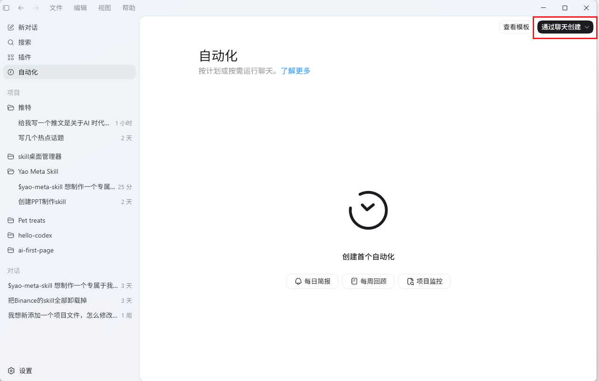
</p>

<p align="center">
  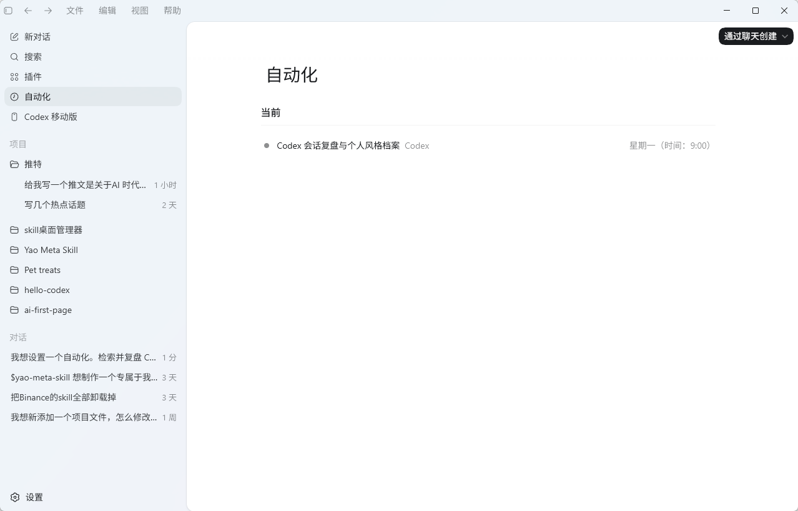
</p>

### Plugins

Plugins are additional “capability packages” installed for Codex.

#### What is a plugin?

Codex can already read code, modify code, and run commands. Plugins extend that baseline by connecting more tools, applying fixed workflows, or adding specialized capabilities.

For example:


| Plugin type | What it lets Codex do |
| --- | --- |
| Chrome plugin | Open webpages, inspect pages, and debug with the browser |
| Gmail plugin | Summarize emails and draft replies |
| Google Drive plugin | Read documents, spreadsheets, and slides |
| Slack plugin | Summarize channel messages and draft team replies |
| Security plugin | Check code security issues |
| Computer Use plugin | Operate applications on the computer |


#### Relationship between Plugins, Skills, and MCP (start with this table)

Plugin, Skill, and MCP are the three easiest concepts to confuse in this part. They do not replace each other; each works at a different layer. Remember the summary table below first, and later sections will not repeat the same comparison.

| Comparison | Plugin | Skill | MCP |
| --- | --- | --- | --- |
| One sentence | Installable capability package | A fixed working method | Interface for connecting external tools |
| Problem solved | Installing, packaging, and distributing capabilities | “How to do” a class of tasks | “Which tool or data to connect” |
| Scope | Largest; can package Skills, MCP, and more | Smaller; workflow for one task category | Connection to one external tool or data source |
| Analogy | Toolbox | Manual inside the toolbox | Socket that powers the toolbox |
| Who uses it | Ordinary users can install with one click | Ordinary users can use it too | More oriented to developer and team configuration |
| Examples | GitHub plugin, Figma plugin | README Skill, code-review Skill | Database MCP, documentation MCP |

Remember one sentence: **Plugins can package Skills and MCP into easier-to-install capability bundles; Skills define “how to do it,” while MCP defines “what tool to connect.”**

#### How to install plugins in Codex App

##### Open Codex App

<p align="center">
  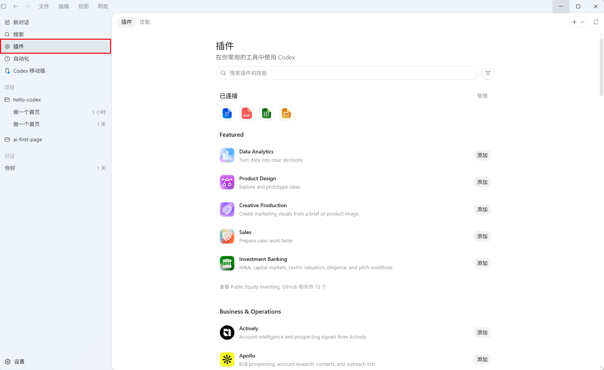
</p>

##### Search or browse plugins

You can also search for the plugin you need.

<p align="center">
  
</p>

##### Open plugin details

<p align="center">
  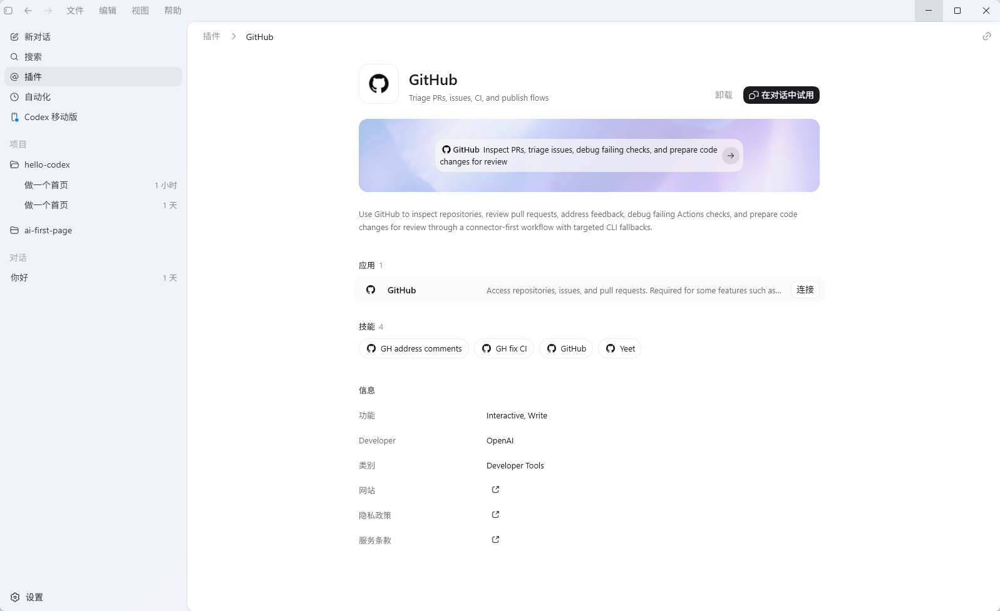
</p>

##### Click Add to Codex or the add button

<p align="center">
  
</p>

##### After installation, open a new thread to use it

<p align="center">
  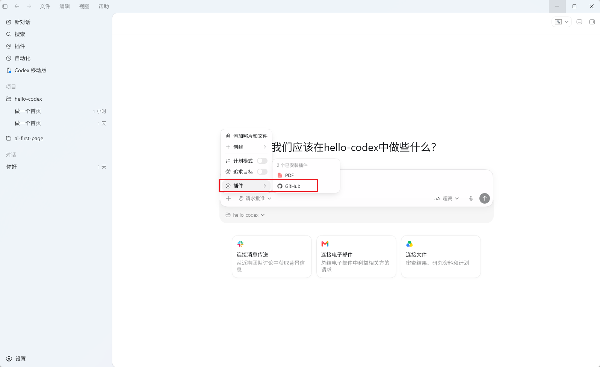
</p>

#### How to install plugins in Codex CLI

After entering the project directory, start Codex first:

```text
codex
```

Then enter inside Codex CLI:

```text
/plugins
```

After opening the plugin list, you can:


| Action | Description |
| --- | --- |
| Search plugins | Find the plugin you need |
| View details | See what the plugin can do and which permissions it needs |
| Install plugin | Install the plugin |
| Uninstall plugin | Uninstall the plugin |
| Space | Enable or disable an installed plugin |


#### Common plugins and capability areas

The plugin directory changes depending on Codex version, workspace, and account permissions. The following is not a fixed ranking, but a list of common capability areas. The actual installable content is subject to your current Codex plugin page.

| Type | Included plugins | Suitable for |
| --- | --- | --- |
| Browser and computer operation | Chrome, Computer Use | Web testing, automated clicks, software operation |
| Code and project collaboration | GitHub | Repository management, bug fixing, PR creation |
| Frontend and design | Build Web Apps, Figma | Generate webpages, convert designs to code |
| Office deliverables | Documents, Presentations, Spreadsheets | Documents, PPT, spreadsheet analysis |
| Video generation | HyperFrames, Remotion | Generate videos using code or HTML |


| No. | Plugin / capability | Main purpose | Simple meaning |
| --- | --- | --- | --- |
| 1 | Chrome | Lets Codex operate the browser directly | Open webpages, click buttons, inspect page effects, test web features |
| 2 | GitHub | Code repository management and collaboration | Let Codex read repositories, handle issues, modify code, create PRs |
| 3 | Computer Use | Lets Codex operate the computer | See the screen, click buttons, operate software like a person; high permission level |
| 4 | Build Web Apps | Generate frontend web apps from a sentence | Enter requirements and generate webpages, small tools, landing pages, demos |
| 5 | Figma | Design-to-code and prototype work | Convert Figma designs into frontend pages; suitable for UI development |
| 6 | Documents | AI-assisted formal document delivery | Generate README, project docs, tutorials, product documentation |
| 7 | Presentations | Generate high-quality PPTs | Create reports, courses, product introductions, and proposal decks |
| 8 | Spreadsheets | AI data analysis and spreadsheet handling | Organize Excel files, analyze data, generate spreadsheet conclusions |
| 9 | HyperFrames | Generate videos directly from HTML | Use webpage / HTML structures to generate video content |
| 10 | Remotion | Generate high-quality video with code | Use React / code to create more professional videos |


### Skill

A Skill is a “fixed working method” prepared for Codex.

Codex itself can read code, modify code, and run commands.

But if you often ask it to do the same kind of task, such as writing READMEs, doing code reviews, generating webpages, or organizing documents, you can turn that workflow into a Skill.

#### What is a Skill?


| Concept | Simple meaning |
| --- | --- |
| Skill | A fixed working method |
| Prompt | The prompt for this task |
| Workflow | The work process |
| Template | A fixed template |
| Instruction | Long-term rules for Codex |
| Resource | Reference material included in the Skill |
| Script | Optional automation script included in the Skill |


For example, if you always want Codex to write a README that must include:

```text
Project introduction
Installation steps
Startup commands
File structure
FAQ
```

You can create a README Skill.

After that, you do not need to explain the rules from scratch each time. Call the Skill, and Codex follows that workflow.


---

#### Skill or MCP? When to use which

For the overall difference between Plugins, Skills, and MCP, see the earlier summary table “Relationship between Plugins, Skills, and MCP.” This section answers the most common practical question: should a given requirement use Skill or MCP?

Remember one sentence: **Use Skills for “how to do it”; use MCP for “what tool to connect.”**

| Your need | Use Skill or MCP |
| --- | --- |
| Write README and use a fixed document output format | Skill |
| Perform code review or UI review | Skill |
| Generate landing pages or standardize a bug-fix workflow | Skill |
| Look up latest developer documentation or new API versions | MCP |
| Connect a database | MCP |
| Read Figma designs | MCP |
| Read GitHub issues / PRs | MCP |
| Connect Notion, internal knowledge bases, or company internal tools | MCP |

#### Difference between Skill and ordinary prompts

One-time task = write a prompt directly. Frequently repeated task = suitable for a Skill.


| Dimension | Ordinary prompt | Skill |
| --- | --- | --- |
| Usage | Manually entered each time | Saved as a fixed capability |
| Stability | Easy to miss requirements | More stable |
| Best for | Temporary tasks | Repeated tasks |
| Reusability | Low | High |
| Structure | A prompt | Instructions, templates, materials, scripts |
| Best for whom | Everyone | People who repeatedly do similar tasks |


#### When Skills are suitable


| Situation | Suitable for a Skill? |
| --- | --- |
| The same type of task is repeated often | Suitable |
| You write many rules every time | Suitable |
| You want Codex output to be more stable | Suitable |
| Multiple team members need the same process | Suitable |
| One-off small task | Not necessarily needed |
| Temporary copy change | Not needed |
| Asking a concept question | Not needed |


#### What a Skill usually contains


| Content | Purpose |
| --- | --- |
| instructions | Tell Codex how to work |
| resources | Store references, templates, and standards |
| scripts | Optional scripts for automated processing |
| examples | Example inputs and outputs |
| checklist | Checklist to prevent missing steps |


#### Basic Skill structure

A simple Skill can look like this:

```text
# Skill name

## Applicable scenarios
What this Skill is suitable for.

## Work goal
What Codex should ultimately deliver.

## Workflow
1. Analyze the input content first
2. Confirm the task type
3. Process it through fixed steps
4. Output the result and checklist

## Output format
Specify how Codex should output the final result.

## Notes
What must not be done, and which risks should be flagged.
```

For example, a README Skill:

```text
# README Generation Skill

## Applicable scenarios
Used to generate README documentation based on the current project.

## Work goal
Output a clearly structured README suitable for beginners.

## Workflow
1. Read the project structure
2. Inspect package.json or main entry files
3. Determine the project type
4. Generate project introduction
5. Add installation steps and startup commands
6. Explain file structure
7. Output FAQ

## Output format
Use Markdown format.

## Notes
Do not invent functionality that does not exist.
Clearly mark uncertain information.
```

#### How to add a Skill in Codex App

Adding a Skill in Codex App can be divided into two cases:

```text
1. Use an existing Skill
2. Create your own Skill
```

##### Use an existing Skill

In the plugin section, you can see some Skills recommended by the system.

<p align="center">
  
</p>

##### Create your own Skill

To create your own Skill, use the following in a Codex App thread:

```text
$skill-creator
```

It acts as a Skill creation assistant and helps turn a repeated process into a Skill.

Steps:


| Step | Action |
| --- | --- |
| 1 | Open Codex App |
| 2 | Choose a project |
| 3 | Create a new thread |
| 4 | Enter `$skill-creator` |
| 5 | Tell it what Skill you want to create |
| 6 | Provide scenarios, rules, and example output |
| 7 | Let Codex generate the Skill file |
| 8 | Inspect the generated result |
| 9 | Use this Skill in a new thread later |


Example prompt:

```text
$skill-creator

Please help me create a README Skill.

Purpose of this Skill:
Automatically generate a beginner-friendly README based on the current project.

Trigger scenarios:
Use it when I say “generate README,” “write project description,” or “organize project documentation.”

Workflow:
1. Read the project structure first
2. Inspect package.json, README, and entry files
3. Determine the project type
4. Generate a project summary
5. Write installation steps
6. Write startup commands
7. Explain the purpose of major folders
8. Add FAQ
9. Do not invent anything uncertain

Output format:
Use Markdown.

Must include:
- Project summary
- Features
- Installation steps
- Startup commands
- File structure
- FAQ
- Future improvement directions
```


##### Recommended Skills to install


| Skill / project | Main purpose | GitHub URL |
| --- | --- | --- |
| Superpowers | Adds a full software-development methodology to coding agents: clarify requirements, write specifications, create implementation plans, then proceed through TDD and task decomposition. Suitable for engineering agents such as Codex, Claude Code, Cursor, and Gemini CLI. | https://github.com/obra/superpowers |
| skill-creator | A helper Skill for creating Skills. Whether it is built into Codex or available depends on your current environment; Skills with the same name from different sources may have different implementations. | Based on your current Codex Skill list |
| baoyu-skills | A practical set of Skills organized by Baoyu, focused on content creation and daily productivity: Xiaohongshu posts, article visuals, comics, WeChat publishing, X/Weibo publishing, webpage-to-Markdown, YouTube subtitles, AI image generation, and more. The repository notes that it improves efficiency for AI agents such as Claude Code and Codex, and recommends installing only what you need. | https://github.com/JimLiu/baoyu-skills |
| Agent Reach | Gives agents “web access”: reads webpages, YouTube, RSS, GitHub, Twitter/X, Bilibili, Reddit, Xiaohongshu, LinkedIn, and more; includes diagnostics and multi-backend routing. In simple terms, it makes it easier for local agents to search the web and read platform content. | https://github.com/Panniantong/Agent-Reach |
| find-skills | A “Skill for finding Skills.” When you ask whether there is a Skill for a certain function, it helps search, discover, and install Agent Skills; it works with `npx skills find / add / check / update`. | https://github.com/vercel-labs/skills/tree/main/skills/find-skills |


#### How to add Skills in Codex CLI

There are three main ways to add Skills in Codex CLI:

```text
1. Use an existing Skill
2. Create a Skill with $skill-creator
3. Manually create a SKILL.md file
```

##### Three ways to add Skills


| Method | Best for | Simple meaning | Recommendation |
| --- | --- | --- | --- |
| Use an existing Skill | Beginners | Directly call a ready-made Skill | Recommended |
| Create with `$skill-creator` | Users who want to turn prompts into Skills | Let Codex organize the Skill for you | Most recommended |
| Manually create `SKILL.md` | Users familiar with file structure | Write the Skill file yourself | Advanced |


---

###### Method 1: Use an existing Skill

After entering the project directory, start Codex CLI:

```text
cd project-directory
codex
```

After entering Codex CLI, you can type:

```text
/skills
```

Or directly type:

```text
$
```

Codex shows the currently available Skills.

If you already know the Skill name, you can call it directly in the task:

```text
Please use $readme-skill to generate a README based on the current project.
```

Or:

```text
$ui-review-skill Please check the visual issues on the current homepage and provide improvement suggestions.
```

---

###### Ways to use existing Skills


| Usage | Example | Suitable scenario |
| --- | --- | --- |
| /skills | Open the Skill list | When you do not know which Skills are available |
| Type $ | Quickly select a Skill | When you want to call one quickly |
| `$skill-name` | `$readme-skill` | When you know the exact Skill name |
| Natural language | Please use README Skill to write project documentation | When you are unsure of the exact name |


---

###### Method 2: Create a Skill with `$skill-creator`

If you want to save a repeated process as a Skill, use:

```text
$skill-creator
```

It acts as a Skill creation assistant and asks you:


| Question | Purpose |
| --- | --- |
| What does this Skill do? | Clarify the purpose |
| When should it be triggered? | Define applicable scenarios |
| Should it include scripts? | Determine whether it is only instruction-based |
| What is the output format? | Ensure stable results |
| What constraints exist? | Avoid uncontrolled edits, fabrication, or execution |


---

###### `$skill-creator` flow


| Step | Action | Purpose |
| --- | --- | --- |
| 1 | Enter the project directory | Ensure the Skill is generated in the correct project |
| 2 | Run `codex` | Open Codex CLI |
| 3 | Enter `$skill-creator` | Start the Skill creation assistant |
| 4 | Describe the Skill purpose | Tell it what to do |
| 5 | Add trigger scenarios | Tell it when to use the Skill |
| 6 | Add workflow | Fix Codex's execution steps |
| 7 | Add output format | Ensure stable results |
| 8 | Inspect generated result | Confirm whether `SKILL.md` is reasonable |
| 9 | Reopen or continue using it | Test whether the Skill works |


---

###### `$skill-creator` example prompt

```text
$skill-creator

Please help me create a README Skill.

Purpose of this Skill:
Automatically generate a beginner-friendly README based on the current project.

Trigger scenarios:
Use it when I say “generate README,” “write project description,” “organize project documentation,” or “write installation tutorial.”

Workflow:
1. Read the project structure first
2. Inspect package.json, README, and entry files
3. Determine the project type
4. Generate project summary
5. Write installation steps
6. Write startup commands
7. Explain the purpose of main folders
8. Add FAQ
9. Do not invent uncertain information

Output format:
Use Markdown.

Must include:
- Project summary
- Features
- Installation steps
- Startup commands
- File structure
- FAQ
- Future improvement directions

Notes:
Do not invent functionality that does not exist.
Do not read or output API keys, passwords, tokens, or private keys.
```

---

###### Method 3: Manually create a Skill file

A Skill is essentially a folder that must contain:

```text
SKILL.md
```

The simplest structure is:

```text
.agents
└── skills
    └── readme-skill
        └── SKILL.md
```

It can also contain scripts, references, and resource files:

```text
.agents
└── skills
    └── readme-skill
        ├── SKILL.md
        ├── scripts
        ├── references
        └── assets
```

---

###### Skill file structure


| File / folder | Required? | Purpose |
| --- | --- | --- |
| `SKILL.md` | Required | Defines Skill name, description, and detailed instructions |
| scripts/ | Optional | Stores executable scripts |
| references/ | Optional | Stores reference documents, standards, and notes |
| assets/ | Optional | Stores templates, images, and resource files |


---

###### A minimal `SKILL.md` example

```text
---
name: readme-skill
description: Use when the user needs to generate a README, project description, installation tutorial, or startup steps.
---

You are a README documentation assistant.

Task:
Generate a README suitable for beginners based on the current project.

Workflow:
1. Read the project structure
2. Inspect package.json, README, and entry files
3. Determine the project type
4. Generate project introduction
5. Write installation steps
6. Write startup commands
7. Explain file structure
8. Add FAQ
9. Do not invent uncertain information

Output format:
Use Markdown.

Must include:
- Project summary
- Features
- Installation steps
- Startup commands
- File structure
- FAQ
- Future improvement directions
```

#### How to use a Skill after adding it

After adding a Skill, there are two common usage patterns:


| Usage | Example |
| --- | --- |
| Explicitly specify the Skill | Please use `$readme-skill` to generate a README |
| Let Codex infer automatically | Help me write a project README |


If the Skill description is clear, Codex can more easily infer when to use it.

For example:

```text
description: Use when the user needs to generate a README, project description, installation tutorial, or startup steps.
```

This description is clear.

Do not write it too vaguely:

```text
description: Help me write things.
```

Codex will not know when to call it.

#### Where Skills should be stored


| Location | Suitable scenario | Simple meaning |
| --- | --- | --- |
| `.agents/skills` inside a project | Only for the current project | Project-specific Skill |
| User-level Skill directory | You want to use it across multiple personal projects | Personal general-purpose Skill |
| Team / admin configuration | Team members need the same workflow | Shared team Skill |
| Inside a plugin | You want to package and distribute it for others | Formal capability package |


### MCP

**Only advanced AI programming users need to understand this. Ordinary users can skip it.**

MCP is an interface that lets Codex connect to external tools.

Codex itself can read code, modify code, and run commands.

MCP lets Codex connect to more external tools, data sources, or services.

#### What is MCP?


| Concept | Simple meaning |
| --- | --- |
| MCP | A standard interface for connecting external tools |
| MCP Server | A service that provides tool capabilities |
| Tool | A specific function Codex can call |
| Config | MCP configuration file |
| STDIO Server | An MCP service started through a local command |
| HTTP Server | An MCP service connected through a URL |
| Context | Context information provided to Codex by external tools |


Everyday analogy:

```text
Codex = a person who can work
MCP = sockets that connect different tools to that person
MCP Server = toolbox plugged into the socket
Tool = a specific tool inside the toolbox
```

For example, a documentation MCP can let Codex read documents.

A database MCP can let Codex query a database.

A design-tool MCP can let Codex retrieve design information.


---

#### What MCP is suitable for


| Scenario | How MCP can help |
| --- | --- |
| Look up developer documentation | Connect a documentation MCP so Codex can check latest API docs |
| Connect a database | Let Codex query database schema or test data |
| Connect design tools | Let Codex read design files and component information |
| Connect project management tools | Read issues, tasks, and requirement descriptions |
| Connect internal systems | Call company internal tools or data sources |
| Connect knowledge bases | Let Codex work based on team documentation |
| Connect automation tools | Let Codex call additional scripts or services |


Beginners can judge it like this:

```text
Ordinary coding does not necessarily need MCP.
Consider MCP only when Codex needs to access external tools or external data.
```

#### What is an MCP Server?

An MCP Server can be understood as:

A service that provides tool capabilities to Codex.

For example:


| MCP Server type | What it can provide |
| --- | --- |
| Documentation MCP | Query developer docs and API docs |
| Database MCP | Query table structure and read test data |
| GitHub MCP | Read issues, PRs, and repository information |
| Figma MCP | Read design information |
| Notion MCP | Read knowledge-base pages |
| Browser MCP | Access webpages and retrieve page information |
| Internal-tool MCP | Connect company internal systems |


In simple terms:

```text
MCP Server = an external tool service Codex can call.
```

#### How to use MCP in Codex App

##### Basic flow for using MCP in Codex App


| Step | Action | Simple meaning |
| --- | --- | --- |
| 1 | Open Codex App | Enter desktop Codex |
| 2 | Go to Settings | Open settings |
| 3 | Find MCP servers | Enter MCP tool management |
| 4 | View recommended servers | See official or system-recommended MCPs |
| 5 | Add custom server | Add your own MCP server |
| 6 | Complete authorization as prompted | Some MCPs require signing in to external accounts |
| 7 | Return to project thread | Call MCP in a task |
| 8 | Review result and permission requests | Confirm which tools Codex called |


<p align="center">
  
</p>

##### What you usually fill in when adding MCP


| Configuration item | Purpose | Simple meaning |
| --- | --- | --- |
| Name | MCP name | Name this tool |
| Command / URL | Startup command or service address | Codex uses this to connect to the tool |
| Type | MCP type | Local command or remote HTTP type |
| Env | Environment variables | Store tokens, configuration items, and more |
| Auth | Authorization method | Whether signing in to an external account is required |
| Enabled tools | Which tools are enabled | Enable only needed functions |


<p align="center">
  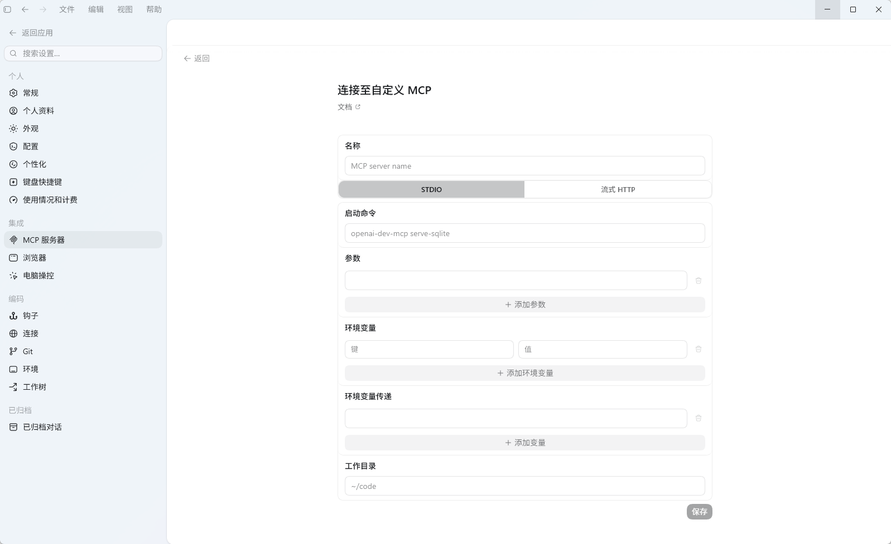
</p>

##### How to use MCP after adding it

After adding MCP, return to the Codex App thread and describe the task directly.


| Usage | Example |
| --- | --- |
| Describe the need directly | Please look up the latest usage of Next.js App Router |
| Explicitly ask to use MCP | Please use available MCP tools to query this library's documentation |
| Specify an MCP | Please use context7 to query the latest Next.js documentation |
| View available tools first | Which MCP tools are currently available? |


Example prompt:

```text
Please use the available MCP documentation tool
to query the latest usage of Next.js App Router,
then tell me how the current project should be modified.
```

Or:

```text
Please use Figma MCP to read this design file,
analyze the page structure, and generate a frontend implementation plan for me.
```

#### How to use MCP in Codex CLI

Using MCP in Codex CLI means:

Connecting external tools to terminal Codex.

For example:

```text
Documentation MCP: lets Codex query developer documentation
GitHub MCP: lets Codex read issues, PRs, and repository information
Figma MCP: lets Codex read design files
Database MCP: lets Codex query database schema
```

Beginners can understand it this way:

```text
Codex CLI = AI programming assistant in the terminal
MCP = interface for connecting external tools to Codex CLI
```

---

##### Basic CLI flow for using MCP


| Step | Action | Simple meaning |
| --- | --- | --- |
| 1 | Open terminal | PowerShell / Terminal |
| 2 | Enter project directory | Let Codex know the current project |
| 3 | Add MCP server | Connect an external tool to Codex |
| 4 | Check whether MCP was added successfully | Confirm the tool is available |
| 5 | Start Codex CLI | Enter the Codex conversation interface |
| 6 | Use /mcp to view tools | See which MCPs are available |
| 7 | Call MCP in a task | Let Codex use the external tool |
| 8 | Review results and permission prompts | Confirm safety |


---

##### Common MCP terminal commands


| Command | Purpose | Simple meaning |
| --- | --- | --- |
| `codex mcp --help` | View MCP command help | Check first when unsure how to use it |
| `codex mcp list` | View configured MCP servers | See which external tools are connected |
| `codex mcp add` | Add an MCP server | Add an external tool to Codex |
| `codex mcp remove` | Remove an MCP server | Remove it when no longer needed |
| `codex mcp get` | View details of a specific MCP server | See the exact configuration |
| `codex mcp login` | Sign in to an MCP that requires authorization | Authorize certain remote MCPs |
| `codex mcp logout` | Sign out of an MCP authorization | Disconnect authorization |
| /mcp | View MCP inside a Codex session | See which tools the current session can call |


---

##### Basic format for adding MCP

The basic command for adding MCP is usually:

```text
codex mcp add name -- startup-command
```

In simple terms:

```text
name = the name you give this MCP
startup-command = how this MCP starts
```

Example:

```text
codex mcp add context7 -- npx -y @upstash/context7-mcp
```

This command means:

```text
Add an MCP named context7 to Codex.
It starts the @upstash/context7-mcp tool through npx.
```

---

##### View added MCP servers

After adding one, run:

```text
codex mcp list
```

Purpose:

```text
View which MCP servers are currently configured for Codex CLI.
```

If you see the name you just added, the configuration has been written.

---

##### View MCP after entering Codex

First enter the project directory:

```text
cd project-directory
```

Then start Codex:

```text
codex
```

After entering Codex CLI, type:

```text
/mcp
```

Purpose:

```text
View MCP tools available in the current session.
```

If the MCP does not appear, possible causes include:


| Issue | Possible cause |
| --- | --- |
| Not added successfully | `codex mcp add` command failed |
| MCP failed to start | Dependency not installed or command incorrect |
| Name typo | Server name was written incorrectly when calling |
| Authorization required | External service not yet signed in |
| Configuration not refreshed | Need to restart Codex CLI |


---

##### Call MCP in tasks

After MCP is configured, you do not need to remember complex commands.

You can simply say inside Codex CLI:

```text
Please use available MCP tools to query the latest documentation for Next.js App Router.
```

You can also specify an MCP:

```text
Please use context7 to query the latest usage of Next.js App Router,
then tell me how the current project should be modified.
```

For Figma-type MCP, you can say:

```text
Please use Figma MCP to read this design file,
analyze the page structure, and generate a frontend implementation plan for me.
```

For GitHub-type MCP, you can say:

```text
Please use GitHub MCP to check the recent open issues in this repository,
and summarize the top 3 highest-priority problems.
```

---

##### Where the MCP configuration file is

Codex writes MCP configuration into a configuration file.

A common location is:

```text
~/.codex/config.toml
```

In simple terms:

```text
config.toml = Codex's configuration file
```

It may contain configuration like this:

```text
[mcp_servers.context7]
command = "npx"
args = ["-y", "@upstash/context7-mcp"]
```

This means:

```text
There is an MCP server named context7.
The startup command is npx -y @upstash/context7-mcp.
```

If you are not familiar with configuration files, do not edit them randomly at first.

Prefer using:

```text
codex mcp add
codex mcp list
codex mcp remove
```

---

##### Add remote MCP

Some MCPs are not started by local commands, but connected through URLs.

These are often called remote MCP / HTTP MCP.

They may require:


| Configuration item | Simple meaning |
| --- | --- |
| URL | Remote MCP service address |
| Auth | Whether login is required |
| Token | Access credential |
| OAuth | Browser-based authorization login |


If login is required, use:

```text
codex mcp login MCP-name
```

When no longer needed:

```text
codex mcp logout MCP-name
```

Beginner recommendation:

```text
Start with documentation MCPs that do not require complex authorization.
Try remote MCPs that require login later.
```

---

##### Remove unused MCP

If an MCP is no longer needed, remove it:

```text
codex mcp remove name
```

For example:

```text
codex mcp remove context7
```

Then check again:

```text
codex mcp list
```

Confirm it is no longer in the list.

### Code management (Git and GitHub workflows)

When using Codex on real projects, you must understand some Git and GitHub basics.

Beginners can start with this:

```text
Git = local code version-control tool
GitHub = online platform for storing and collaborating on code
Codex = AI programming assistant that helps read code, modify code, and run commands
```

In one sentence:

```text
Git records code changes.
GitHub stores code remotely and supports collaboration.
Codex helps you complete specific programming tasks.
```

#### Difference between Git and GitHub


| Comparison | Git | GitHub |
| --- | --- | --- |
| Simple meaning | Local version-control tool | Code cloud drive + collaboration platform |
| Main purpose | Record what changed each time | Store code remotely and support team collaboration |
| Where used | On your computer | Browser / cloud |
| Core capabilities | commit, branch, diff, merge | repository, issue, pull request |
| Requires internet? | No | Yes |
| Relationship with Codex | After Codex modifies code, use Git to inspect and save changes | Codex Web / Cloud often works with GitHub |


##### Git concepts beginners must understand first


| Concept | Simple meaning | Purpose |
| --- | --- | --- |
| Repository | A code repository | Stores the whole project |
| Commit | A code snapshot | Records what changed this time |
| Branch | Branch | Modify code without affecting the main line |
| Diff | Change comparison | See what was added, deleted, or modified |
| Stage | Staging area | Prepare which changes go into a commit |
| Merge | Merge | Bring changes from one branch into another |
| Conflict | Conflict | Both sides changed the same code and need manual choice |
| Push | Push | Upload local code to GitHub |
| Pull | Pull | Sync new code from GitHub to local |
| Clone | Clone | Download a project from GitHub to local |


---

##### GitHub concepts beginners must understand first


| Concept | Simple meaning | Purpose |
| --- | --- | --- |
| Repository | Project repository on GitHub | Stores code |
| Issue | Bug / requirement record | Records bugs, requirements, tasks |
| Pull Request / PR | Code merge request | Request merging after code changes |
| Main Branch | Main branch | Stable version of the project |
| Feature Branch | Feature branch | Used to develop new features |
| Review | Code review | Inspect code before merging |
| Actions | Automation workflows | Automated testing, build, deployment |
| README | Project manual | Tells others how to use the project |
| .gitignore | Ignore-file list | Prevents uploading irrelevant or sensitive files |


---

#### Why Git matters even more when using Codex


| Scenario | Why Git is needed |
| --- | --- |
| Codex modifies a lot of code | You can inspect exactly what changed |
| Codex makes a wrong change | You can roll back to a previous version |
| Codex deletes content it should not delete | You can recover it with Git |
| You ask Codex to modify repeatedly | Each commit saves one stage |
| You want Codex to try ideas boldly | Use branches or worktrees to isolate risk |
| You want to put a project on GitHub | You need to push to a remote repository |
| Team collaboration | Requires PR, review, and merge |


In one sentence:

```text
Without Git, it is hard to roll back if Codex makes a wrong change.
With Git, Codex can try more safely, and you can inspect and recover at any time.
```

---

#### How to use Git with Codex


| Step | Action | Purpose |
| --- | --- | --- |
| 1 | Initialize Git | Start managing the project with Git |
| 2 | Write .gitignore | Prevent uploading junk files and secrets |
| 3 | Commit once first | Save a clean version |
| 4 | Create a branch | Give Codex a safe experimentation area |
| 5 | Let Codex modify code | Complete the specific task |
| 6 | Inspect diff | Check what Codex changed |
| 7 | Run project / build | Confirm nothing is broken |
| 8 | Commit when satisfied | Save this modification |
| 9 | Push to GitHub | Upload to remote repository |
| 10 | Create PR | Review again before merging |


##### Enter in the Codex dialog: initialize the project as a Git project and exclude unnecessary files

<p align="center">
  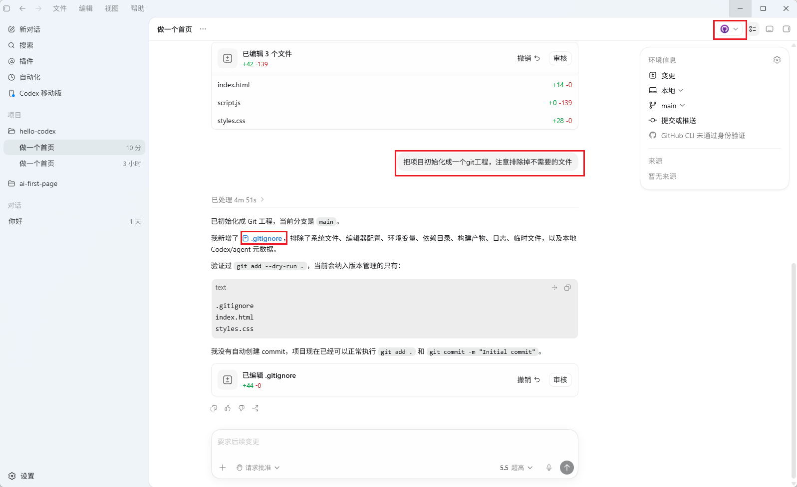
</p>


---

##### Codex will help write the .gitignore file directly

<p align="center">
  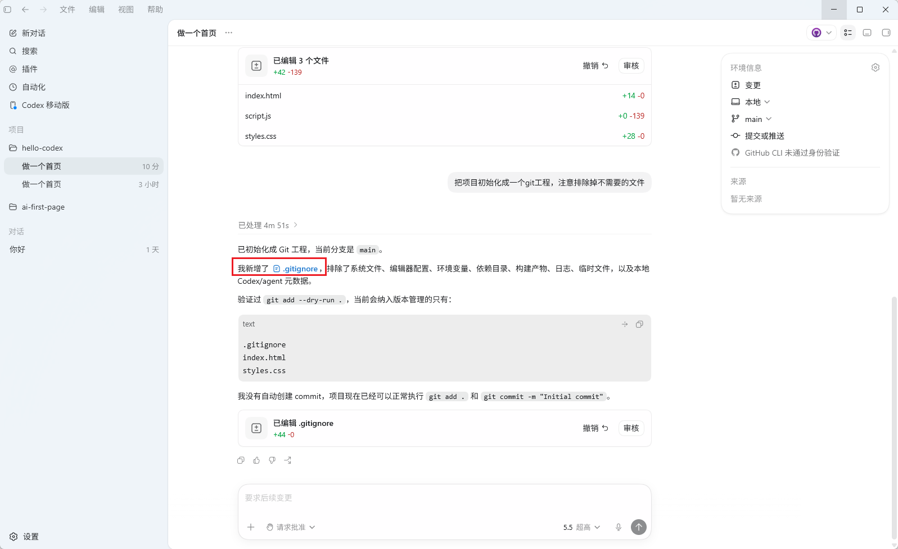
</p>

#### How to use GitHub with Codex

##### What to prepare before using it


| Item | Purpose | Simple meaning |
| --- | --- | --- |
| GitHub account | Store remote code | Code cloud-drive account |
| Git | Local version management | Record code changes |
| GitHub repository | Store project code | A remote project folder |
| Local project | Code Codex will modify | Project folder on your computer |
| GitHub login permission | Allow push / PR | Prove this is your repository |
| .gitignore | Prevent uploading irrelevant files | Do not upload junk files or secrets |


##### Standard upload flow


| Step | Action | Purpose |
| --- | --- | --- |
| 1 | Create a repository on GitHub | Create a remote project space |
| 2 | Copy the repository URL | Used to connect the local project later |
| 3 | Paste the URL to Codex | Tell Codex which repository to upload to |
| 4 | Push to GitHub | Upload code officially |


###### Create a GitHub repository

<p align="center">
  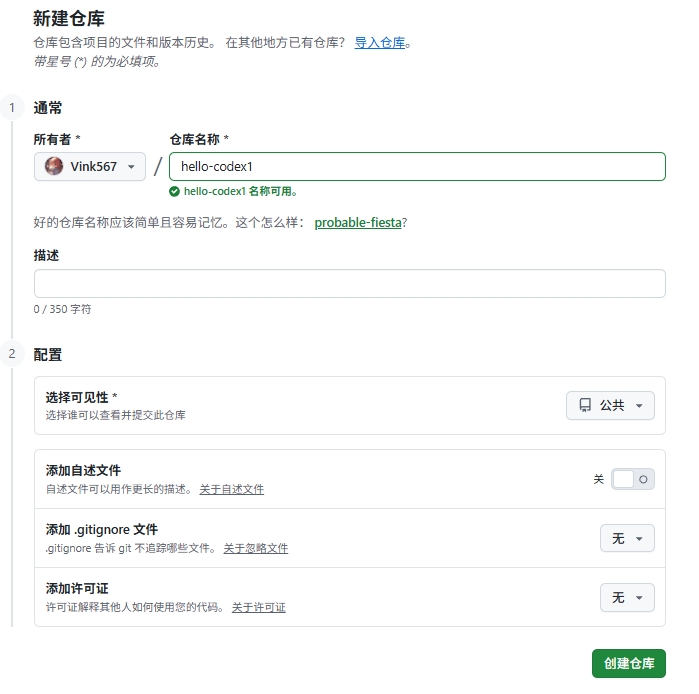
</p>

###### Copy the repository URL

<p align="center">
  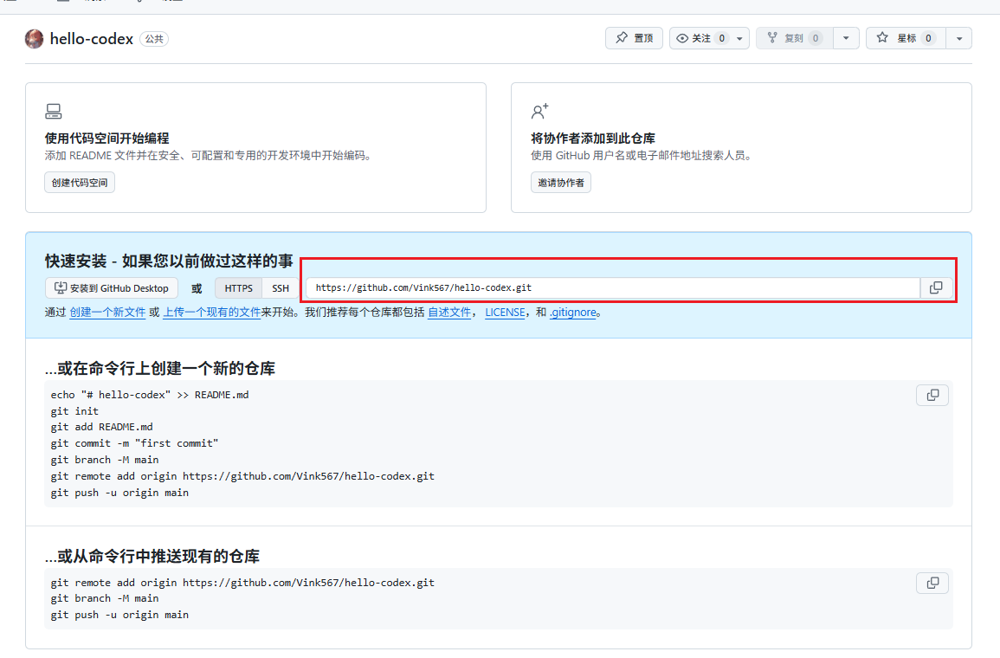
</p>

###### Paste the URL to Codex

<p align="center">
  
</p>

###### Push to GitHub

#### Code rollback

##### Modify code

First ask the AI to modify some code.

<p align="center">
  
</p>

##### Commit to Git and save the current version

<p align="center">
  
</p>

##### Continue modifying code

<p align="center">
  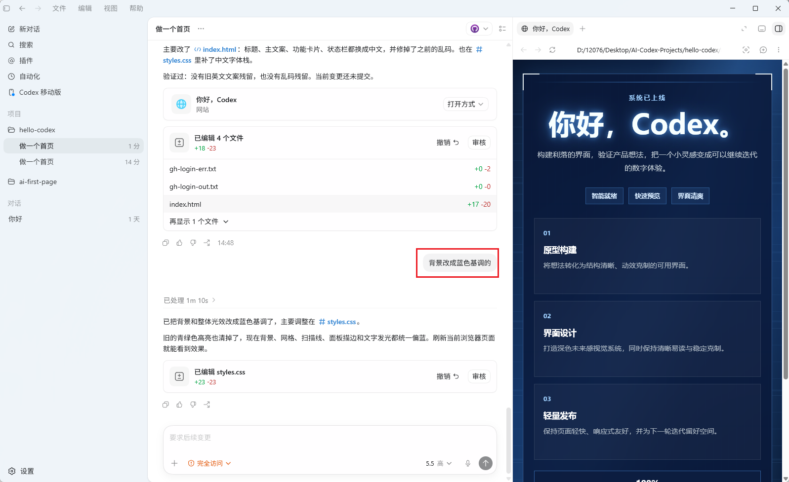
</p>

##### Open the IDE to inspect code and roll it back

First open the IDE to inspect the code.

<p align="center">
  
</p>

##### Copy the version number

<p align="center">
  
</p>

##### Paste it to Codex and ask it to roll back code to the specified version

<p align="center">
  
</p>

#### Git Worktree

A worktree creates an additional independent working copy for the same Git project.

It works like a draft copy. After you are satisfied with the result, merge it back into the official project.

##### Why Worktree is useful

Ordinary Git branches can be switched, but only one branch can be operated in one folder at a time.

The advantages of Worktree:


| Scenario | What Worktree does |
| --- | --- |
| You want Codex to modify code boldly | Give it a separate copy |
| You do not want to affect the current project | Keep the main project unchanged |
| You want to work on multiple tasks at once | One worktree per task |
| You want to compare multiple approaches | Put options A / B / C separately |
| A change is broken and unwanted | Discard the worktree directly |
| Large change / refactor | Reduce the risk of polluting the main project |


##### Create a Worktree

<p align="center">
  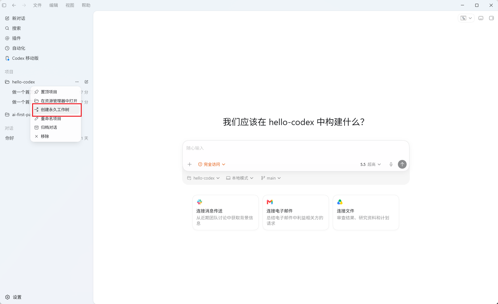
</p>

<p align="center">
  
</p>

##### Use a branch for the task

<p align="center">
  
</p>

##### Merge back to main

After you are satisfied with the result, merge it back into main and delete the branch.

<p align="center">
  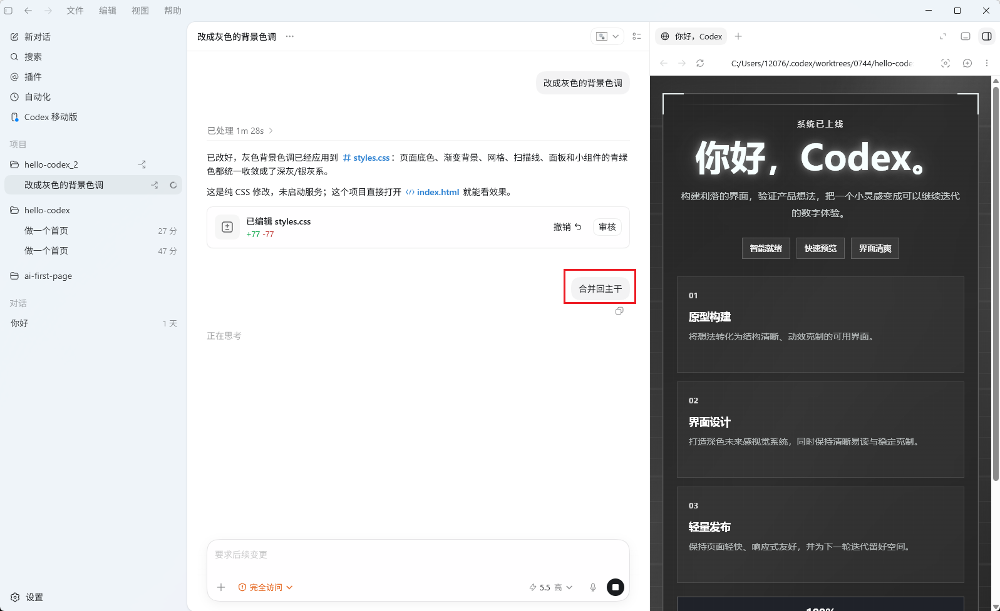
</p>

### Cloud execution

Codex cloud tasks are suitable when you cannot keep your local computer running. If your account and client support mobile entry points, you can also view or advance part of the task while away.

```text
Hand code tasks to Codex and let it run them in a cloud environment.
```

Beginners can understand it this way:


| Mode | Where it runs | Simple meaning |
| --- | --- | --- |
| Local | Local project on your computer | Codex directly modifies code on your computer |
| Worktree | Local copy on your computer | Codex modifies code in a safe copy |
| Cloud | OpenAI cloud environment | Codex pulls a GitHub repository and processes tasks in the cloud |


#### What is Codex cloud execution?

Codex cloud execution is essentially:


| Item | Description |
| --- | --- |
| Runtime environment | Cloud container |
| Code source | GitHub repository |
| Working style | Codex reads, modifies, runs, and verifies code in the cloud |
| Final result | Generates modification results and diffs, and creates PRs when needed |
| Suitable tasks | Bug fixes, feature changes, documentation, code review, issue handling |
| Not suitable for | Local private files, projects not uploaded to GitHub, high-risk production operations |


---

#### Difference between cloud execution and local execution


| Comparison | Local / Worktree | Cloud |
| --- | --- | --- |
| Code location | On your computer | GitHub repository |
| Runtime location | Your computer | Cloud container |
| Occupies your computer? | Yes | Mostly no |
| Requires GitHub? | Not necessarily | Usually yes |
| Suitable for background tasks? | Average | Very suitable |
| Suitable for parallel tasks? | Average | Very suitable |
| Permission risk | Mainly local file permissions | Mainly repository, environment variable, and network permissions |
| Suitable for beginners? | Better to learn first | Use after learning GitHub |


#### Cloud execution steps

##### Push code to GitHub

<p align="center">
  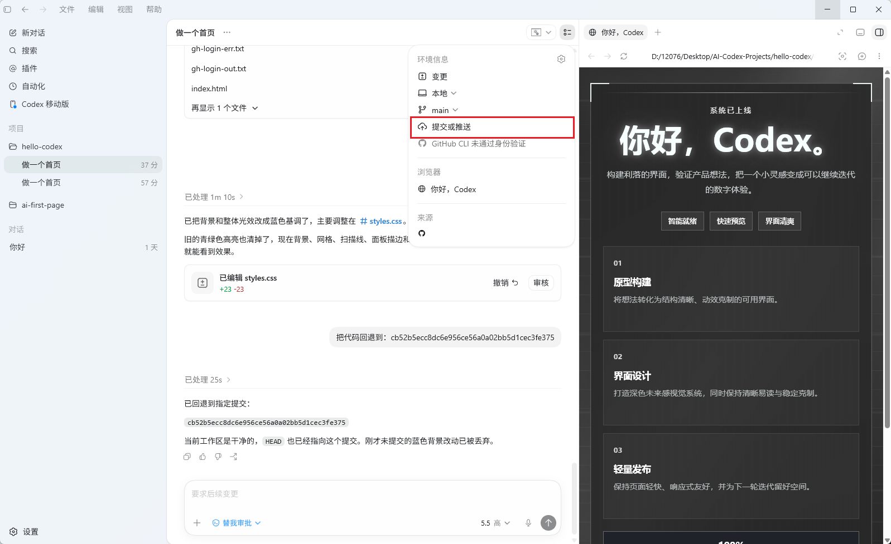
</p>

##### Open Codex Web

<p align="center">
  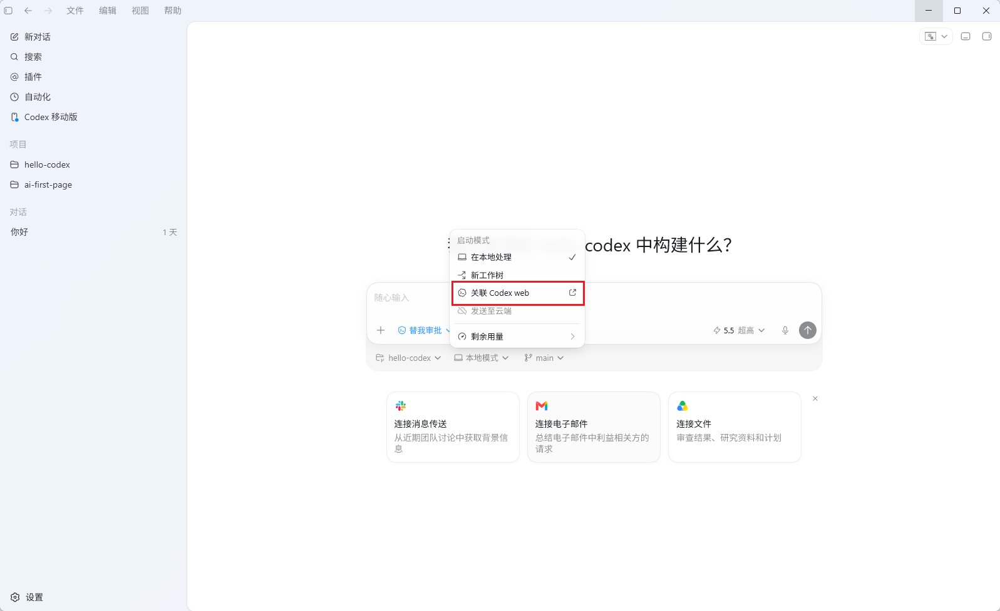
</p>

<p align="center">
  
</p>

##### Choose the repository we want to modify

After choosing it, ask Codex to work on it.

<p align="center">
  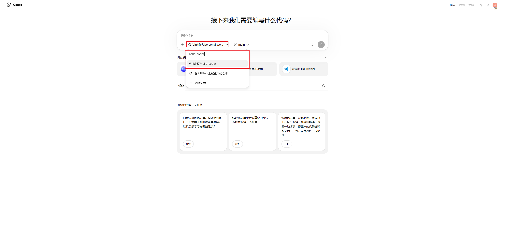
</p>

##### Upload the completed changes to the GitHub repository

<p align="center">
  
</p>

<p align="center">
  
</p>

##### Sync the latest GitHub repository code before modifying locally

If a cloud task has already pushed changes back to GitHub, sync the latest code before continuing local development to avoid conflicts caused by editing an old version. Whether Codex automatically applies the changes for you or you manually run `git pull` / `codex apply` depends on the current entry point and task type.

<p align="center">
  
</p>

### Memory system

Let Codex remember some long-term useful information so it can continue work more easily later.

#### Project-level AGENTS.md

```text
A project rules manual written for Codex.
```

Beginners can understand it this way:


| File | Main reader | Purpose |
| --- | --- | --- |
| README.md | Humans | Tells people what the project is, how to install it, and how to use it |
| AGENTS.md | Codex / AI Agent | Tells AI how to work in this project |
| .gitignore | Git | Tells Git which files not to upload |


##### Where to put AGENTS.md


| Location | Scope | Simple meaning |
| --- | --- | --- |
| Project root AGENTS.md | Entire project | Main rules for the current project |
| AGENTS.md in a subdirectory | Current subdirectory and related tasks | Module-specific rules |
| User-level `~/.codex/AGENTS.md` | All your projects | Personal general rules |
| Project-level AGENTS.md + user-level AGENTS.md | Both apply | Personal habits + current project rules |


##### How to write AGENTS.md

You can hand it directly to AI and ask AI to summarize the core content of the project into AGENTS.md.

###### Frontend project AGENTS.md template

```text
# AGENTS.md

## Project description

This is a frontend web project used to build product pages, tool pages, or personal portfolio pages.

## Tech stack

- React
- Vite
- Tailwind CSS
- JavaScript / TypeScript

## Common commands

- Install dependencies: `npm install`
- Start project: `npm run dev`
- Build project: `npm run build`

## Project structure

- `src/`: main source code
- `src/components/`: shared components
- `src/pages/`: page files
- `src/assets/`: static assets such as images and icons
- `public/`: public static files

## Code conventions

- Prefer React function components
- Prefer Tailwind CSS for styling
- Do not introduce Bootstrap
- Do not broadly refactor unrelated code
- Keep file structure clear when modifying
- Chinese copy should be natural, concise, and suitable for general users

## UI rules

- Pages should have clear information hierarchy
- Buttons, cards, headings, and spacing should be consistent
- Mobile should be basically usable
- Do not overuse gradients, shadows, or AI-template aesthetics
- Prioritize a real product feel rather than a demo feel

## Prohibited actions

- Do not modify `.env` or `.env.local`
- Do not output API keys, tokens, or passwords
- Do not delete existing core functionality
- Do not add large dependencies casually
- Do not directly modify files unrelated to the current task

## After completing a task

After each modification, output:

1. Which files changed
2. What changed in each file
3. Why the change was made
4. Whether `npm run build` needs to be run
5. Remind me to inspect the diff
```

###### Characteristics of a good AGENTS.md


| Characteristic | Description |
| --- | --- |
| Specific | Clearly states tech stack, commands, directories |
| Concise | Does not become long-winded noise |
| Actionable | Codex knows what to do after reading it |
| Constrained | Clearly states which files cannot be touched |
| Verifiable | Specifies which commands to run for checks |
| Has completion criteria | Lets Codex know what to deliver |
| Maintainable | Updated promptly as the project changes |


#### Global AGENTS.md

##### Open Codex settings and find personalization

<p align="center">
  
</p>

##### Enter instructions; these instructions become your general personal preferences for future Codex sessions

When using AI programming tools, one of the biggest concerns is that AI may delete things carelessly. You can use the following instruction:

Do not batch-delete files or directories.

Do not use:

- `del /s`
- `rd /s`
- `rmdir /s`
- `Remove-Item -Recurse`
- `rm -rf`

When deleting files is necessary, delete only one file at one explicit path at a time.

Correct example:

```powershell
Remove-Item "C:\path\to\file.txt"
```

If batch deletion is needed, stop the operation and ask the user to delete manually.

## Part 4: Standard workflow

### The complete path from requirement to delivery

When many people first start using Codex, they throw a one-line request at it:

> Build me a website.  
> Change this feature for me.  
> Optimize this project.

This can work, but it often creates a problem:
**AI changes things very quickly, but you do not know exactly what it changed or whether the result is safe to deliver.**

So the truly stable approach is not to let Codex modify everything at once. It is to move forward through a fixed workflow.

You can understand it this way:

> A requirement does not become a deliverable directly. It must pass through “understanding, planning, modification, validation, review, and acceptance.”

#### Standard six-step method


| Step | Name | Simple meaning | Purpose |
| --- | --- | --- | --- |
| 1 | Requirement breakdown | First let Codex understand what the project and task are | Avoid modifying blindly without understanding structure |
| 2 | Create a plan | List what needs to be done and confirm before acting | Avoid changing too much at once or going in the wrong direction |
| 3 | Implement in small steps | Change only one small piece at a time | Reduce error probability and make rollback easier |
| 4 | Test | Run checks and manually validate after changes | Confirm the code has no obvious errors |
| 5 | Code review | Inspect diff and check correctness and risk | Prevent AI from modifying areas it should not touch |
| 6 | Commit and review | Commit code and distill lessons | AI executes; humans make final decisions |


##### Step 1: Requirement breakdown

Before asking Codex to modify a project, the first step is not writing code. It is breaking down the requirement.

Many Codex failures happen not because Codex cannot write code, but because the requirement was unclear at the beginning.

For example, if you only say:

> Optimize the homepage.

Codex may interpret it as:

- Change UI
- Change copy
- Change layout
- Change component structure
- Change routes
- Even delete code it considers “unused”

So before actual implementation, break the requirement into several key questions.

###### What is the background?

First explain why this task needs to be done.


| Question | Example |
| --- | --- |
| What stage is the project in now? | This is an already launched official website page |
| What is the current situation? | Homepage conversion is low, and users do not understand the product value |
| Why change it now? | A new release is coming, and the hero message needs improvement |
| What type of requirement is this? | UI improvement / bug fix / new feature / refactor |


###### What problem should be solved?

Requirements should be as specific as possible. Do not write only “optimize,” “make it prettier,” or “improve it.”


| Vague wording | Clearer wording |
| --- | --- |
| Optimize homepage | Improve the homepage hero title, subtitle, and CTA button |
| Page does not look good | Adjust card spacing, typography hierarchy, and button style |
| Login has a problem | Fix the issue where clicking the login button does not navigate |
| Build an admin panel | Add a user list page with search, filtering, and pagination |


A good requirement should answer:

> Which specific problem is this task solving?

Example:

```text
This task mainly solves three problems:
1. The hero title is unclear
2. The CTA button is not prominent
3. The mobile hero content is too crowded
```

###### Which files may be related?

If you roughly know where the files are, tell Codex in advance.

This reduces the chance of it searching and modifying the whole project randomly.


| Scenario | Possibly related files |
| --- | --- |
| Modify homepage | app/page.tsx, pages/index.tsx, components/Hero.tsx |
| Modify styles | globals.css, tailwind.config.js, related component files |
| Modify login | login/page.tsx, auth.ts, middleware.ts |
| Modify API | api directory, server directory, lib directory |
| Modify copy | Page components, configuration files, i18n files |


###### Which features must not be touched?

This is very important.

Codex may easily change other areas while trying to complete the current task.

Tell it in advance:


| What must not be touched | Explanation |
| --- | --- |
| Login logic | Only change UI; do not change authentication flow |
| API URLs | Do not change API request paths |
| Data structure | Do not change database fields |
| Route structure | Do not change existing page paths |
| Existing components | Do not perform broad refactors unless necessary |
| Dependency versions | Do not upgrade or add dependencies casually |


The core of this step is drawing boundaries for Codex.

---


###### What counts as done?

Do not only say “finish it.” Tell Codex what “done” means.


| Requirement type | Completion criteria |
| --- | --- |
| UI improvement | Visual clarity improves, and mobile layout is not broken |
| Bug fix | Original error disappears, and related feature works normally |
| New feature | User can complete the full operation flow |
| Performance optimization | Build succeeds, and page loading is not noticeably slower |
| Copy improvement | Title, subtitle, and button copy become clearer |


Example:

```text
Completion criteria:
1. Homepage hero clearly explains what the product does
2. CTA button is more prominent
3. Mobile display works normally
4. Other pages are unaffected
5. Project can run and build normally
```

###### What tests are needed?

After changes, do not rely only on Codex saying “done.” Explain in advance how the result should be verified.


| Test type | Applicable scenario |
| --- | --- |
| Page preview | UI changes, layout changes |
| Console check | Frontend pages, interactive features |
| Build test | Next.js, React, Vue projects |
| Unit tests | Projects with test files |
| Manual flow test | Login, payment, forms, uploads, and similar flows |
| Mobile test | Responsive pages, Xiaohongshu cover images, mobile webpages |


---


###### What risks exist?

During requirement breakdown, ask Codex to identify risks in advance.

This prevents it from modifying and experimenting blindly.


| Risk | Explanation |
| --- | --- |
| Impact scope too large | A small requirement becomes a large refactor |
| Style pollution | Global CSS changes affect other pages |
| Dependency risk | Unnecessary dependencies make the project more complex |
| Logic risk | Fixing one issue breaks other flows |
| Data risk | API, field, or database-related changes |
| Compatibility risk | Desktop works, mobile breaks |


###### Requirement breakdown prompt template

In actual Codex use, you can copy this directly:

```text
Please first break down the requirement. Do not modify code immediately.

Requirement:
[Write your requirement here]

Please analyze using the following structure:

1. What is the background?
- What the current project roughly is
- Why this requirement needs to be done
- Whether this requirement is a new feature, bug fix, UI improvement, or refactor

2. What problem should be solved?
- What the specific current problem is
- How far this task should solve it
- Which content is out of scope

3. Which files may be related?
- Based on the project structure, determine which files may be involved
- List them first; do not modify directly

4. Which features must not be touched?
- Which logic should not be changed
- Which APIs should not be touched
- Which pages or components should not be affected

5. What counts as done?
- Functional completion criteria
- Page completion criteria
- Code completion criteria

6. What tests are needed?
- Which commands need to be run
- Which pages need manual checks
- Which flows need special validation

7. What risks exist?
- Which features may be affected
- Whether there is style pollution risk
- Whether there is over-refactor risk
- Whether there is dependency-addition risk

Finally, give me a short execution recommendation:
- Which step should be done first
- Whether I should confirm before you modify
```

##### Step 2: Ask Codex to create a plan

After requirement breakdown, do not let Codex write code immediately.

This step asks Codex to create a plan first.

You can understand it as:

> First let AI explain how it intends to work, then decide whether to let it act.

Many projects go wrong not because Codex cannot change the code, but because it starts changing immediately.

By the time you notice the direction is wrong, it may have already changed many files, making review and rollback difficult.

So the core of Step 2 is:

> Plan first, execute later.  
> Confirm first, modify later.

###### Do not write code yet

Put this at the very beginning of the prompt.

Codex's default tendency is to solve a problem immediately after seeing a requirement.

But in real projects, directly changing code is risky.


| Problem with writing code directly | Possible consequence |
| --- | --- |
| Project structure not understood | Wrong file changed |
| Requirement boundary not confirmed | Features outside scope are implemented |
| Impact scope not assessed | Existing functionality is accidentally affected |
| Test method not listed | No clear acceptance criteria after change |
| Too many changes at once | Hard to roll back after errors |


Example prompt:

```text
Do not write code yet, and do not modify any files.
Please create a modification plan based on the current requirement and project structure.
Wait for my confirmation before execution.
```

###### Enable plan mode

See the earlier “Plan mode” section under basic Codex App usage. In real use, you can also enter `/plan` directly in Codex CLI or App to ask Codex to output a plan first, then decide whether to execute.


##### Step 3: Implement in small steps

After confirming the plan, enter the actual code modification stage.

But there is one very important principle:

> Do not let Codex finish everything in one pass.

Many Codex failures happen because users ask it to “implement everything” at the start.

It may change pages, components, styles, APIs, and configuration at the same time. The project may look different afterward, but it becomes hard to determine where problems came from.

A more stable approach is:

> Modify only one functional point at a time.  
> After each small step, inspect that small step.

###### Modify only one functional point at a time

The core of small-step implementation is controlling modification scope.

For example, if you want to improve the homepage, do not say:

```text
Please optimize the entire homepage.
```

Break it down instead:


| Step | Modification |
| --- | --- |
| Step 1 | Improve only the hero title and subtitle |
| Step 2 | Adjust only the CTA button |
| Step 3 | Improve only the mobile layout |
| Step 4 | Add only product value cards |
| Step 5 | Handle final style details only |


Each step is clear, and problems are easier to locate.

###### Do not let Codex opportunistically refactor unrelated code

Sometimes Codex decides that some code is “not elegant enough” and refactors it on the side.

In real projects, opportunistic refactoring is dangerous.


| Codex's opportunistic action | Possible problem |
| --- | --- |
| Rename components | Breaks import paths |
| Split files | Increases maintenance cost |
| Change global styles | Affects other pages |
| Optimize old logic | Breaks previously working functionality |
| Upgrade dependencies | Triggers compatibility issues |
| Delete code it considers unused | May actually be business logic |


When implementing in small steps, set clear constraints:

```text
For this step, implement only the current functional point.
Do not opportunistically refactor unrelated code.
Do not change naming, directory structure, dependency versions, or global configuration.
If you find code that could be improved, record it as a suggestion first. Do not modify it directly.
```

This sentence is important.

Codex can make suggestions, but it must not expand the change scope on its own.

---

###### Do not accept broad unexplained changes

If Codex changes many files at once and does not explain why, pause.

Be especially alert when you see:


| Situation | Response |
| --- | --- |
| Suddenly many files changed | Ask it to explain why each file changed |
| Large amounts of code deleted | Ask it to explain the reason for deletion |
| Unknown dependency added | Ask why it is necessary |
| Configuration file modified | Ask for impact scope |
| Pages unrelated to the requirement changed | Ask it to revert unrelated modifications |
| Code style changed drastically | Ask it to preserve the original project style |


###### Pause and ask when uncertain

Small-step implementation does not mean Codex must ask about everything. But when there is key uncertainty, it must stop and ask.

For example:


| Uncertain situation | Why pause |
| --- | --- |
| Unsure which file to modify | Prevents changing the wrong place |
| Unsure about business rules | Prevents incorrect logic |
| Unsure whether old code can be deleted | Prevents accidental feature deletion |
| Unsure whether to add dependency | Prevents project complexity |
| Unsure about API meaning | Prevents data impact |
| Unsure why tests fail | Prevents making the issue worse |


Add this rule to Codex in advance:

```text
If you encounter any of the following situations, stop and ask me first. Do not decide on your own:

1. Unsure which file to modify
2. Unsure whether old code should be deleted
3. Unsure whether to add a dependency
4. Unsure how business logic should be handled
5. Unsure why tests are failing
6. A change is needed beyond the original plan
```

###### Small-step implementation prompt template

In actual use, copy this directly:

```text
Please start small-step implementation.

For now, execute only Step [1]:
[Write the single functional point for this step here]

Requirements:
1. Modify only this functional point at a time
2. Modify only files directly related to the current function
3. Do not opportunistically refactor unrelated code
4. Do not change directory structure
5. Do not add unnecessary dependencies
6. Do not delete existing functionality
7. Do not modify files outside the plan

After completing the modification, stop and output:

1. Which files were modified this time
2. What changed in each file
3. Why these changes were necessary
4. Whether any out-of-plan content was changed
5. Whether there are potential risks
6. What you recommend next

Note:
If you encounter uncertainty, stop and ask me first. Do not decide on your own.
```


##### Step 4: Testing

After Codex completes a small-step change, do not move to the next step immediately. Test first.

The biggest problem many users have with Codex is:

> AI says it is done, but the project does not actually run.  
> The page looks fine, but some function is broken.  
> The current feature is fixed, but old functionality is affected.

The core of testing is: **do not trust Codex saying “done”; use results to prove that it is done.**

The table below covers what a complete testing pass should include. Run it from fastest to slowest:

| Test type | Purpose | Common command | Focus |
| --- | --- | --- | --- |
| Unit tests | Check whether functions, components, and modules work | `npm test` / `pnpm test` / `yarn test` | Explain failures first; do not directly modify code |
| Type check | Catch TypeScript errors early | `npm run typecheck` / `tsc --noEmit` | Clearly state if no such command exists |
| lint | Check code-quality issues such as unused variables, import order, Hook usage | `npm run lint` | Distinguish newly introduced issues from existing project issues |
| Build | Local preview does not mean production build works | `npm run build` / `pnpm build` | Summarize error and impact scope first if it fails |
| Manual testing | UI, forms, login, payment, upload must be clicked through manually | — | Validate step by step along the user path |
| Browser testing | Page, console, and API issues that terminal cannot reveal | — | Check page display, Console errors, Network, mobile |
| Regression testing | Test not only new features but also whether old features broke | — | List old pages and components that may be affected |

> Two reminders: many legacy projects already have lint or type issues, so do not let Codex opportunistically refactor all historical problems; regression testing is the step beginners most easily overlook—changing a homepage button may also affect other pages reusing the same component.

For manual testing, ask Codex to list validation steps as an “operation—expected result” table:

| Step | Operation | Expected result |
| --- | --- | --- |
| 1 | Open homepage | Page loads normally |
| 2 | Click CTA button | Navigates to registration page |
| 3 | Resize to phone width | Page layout does not break |
| 4 | Open console | No obvious red errors |

###### Testing-stage prompt template

In actual use, copy this directly:

```text
Please test this modification. Do not continue adding features.

Execute or explain in the following order:

1. Unit tests
- Whether the project has unit tests
- If yes, run the test command
- If it fails, explain the failure cause

2. Type check
- Whether the project has a typecheck command
- If yes, run it
- If not, state that clearly

3. lint
- Run lint checks
- Distinguish newly introduced issues from existing project issues

4. Build
- Run the build command
- If it fails, explain the error cause and impact scope

5. Manual testing
- List pages that need manual testing
- List user operation steps
- List expected result for each step

6. Browser testing
- Check page display
- Check console errors
- Check mobile layout
- Check key buttons and interactions

7. Regression testing
- Check whether this modification affects old functionality
- List pages, components, and flows that may be affected

Finally, output a testing summary:
- Which tests passed
- Which tests failed
- Why they failed
- Whether we can proceed to the next step
- Whether issues should be fixed first
```

##### Step 5: Code review

Passing tests does not mean the change can be delivered directly.

A code review is still needed.

Code review means:

> Not only checking whether the code can run, but also whether the change is correct, stable, and safe.

Codex writes code quickly, but it can still produce problems such as:


| Common issue | Explanation |
| --- | --- |
| Function runs, but logic is wrong | Looks fine on the surface; real business flow is wrong |
| Change is too broad | Many unrelated files changed for a small requirement |
| Old logic deleted by mistake | Code that looked unused was actually useful |
| Boundary conditions ignored | Normal input works, abnormal input crashes |
| Security issue | Secret exposure, permission check error, unvalidated input |
| Inconsistent style | New code does not match the project style |
| Poor maintainability | Hard-coded temporary solution that is hard to change later |


So code review is not optional; it is a key step in the Codex workflow.

---

###### Two rounds of review: Codex self-review + human review

First ask Codex to review its own changes (the goal is not to trust it completely, but to expose obvious issues first). Ideally, have it output a table:

| Check item | Result | Note |
| --- | --- | --- |
| Did it modify files outside the plan? | No | Only homepage-related components changed |
| Did it add dependencies? | No | package.json was not modified |
| Did it delete old logic? | No | Original button navigation logic preserved |
| Is there any risk? | Yes | Mobile button spacing still needs human confirmation |

Second comes human review. The person delivering the project is you, not Codex. You do not need to understand every line, but focus on these diff areas:

| Review focus | What to inspect |
| --- | --- |
| File scope | Whether only the correct files were changed |
| Modifications / deletions | Whether they match the plan and do not remove old features |
| Naming and structure | Whether they match the original project style |
| Business logic | Whether it matches real requirements (runs ≠ correct logic) |
| Test results | Whether tests were actually run |

For important code involving login, payment, permissions, databases, authentication, and similar areas, it is recommended to use a second model for cross-review—one model writes, another model finds problems. For copy-only changes or minor styles, this is usually unnecessary. But recommendations from the second model also cannot be accepted blindly; it helps discover problems, while you still make the final decision.

###### Focus on four high-risk categories

The following four categories are where Codex most often goes wrong and where review should focus:

| Category | Common issue | Review focus |
| --- | --- | --- |
| Boundary conditions | Normal input works, abnormal input crashes | Empty data, API failure, unauthenticated user, insufficient permission, mobile sizes, repeated clicks |
| Security issues | User/API/permission/payment/upload/database-related code | Whether secrets or tokens are exposed, permission checks missing, input validation missing, sensitive information leaked, API authentication changed |
| Accidental deletion | Code that looks useless but is actually needed is deleted | Focus on diff deletions; old components, comments, compatibility code, fallback logic, and config items may still be depended on |
| Business logic | Code runs but logic is wrong, such as wrong navigation, wrong price calculation, privilege escalation | Normal path, error path, permission checks, whether old business rules are preserved |

If you see a large deletion and Codex does not clearly explain it, do not accept it directly.

###### Code-review prompt template

In actual use, copy this directly:

```text
Please review this modification. Do not continue writing code.

Review using the following structure:

1. Codex self-review
- Whether this change only modified planned files
- Whether there was unrelated refactoring
- Whether dependencies were added
- Whether there is hard coding
- Whether old logic was accidentally deleted

2. Modification scope review
- Which files were modified
- Why each file needed modification
- Whether there were out-of-plan changes
- Whether there were broad unexplained changes

3. Boundary condition review
- How empty data is handled
- How API failure is handled
- How unauthenticated users are handled
- How insufficient permissions are handled
- How repeated clicks are handled
- Whether mobile may behave abnormally

4. Security review
- Whether secrets, tokens, account passwords were exposed
- Whether permission checks were affected
- Whether input validation is missing
- Whether sensitive information may leak
- Whether API authentication logic was modified

5. Deletion review
- Which code was deleted
- Why it was deleted
- Whether no other place depends on it
- Whether old functionality may be affected

6. Business logic review
- Whether it matches the requirement
- Whether the normal flow is correct
- Whether error flows are correct
- Whether old business rules are affected
- Whether there are uncertain business assumptions

7. Review conclusion
Finally, give a conclusion:
- Can continue
- Needs minor fixes
- Needs partial rollback
- Needs a new plan

Note:
Review only. Do not continue modifying code.
If you find an issue, explain the problem and suggestion first, then wait for my confirmation before changing it.
```

##### Step 6: Commit and review

After code passes testing and review, the final step is not simply saying “done.”

A complete Codex workflow still needs two things:

> First, formally commit the change.  
> Second, distill the lessons from this change.

Many users stop once “the code runs,” but do not write commit notes, PR descriptions, issue records, or documentation updates.

This may look fine in the short term, but over time it creates a problem:

> Every time feels like the first time.  
> Every time requires re-explaining.  
> Every time repeats the same mistakes.

So the core of Step 6 is:

> Delivery is not the end. Review is where the next efficiency gain begins.

###### Generate commit

After this change has passed testing and review, you can ask Codex to help generate a commit.

A commit should not simply say “update.” It should explain what changed.

A good commit should answer:


| Question | Explanation |
| --- | --- |
| What changed? | Main content of this commit |
| Why changed? | Which requirement or issue it corresponds to |
| What is affected? | Which modules, pages, or features are involved |
| Did tests pass? | Whether build, lint, or tests passed |


Common commit message formats:

```text
feat: add user profile page
fix: resolve login redirect issue
style: improve homepage responsive layout
refactor: simplify product card component
docs: update setup guide
```

For another wording style, keep the type prefix and make the summary concise:

```text
feat: add a user profile page
fix: resolve the redirect issue after login
style: optimize the home page mobile layout
docs: update the project usage guide
```

###### Write a PR

If the project uses GitHub, GitLab, or a team collaboration flow, a PR is usually needed after the commit.

A PR is not “just ceremony.” It helps others quickly understand:


| What the PR should explain | Purpose |
| --- | --- |
| What was done | Helps reviewers understand quickly |
| Why it was done | Explains requirement background |
| Which areas changed | Reduces review cost |
| How it was tested | Shows the change was not random |
| What risks exist | Surfaces uncertainty early |
| Which areas need special attention | Guides reviewer focus |


A good PR description can look like this:

```text
## Changes in this PR

- Improved the homepage hero title, subtitle, and CTA button
- Adjusted the mobile hero layout
- Preserved the original navigation logic; did not modify APIs or routes

## Test results

- npm run lint passed
- npm run build passed
- Manually checked homepage display on desktop and mobile
- CTA button navigation works normally

## Risk notes

- This change adjusts homepage styles; mobile display should be reviewed carefully
- No new dependencies added
- No login, API, or database logic modified
```

###### Record issues

During review, record the issues encountered in this process.

This step is very important.

In the Codex workflow, the truly valuable thing is not “this task is done,” but:

> Next time a similar problem appears, you can avoid detours.

Issues to record include:


| Issue type | Example |
| --- | --- |
| Requirement issue | Initial requirement description was unclear |
| Planning issue | Codex's plan missed mobile |
| Modification issue | Codex opportunistically changed unrelated components |
| Testing issue | Project had no typecheck command |
| Review issue | It accidentally deleted fallback logic |
| Communication issue | Prompt did not clearly state “do not add dependencies” |


The record can be simple:

```text
Issue record for this task:

1. Issue: Codex initially wanted to modify global styles
   Cause: Requirement did not explicitly limit it to “homepage only”
   Resolution: Added prompt constraints requiring only homepage-related files to be modified

2. Issue: Mobile testing was missed
   Cause: Plan did not include mobile acceptance criteria
   Resolution: Add mobile checks to the testing checklist in future

3. Issue: PR description was unclear
   Cause: Test results were not recorded in advance
   Resolution: Generate a test summary immediately after each test run
```

###### Summarize prompts

If a prompt worked well in this task, distill it for future use.

The purpose is simple:

> Do not rewrite useful prompts from scratch each time.

For example, if this sentence was useful:

```text
Do not opportunistically refactor unrelated code.
If you find that changes beyond the plan are needed, stop and ask me first.
```

Record it and reuse it as a fixed rule later.

You can organize it as a table:


| Effective prompt | Applicable scenario | Why it works |
| --- | --- | --- |
| Do not write code first; create a plan first | All complex requirements | Prevents Codex from modifying blindly |
| Modify only one functional point at a time | Multi-step tasks | Reduces error and rollback cost |
| Do not opportunistically refactor unrelated code | Legacy project maintenance | Prevents scope expansion |
| Summarize diff after modification | After every modification | Makes human review easier |
| Stop and ask when uncertain | When business logic is unclear | Prevents AI from making assumptions |


###### Update AGENTS.md

If certain rules should be followed every time in the future, do not keep them only in the chat. Add them to the project-level `AGENTS.md`.

`AGENTS.md` can be understood as:

> A project rules manual for Codex.

It can tell Codex:


| Content | Purpose |
| --- | --- |
| How the project runs | Let Codex know startup, test, and build commands |
| What the code style is | Avoid generating code that does not match the project |
| Which directories must not be touched | Prevent accidental core-file changes |
| What to do before modification | Fix “plan before execution” |
| What tests are required | Which checks must be run after changes |
| What submission requirements exist | How to write commit and PR |


Example:

```text
# AGENTS.md

## Working rules

- Read the project structure before modifying.
- Create a plan before modifying; do not write code directly.
- Implement only one functional point at a time.
- Do not opportunistically refactor unrelated code.
- Do not add unnecessary dependencies.
- When business logic is uncertain, ask first instead of deciding on your own.

## Testing requirements

After every modification, check at least:

- npm run lint
- npm run build
- Manual testing of relevant pages
- Whether the browser console has errors
- Whether mobile layout is normal

## Submission requirements

Before submitting, explain:

- Which files changed
- What changed in each file
- Whether tests passed
- Whether there are risks or unfinished items
```

###### Update project documentation

Besides `AGENTS.md`, update project documentation if this change affects how the project is used.

For example:


| Modification | Documentation to update |
| --- | --- |
| New feature | README, feature description |
| New environment variable | .env.example, deployment documentation |
| New command | README, developer guide |
| API change | API documentation |
| Deployment flow change | Deployment instructions |
| Configuration change | Configuration documentation |
| New component | Component usage notes |


Documentation is not for decoration. It prevents future forgetting.

Common documentation files include:


| File | Purpose |
| --- | --- |
| README.md | Project introduction, startup method, common commands |
| .env.example | Environment variable examples |
| docs/ | Detailed project documentation |
| CHANGELOG.md | Version update records |
| AGENTS.md | Codex working rules |
| CONTRIBUTING.md | Team collaboration standards |


###### Commit and review prompt template

In actual use, copy this directly:

```text
Please enter the commit and review stage. Do not continue adding features.

Output using the following structure:

1. Commit recommendation
- Generate a suitable commit message
- Use conventional commit format
- Do not exaggerate the scope of this change

2. PR description
Generate PR content including:
- Changes in this PR
- Why the change was made
- Files involved
- Test results
- Risk notes
- Areas reviewers should focus on

3. Issue record
Review this process:
- What issues appeared
- What caused them
- How they were solved
- How to avoid them next time

4. Prompt summary
Summarize:
- Which prompts worked
- Why they worked
- Which scenarios can reuse them
- Whether they should be added to AGENTS.md

5. AGENTS.md update suggestions
Output long-term rules suitable for AGENTS.md:
- Rules before modification
- Rules during modification
- Testing rules
- Submission rules

6. Project documentation update suggestions
Determine whether these need updates:
- README.md
- .env.example
- docs/
- CHANGELOG.md
- Other project documentation

Finally, give a delivery conclusion:
- Whether it can be committed
- Whether a PR can be opened
- Whether anything is unfinished
- Whether any risk requires human confirmation
```

### Codex task template library

The previous sections covered Codex's standard workflow.

This section provides common templates that can be copied for future use.

The purpose of these templates is:

> Do not rethink prompts every time. Copy by scenario, then fill in your own requirement.

#### Project-reading template

This template is suitable when you have just opened a new project.

Especially when Codex is touching a project for the first time, do not ask it to modify code immediately.

A safer method is: ask it to read the project first and output a project-understanding report.

This lets you check:


| Checkpoint | Purpose |
| --- | --- |
| Whether Codex understood the project | Prevents modifying the wrong file at the start |
| Whether the tech stack was identified correctly | Confirms it knows which framework the project uses |
| Whether startup method is clear | Makes later testing and running smoother |
| Whether core modules were located correctly | Prevents directionless searching later |
| Whether risks were exposed in advance | Avoids accidental core-logic changes |


##### Project-reading template (copy directly)

```text
Do not modify any code yet.

Please read the current project and output a project-understanding report including:

1. Tech stack
- Which main technologies the project uses
- What the frontend / backend / database / build tools are
- Whether it uses TypeScript, Tailwind, a framework, or component library

2. Directory structure
- What the main directories are responsible for
- Where pages, components, utilities, APIs, and configuration files are
- Which directories are core directories and should not be modified casually

3. Startup method
- How to install dependencies
- How to run the project locally
- Whether environment variables are required
- If README contains instructions, prioritize README

4. Test commands
- Whether the project has a test command
- Whether it has a lint command
- Whether it has a typecheck command
- Whether it has a build command
- If no related command exists, state that clearly

5. Core modules
- What the core functional modules are
- What each module is roughly responsible for
- If later features need modification, which files should be checked first

6. Future modification risks
- Which files or directories are high-risk to modify
- Which logic must not be changed casually
- Whether there are high-risk areas such as global styles, global config, authentication, APIs, or databases
- What to pay special attention to in later modifications

Output only the project-understanding report. Do not modify code.
Wait for my confirmation after output.
```

#### Bug-fix template

I encountered a bug:

- [Symptom]
- [Reproduction steps]
- [Expected result]
- [Actual result]
- [Related files/pages]

Please locate the cause first. Do not modify directly.

First provide:

1. Possible causes
2. Files to inspect
3. Fix plan
4. Risks

Wait for my confirmation before modifying code.

#### Feature-addition template

I want to add a feature:

- [Feature description]
- [Entry point]
- [Interaction flow]
- [Visual requirements]
- [Data source]
- [Acceptance criteria]

Please read related code first and provide an implementation plan.

Do not modify unrelated files.

After implementation, run tests and summarize the diff.

#### Frontend page template

Please implement a page based on the following requirements:

- [Page purpose]
- [Target users]
- [Visual style]
- [Module structure]
- [Chinese copy]
- [Responsive requirements]
- [Problems to avoid]

Please first provide a component breakdown plan, then start implementation.

#### Code-review template

Please review the current branch diff against main.

Focus on:

1. Potential bugs
2. Boundary conditions
3. Security risks
4. Type issues
5. Performance issues
6. Unrelated changes
7. Whether testing is sufficient

Do not directly modify code. Output a review report first.

#### Refactor template

Please refactor the following module:

[Module path]

Goals:

1. Improve readability
2. Reduce duplicated code
3. Preserve existing behavior
4. Do not change public APIs
5. Do not introduce new dependencies

Please write a refactor plan first and explain how to verify behavior remains consistent.

#### Test-writing template

Please add tests for the following feature:

- [Feature description]
- [Related files]
- [Boundary cases]

Requirements:

1. Do not change business logic
2. Cover the normal path
3. Cover error paths
4. Cover boundary conditions
5. Run tests and report results.

#### Documentation-writing template

Please generate documentation based on the current project:

1. Project introduction
2. Installation method
3. Startup method
4. Environment variables
5. Common commands
6. Directory structure
7. Development notes
8. FAQ

Do not invent commands that do not exist. You must infer based on project files.

---

## Part 5: Real-world case library

### Case 1: Build a frontend website for selling pet treats

Build a publishable frontend webpage from scratch.

#### Create a local folder named Pet treats

Select the folder you created.

<p align="center">
  
</p>

#### Enable plan mode

Generate an initial project plan. After checking that everything looks correct, execute it directly.

<p align="center">
  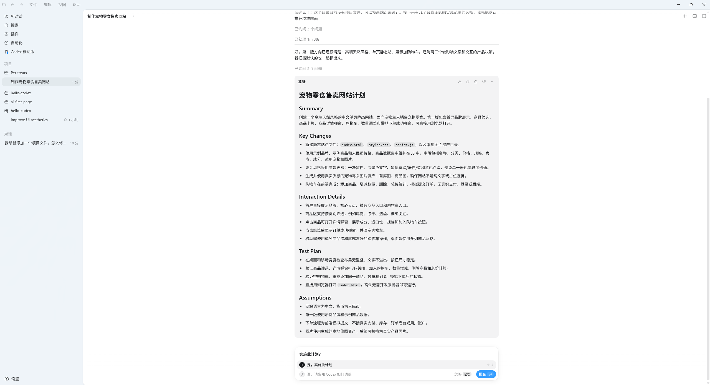
</p>

#### Open index.html for preview

<p align="center">
  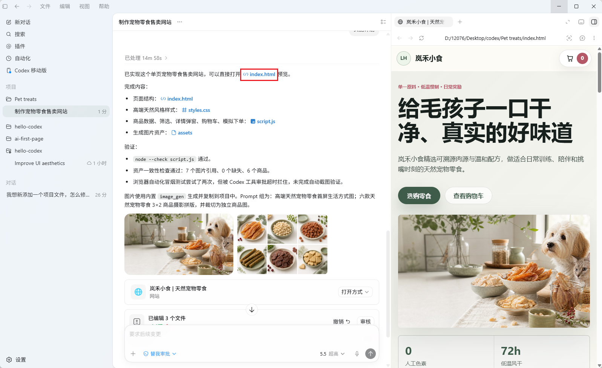
</p>

#### Create a Git repository

Create a Git repository for code management so future updates and maintenance are easier.

<p align="center">
  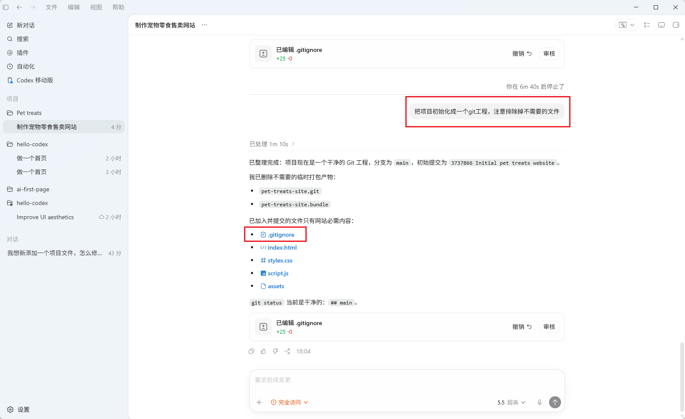
</p>

#### Improve detailed changes

Use comments directly on the page to make detailed changes.

<p align="center">
  
</p>

Add monthly sales.

<p align="center">
  
</p>

#### Add a feature

Add a best-sellers ranking.

<p align="center">
  
</p>

#### Push updated code

After confirming there are no problems, push the updated code.

<p align="center">
  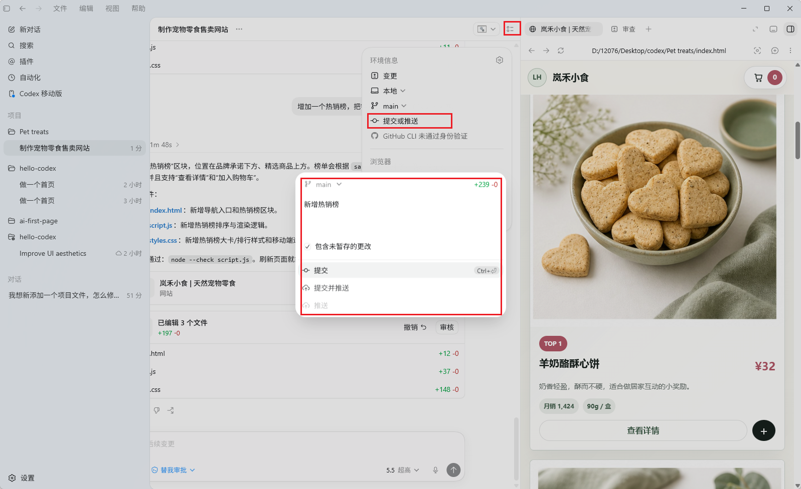
</p>

#### Upload to GitHub repository

##### Create a new repository

<p align="center">
  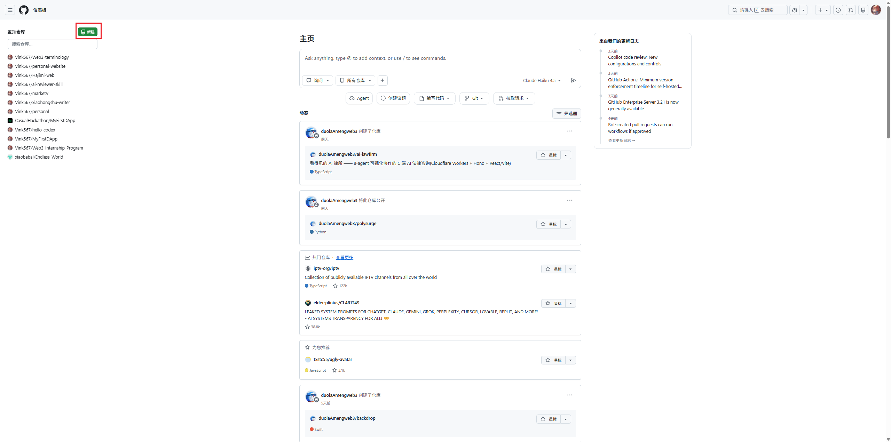
</p>

<p align="center">
  
</p>


---

##### Copy the corresponding repository link

<p align="center">
  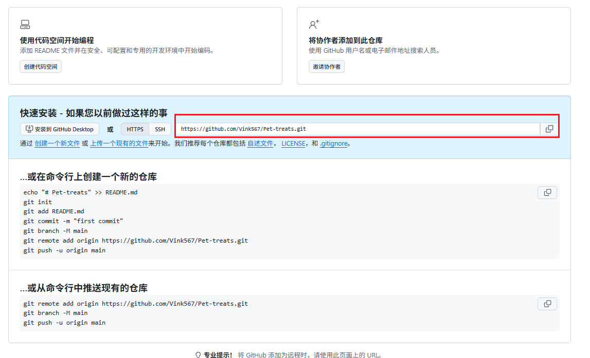
</p>

##### Ask Codex to upload code to the GitHub repository

<p align="center">
  
</p>

<p align="center">
  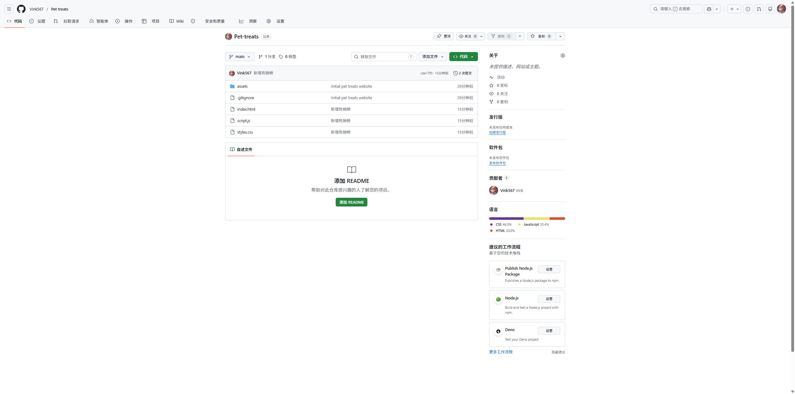
</p>

##### Publish the webpage through GitHub Pages so others can access it

Find Pages in Settings and click Save.

Wait a few minutes.

<p align="center">
  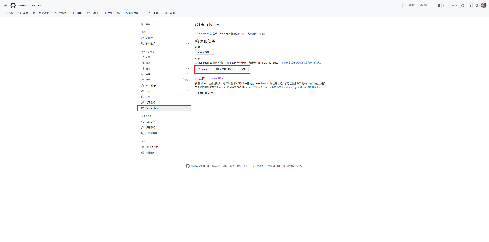
</p>

After a few minutes, a link appears. Others can access your webpage through this link.

Note that GitHub Pages is suitable for hosting static websites such as HTML, CSS, JavaScript, and static assets. It is not suitable for running business logic that requires a backend server, database, or sensitive transactions.

<p align="center">
  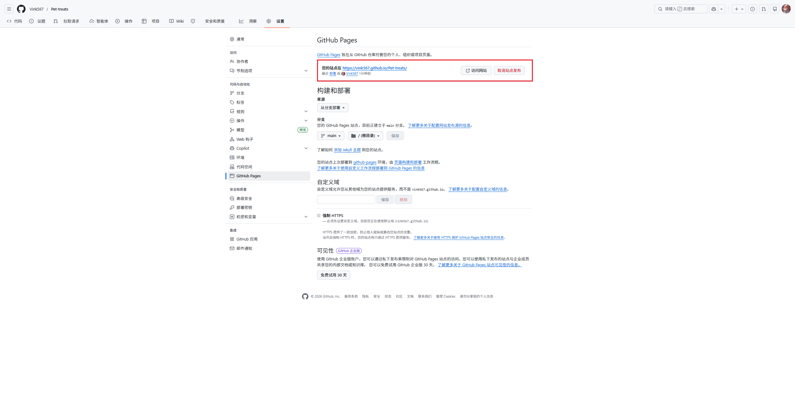
</p>

##### Open the webpage and view the completed project

Access stability for GitHub Pages may vary by region and network environment. If it cannot be opened, try another network or wait until deployment completes.

https://vink567.github.io/Pet-treats/

<p align="center">
  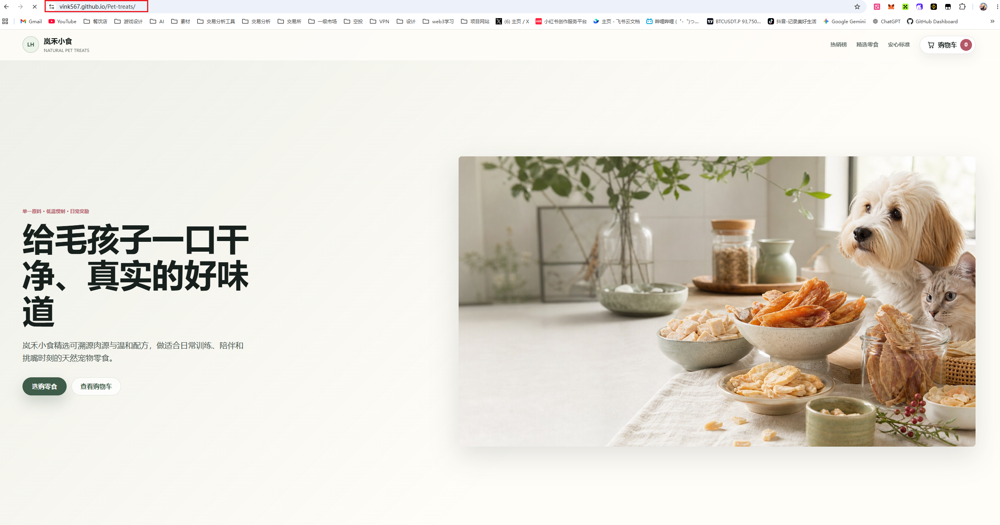
</p>

### Case 2: Add features to the pet-treat website and improve the page

#### Create user login and registration pages

When users make a purchase, they need to fill in their address information. At this point, a personal login account is needed to save that information.

<p align="center">
  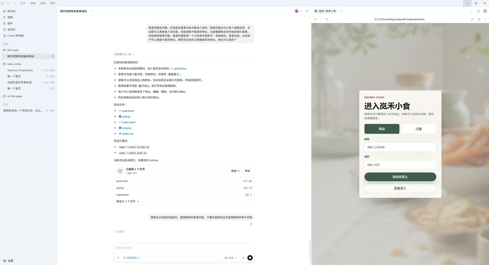
</p>

#### Create different pet categories and food categories under each pet category

Still start with plan mode and check whether AI understands your requirement.

<p align="center">
  
</p>

#### Use the comment feature to refine details

<p align="center">
  
</p>

<p align="center">
  
</p>

#### After selecting food and adding it to the cart, clicking purchase should prompt address confirmation

<p align="center">
  
</p>

#### Commit to Git and save code

<p align="center">
  
</p>

### Case 3: Build an admin dashboard for pet treats

#### Still start with plan mode

<p align="center">
  
</p>

<p align="center">
  
</p>

#### Check the result

<p align="center">
  
</p>

#### Commit to Git and save code

<p align="center">
  
</p>

### Case 4: Create a pet-treat brand partnership PPT

#### Install PPT Skill

Here I installed a PPT Skill I had previously reviewed. Just send the corresponding GitHub Skill URL to Codex and ask it to install it.

<p align="center">
  
</p>

#### Use “/” to select the corresponding Skill

<p align="center">
  
</p>

#### Check the final result

Codex ultimately generated a complete partnership PPT. The final file has been uploaded to the cloud. Click the link below to download and view it:

[⬇ Download partnership PPT](https://r2notes.bozhouai.com/images/codex-orange-book/pet-treats-investment-deck.pptx)


<p align="center">
  
</p>

### Case 5: Create a promotional video for pet treats

#### Install video plugin

This example uses the HyperFrames plugin.

<p align="center">
  
</p>


---

#### Plan video generation

<p align="center">
  
</p>

#### Preview the result

The final output is a promotional video for pet treats. The full video has been uploaded to the cloud. Click the link below to play it directly in the browser:

[▶ Watch demo video online](https://r2notes.bozhouai.com/images/codex-orange-book/pet-treats-promo.mp4)


## Appendix

### Appendix A: Third-party model integration

> This section introduces unofficial ideas for third-party model integration, using CC Switch + DeepSeek as an example. It is not an official OpenAI feature. Model compatibility, stability, privacy, and pricing rules are subject to the corresponding third-party tools and model providers.

#### What is CC Switch?

It is not Claude Code itself and not Codex itself. It is a third-party open-source desktop tool used to manage different agent tools in one place.

In simple terms:

> **Previously, you had to manually edit configuration files for Claude Code, Codex, and Gemini CLI.**  
> **Now CC Switch turns this into a visual panel where you can switch with one click.**

Its three core uses are:


| Function | Simple meaning |
| --- | --- |
| Provider switching | Switch from the official Claude API to a proxy API, or to another model service |
| Unified MCP management | Avoid configuring MCP separately for Claude Code, Codex, and Gemini |
| Skills management | Install Skills from GitHub or ZIP and sync them across different AI programming tools |


**If you need to switch among multiple agent tools and models, CC Switch can be an advanced option.**

#### Download CC Switch

First go to the official website: https://ccswitch.io/zh/

After clicking Download, you will be redirected to the corresponding download page. Scroll down, find the correct version, and download it.

<p align="center">
  
</p>

#### Connect third-party models

##### DeepSeek is used here as an example

###### First find the DeepSeek official website and create an API key

<p align="center">
  
</p>

###### Open CC Switch

Click Add model.

<p align="center">
  
</p>

Copy the API key you just created here.

<p align="center">
  
</p>

Enable local route mapping.

<p align="center">
  
</p>

Then click Add.

<p align="center">
  
</p>

Go to settings and turn on all routes.

<p align="center">
  
</p>

Click Enable.

<p align="center">
  
</p>

If CC Switch routing, the model service, and Codex-side configuration are compatible, opening Codex at this point may allow you to use DeepSeek and other third-party models through this unofficial routing setup.

This approach is not an official OpenAI feature. Whether it works, model capability, context length, tool-calling compatibility, cost, and privacy rules are all subject to CC Switch, the model provider, and your own configuration. For important projects, verify with a test repository first; do not try it directly in production projects.
